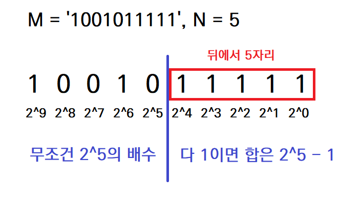

출처: SW Expert Academy

https://swexpertacademy.com/main/code/problem/problemDetail.do?contestProbId=AXRSXf_a9qsDFAXS&categoryId=AXRSXf_a9qsDFAXS&categoryType=CODE&problemTitle=10726&orderBy=FIRST_REG_DATETIME&selectCodeLang=ALL&select-1=&pageSize=10&pageIndex=1

<br>

쉬운 문제지만, 문제 풀이 과정에서 기억할 만한 부분이 있어서 간단히 정리해보았다.

<br>

## 🔓 첫 번째 풀이

가장 쉽게 생각할 수 있는 풀이다. `bin()`으로 M의 2진수 표현을 구한 뒤, 슬라이싱을 통해 앞의 `0b`를 없애준다. 그리고 다시 뒤에서부터 N개를 잘라내면, M의 2진수 표현의 마지막 N비트가 나온다. 이것이 모든 자리의 수가 '1'인 N자리 수와 같으면 ON, 아니면 OFF이다.

```python
for tc in range(1, TC + 1):
    N, M = map(int, input().split())
    power = 'OFF'

    last_n_number = bin(M)[2:][-N:]

    if last_n_number == ('1' * N):
        power = 'ON'

    print(f"#{tc} {power}")
```

<br>

## ✅ 두 번째 풀이

첫 번째 풀이에서는 M의 2진수 표현을 문자열과 비교하는 방식으로 문제를 풀었다. 그런데 사실 M은 2진수로 표현하더라도 동일한 값을 가지는 수이므로, M의 값 자체를 활용한 풀이를 생각해보았다.

<p align="center">
  
</p>

이 문제에서 알아야 하는 것은 M의 2진수 표현에서 마지막 N자리가 모두 1인지의 여부다. 

10진수 숫자에서 마지막 3자리가 '357'인지 알기 위해서는, 그 숫자를 1000으로 나눈 나머지가 357인지만 확인하면 된다. 마찬가지로 2진수 숫자에서도, 뒤에서 5자리가 모두 1인지 알기 위해서는, 2의 5제곱으로 나눈 나머지가 `0b11111`인지만 알면 된다. 10진수 수에서 천의 자리부터는 반드시 1000의 배수인 것처럼, 2진수 수에서 뒤에서 N + 1자리부터는 반드시 2의 N제곱의 배수이기 때문이다.

그리고 모든 자리의 수가 1인 N자리의 2진수의 값은 `2의 0제곱 + 2의 1제곱 + ... + 2의 (N-1)제곱`과 같이 계산할 수 있다. 그리고 이는 곧 `2의 N제곱 - 1`이다. 따라서 아래와 같은 짧은 코드로도 문제를 해결할 수 있다.

```python
TC = int(input())

for tc in range(1, TC + 1):
    N, M = map(int, input().split())
    power = 'OFF'

    if M % (2 ** N) == 2 ** N - 1:
        power = 'ON'

    print(f"#{tc} {power}")
```

