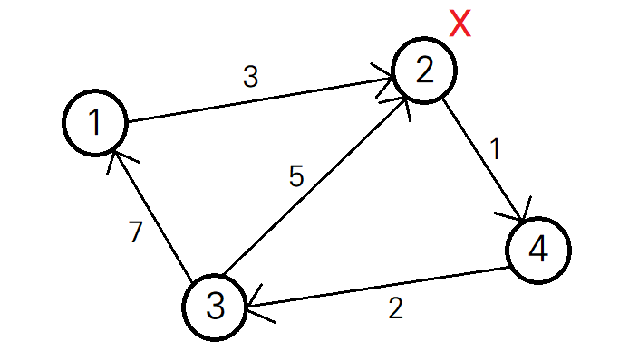

출처: SW Expert Academy

https://swexpertacademy.com/main/code/problem/problemDetail.do?contestProbId=AV4xuqCqBeUDFAUx&categoryId=AV4xuqCqBeUDFAUx&categoryType=CODE&problemTitle=1795&orderBy=FIRST_REG_DATETIME&selectCodeLang=ALL&select-1=&pageSize=10&pageIndex=1

<br>

## 📃 문제 설명

- 마을에 1번부터 N번까지 총 N개의 집이 있다.

- 인수의 집은 X번 집이다. 

- 오늘은 인수의 생일이라, 마을의 모든 사람들이 X번 집으로 모인다.

- 각 사람들은 자신의 집에서 X번 집으로 왔다가, 다시 자기 집으로 가야 한다.

- 도로는 단방향이므로, A에서 B로 가는 시간과 B에서 A로 가는 시간은 다를 수 있다. 

  (각 집을 원소로 하는 그래프로 표현하면, 방향 그래프다.)

- X번 집으로 왔다가 다시 집으로 돌아가는 데 가장 오래 걸리는 집의 소요 시간을 구한다.

<p align="center">
  
</p>

예를 들어, 위 그림에서 인수의 집인 2번 집에 갔다가 다시 돌아오는 데 걸리는 시간은 아래와 같다.

- 1번 집 : 3 + 10 = 13
- 2번 집 : 0 + 0 = 0
- 3번 집 : 5 + 3 = 8
- 4번 집 : 7 + 1 = 8

따라서 인수의 집에 갔다가 돌아오는 데 가장 오래 걸리는 집은 1번 집이며, 그 시간은 13이다.

<br>

## ✏ 문제 접근

X번 집에 갔다 오는 시간이 가장 오래 걸리는 집을 찾으려면, 아래 2가지를 구해야 한다.

1. 각 집에서 X번 집으로 가는 시간
2. X번 집에서 각 집으로 가는 시간

따라서 한 노드에서 다른 노드들로의 최단 거리를 구할 수 있는 **다익스트라 알고리즘**을 활용할 수 있다.

(이하에서는 편의상 A번 집에서 B번 집으로 가는 `시간`을 A번 집에서 B번 집으로 가는 `거리`로 칭하겠습니다.)

<br>

## 🔓 시간 초과 풀이 1

`get_min_distance` 함수에서는 우선순위 큐를 활용한 다익스트라 알고리즘을 통해, start번 집에서 각 집까지의 최단 거리를 구할 수 있다. 이 값이 `costs` 배열에 저장된다. start번 집에서 end번 집까지의 최단 거리는 `costs[end]`에 저장된다. 그래서 `get_min_distance()` 함수에 start와 end의 값을 인자로 주면, start번 집에서 end번 집까지의 최단 거리를 구할 수 있다.

그런데 X번 집에서 다른 집으로 가는 최단 거리를 구하기 위해, 매번 end에 각 집의 번호를 넣어 확인하는 것은 낭비적이다. `get_min_distance()` 함수를 한번만 호출해도, `costs` 배열에 X번 집에서 각 집으로의 최단 거리가 모두 저장되기 때문이다. 그래서 X번 집이 출발지인 경우, end 인자를 넣지 않고(키워드 인자이므로 생략 가능), `costs` 배열 전체를 반환하도록 했다. 

위와 같이 X번 집이 출발지인 경우의 거리(`distance_from_x`)는 함수를 한번만 호출하여 구했다. 반면 X번 집이 도착지인 경우의 거리(`distance_to_x`)는 각 집 번호를 start인자로, X를 end 인자로 넣은 N개의 함수를 호출하여 구했다. 이 코드는 시간초과가 떴다.

```python
from math import inf
from heapq import heappush, heappop


def get_min_distance(start, end=-1):
    """
    - 1) start 인자만 주어진 경우,
      start 정점에서 그래프의 각 정점으로 가는 최단 거리를 구한다.
    - 2) start 인자와 end 인자가 모두 주어진 경우,
      다익스트라 알고리즘을 통해 start 인자에서 end 인자까지 가는 최단 거리를 구한다.
    """
    global N, adj_mat
    # 시작 정점과 도착 정점이 같은 경우 => 0를 리턴한다.
    if start == end:
        return 0

    visited = [False] * (N + 1)
    costs = [inf] * (N + 1)
    costs[start] = 0
    heap = []
    heappush(heap, (0, start))

    while heap:
        # 힙에 저장된 노드 중 거리가 가장 짧은 것부터 하나씩 꺼낸다.
        dst, node = heappop(heap)
        # 이미 방문한 노드인 경우, 다음 노드로 탐색을 이어간다.
        if visited[node]:
            continue

        visited[node] = True

        for i in range(1, N + 1):
            if not visited[i] and adj_mat[node][i]:
                if dst + adj_mat[node][i] < costs[i]:
                    costs[i] = dst + adj_mat[node][i]
                    heappush(heap, (costs[i], i))

    # start 인자만 넣은 경우 => 0번 인덱스를 제외한 costs 배열 전체 반환
    if end == -1:
        return costs[1:]
    # end 인자도 넣은 경우 => end로 가는 최소 거리 반환
    return costs[end]


# T : 테스트케이스 개수
T = int(input())

for tc in range(1, T + 1):
    """
    N : 정점(집)의 개수 (1번 ~ N번)
    M : 간선(경로)의 개수
    X : 인수의 집 번호
    """
    N, M, X = map(int, input().split())
    adj_mat = [[0] * (N + 1) for _ in range(N + 1)]

    for _ in range(M):
        a, b, c = map(int, input().split())
        adj_mat[a][b] = c

    """
    distance_from_x: X에서 각 노드(1번 ~ N번)로 갈 수 있는 최단 거리
    distance_to_x: 각 노드(1번 ~ N번)에서 X로 갈 수 있는 최단 거리
    """
    distance_from_x = get_min_distance(X)
    distance_to_x = [get_min_distance(i, X) for i in range(1, N + 1)]

    max_distance = 0

    for a, b in zip(distance_from_x, distance_to_x):
        max_distance = max(max_distance, a + b)

    print("#{} {}".format(tc, max_distance))
```

<br>

## 🔓 시간 초과 풀이 2

그래프를 인접 행렬도 구현한 것이 문제인가 싶어 대신 인접 리스트로 구현해보았으나, 마찬가지로 시간 초과가 떴다.

```python
def get_min_distance(start, end=-1):
    # ...

    while heap:
        # ...

        for i in range(1, N + 1):
            if not visited[i] and i in adj_list[node]:
                if dst + adj_list[node][i] < costs[i]:
                    costs[i] = dst + adj_list[node][i]
                    heappush(heap, (costs[i], i))

    # ...

    
T = int(input())

for tc in range(1, T + 1):
    N, M, X = map(int, input().split())
    adj_list = [dict() for _ in range(N + 1)]

    for _ in range(M):
        # a번 집에서 b번 집으로 가는 거리 = c
        a, b, c = map(int, input().split())
        # a번 정점의 연결 정보를 담은 딕셔너리에 (정점: 가중치)를 (키:값)으로 저장
        adj_list[a][b] = c

    # ...
```

<br>

## ✅ 정답 풀이

앞선 코드에서 `distance_from_x`를 구하기 위해서는 함수를 한 번만 호출한다. 반면 `distance_to_x`를 구하기 위해서는 집의 개수만큼 함수를 호출한다. 이는 **다익스트라 알고리즘**이 하나의 노드에서 다른 노드들로의 최단 거리를 구하는 알고리즘이기 때문이다. 

그렇다면 반대로 생각해서, 그래프의 도착점(X번)에서부터 각 출발점(각 집)으로의 거리를 계산하면 되지 않을까? A에서 B로 가는 최단 거리는, 그래프의 방향을 거꾸로 했을 때 B에서 A로 가는 최단 거리와 같기 때문이다. 이러한 아이디어를 기초로, 간선의 방향을 반대로 저장한 인접 행렬(`reverse_adj_mat`)을 따로 만들었다. 그리고 해당 인접 행렬을 기준으로 X번 집에서 다른 집들로의 최단 거리를 구했는데, 이는 곧 각 집에서 X번 집으로 가는 최단 거리와 같다. 

역방향 인접행렬을 통해 `distance_to_x`도 한 번의 함수 호출만으로 구할 수 있게 되었고, 시간 초과 문제도 해결되었다.

```python
from math import inf
from heapq import heappush, heappop
import sys
sys.stdin = open("input.txt")


def get_min_distances(start, adj_mat):
    """
    start 노드에서 그래프의 각 노드로 가는 최단 거리를 구한다.
    Args:
        start: 시작 노드
        adj_mat: 인접 행렬
    """
    global N

    visited = [False] * (N + 1)
    # distances[i]: start 노드에서 i번 노드로 가는 최단 거리
    distances = [inf] * (N + 1)
    distances[start] = 0
    heap = []
    heappush(heap, (0, start))

    while heap:
        # 힙에 저장된 노드 중 거리가 가장 짧은 것부터 하나씩 꺼낸다.
        dst, node = heappop(heap)
        # 이미 방문한 노드인 경우, 다음 노드로 탐색을 이어간다.
        if visited[node]:
            continue

        visited[node] = True

        for i in range(1, N + 1):
            # i번 집을 아직 방문하지 않았고, node번 집에서 가는 경로가 있다면
            if not visited[i] and adj_mat[node][i]:
                # 기존 경로보다 더 짧은 경우, 길이를 업데이트하고 힙에 추가한다.
                if dst + adj_mat[node][i] < distances[i]:
                    distances[i] = dst + adj_mat[node][i]
                    heappush(heap, (distances[i], i))

    return distances


T = int(input())

for tc in range(1, T + 1):
    """
    N : 정점(집)의 개수 (1번 ~ N번)
    M : 간선(경로)의 개수
    X : 인수의 집 번호
    """
    N, M, X = map(int, input().split())
    adj_mat = [[0] * (N + 1) for _ in range(N + 1)]
    # reverse_adj_mat: 방향 그래프의 방향을 반대로 저장한 인접 행렬
    reverse_adj_mat = [[0] * (N + 1) for _ in range(N + 1)]

    for _ in range(M):
        a, b, c = map(int, input().split())
        adj_mat[a][b] = c
        reverse_adj_mat[b][a] = c

    """
    distance_from_x[i] : x번 노드에서 i번 노드로 가는 최단 거리
    distance_to_x[i] : i번 노드에서 x번 노드로 가는 최단 거리
    """
    distance_from_x = get_min_distances(X, adj_mat)
    distance_to_x = get_min_distances(X, reverse_adj_mat)

    max_distance = 0

    for i in range(1, N + 1):
        current = distance_from_x[i] + distance_to_x[i]
        max_distance = max(max_distance, current)

    print("#{} {}".format(tc, max_distance))
```
