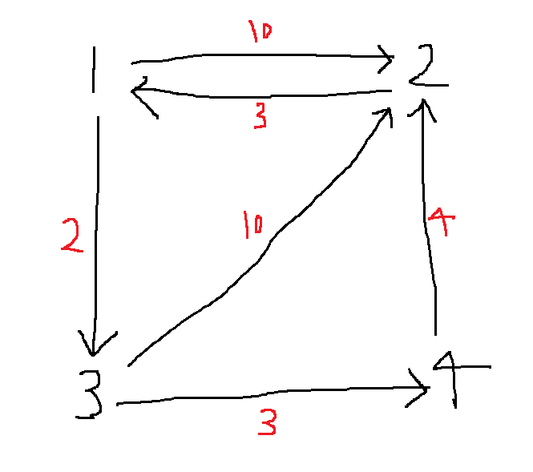

출처: 백준 온라인 저지

https://www.acmicpc.net/problem/2098

<br>

___

## 📃 문제 설명

대표적인 알고리즘 문제 중 하나인 [TSP(traveling salesman problem)](https://en.wikipedia.org/wiki/Travelling_salesman_problem) 문제다.


1번부터 N번까지 번호가 매겨진 도시들이 있다. 

각 도시들 사이를 이동할 수 있는 비용이 행렬 `W[i][j]` 형태로 주어진다.

`W[i][j]`는 도시 i에서 도시 j로 가기 위한 비용이다.

- 도시 i에서 도시 j로 가지 못할 수도 있으며, 이 경우 `W[i][j] = 0`이다.

- `W[i][j]`와 `W[j][i]`는 다를 수 있다.


N개의 도시를 모두 거쳐 다시 원래의 도시로 돌아오는 순회 여행 경로를 계획하고자 한다.

- 단, 마지막에 출발 도시로 돌아오는 것을 제외하고는, 한 번 갔던 도시로는 갈 수 없다.

- 항상 순회할 수 있는 경우만 입력으로 주어진다.

  

이때, 전체 도시를 순회하는 최소 비용을 구한다.

<p align="center">
  
</p>

예를 들어, 위 그림에서는 `2 => 1 => 3 => 4 => 2`로 순회할 때의 12가 최소 비용이다.

<br>

## 💡 기본 아이디어

위 문제에서는, 한 도시에서 시작해 모든 도시를 순회한 뒤, 원래 도시로 돌아오는 경로의 최소 비용을 구한다.

그런데 한 도시에서 출발해 다시 그 도시로 돌아오는 순회 경로에서는, 시작 노드가 의미가 없다.

예를 들어, `1 => 3 => 2 => 4 => 1`의 경로는 `3 => 2 => 4 => 1 => 3`과도 같고, `2 => 4 => 1 => 3 => 2`와도 같다. 

따라서 임의의 한 도시를 시작 경로로 정하더라도, 모든 순회 경로를 탐색할 수 있다.

<br>

## ⏰ 시간 초과 풀이 1 - 완전 탐색

우선 모든 경우의 수를 따지는 방식을 생각해보자. N은 최대 16이므로, 도시가 16개인 상황을 생각해보자. 임의의 한 도시를 시작 경로로 정할 수 있으므로 남은 도시는 15개다. 그럼 15개의 도시 중 하나를 간다. 그 다음 남은 14개의 도시 중 하나를 간다. 그 다음 남은 13개의 도시 중 하나를 간다. 이렇게 마지막 남은 도시까지 모두 방문하고 다시 시작 도시로 돌아가는 경우의 수는 `15!`이다. 당연하게도 이 모든 경우를 다 검사할 수는 없다.

<br>

## ⏰ 시간 초과 풀이 2 - 백트래킹

불필요한 탐색을 줄이기 위해, 백트래킹을 이용해보았다. DFS로 경로를 탐색하면서 전체 도시를 순회하는 최소 비용을 `min_cost` 변수에 저장해간다. 만약 현재까지의 비용이 `min_cost`보다 크다면, 해당 경로를 포함하는 경로는 가지치기를 한다. 

예를 들어, 5개의 도시가 있다고 하자. `1 => 2 => 3 => 4 => 5 => 1`로 순회하는 비용이 100이다. 그렇다면 `min_cost` 변수에 100을 할당한다. 다음으로 `1 => 4 => 2`로 순회하는 비용이 120이다. 그렇다면 `1 => 4 => 2`로 시작하는 경로는 탐색을 진행할 필요가 없다.

이렇게 구현해보았으나, 시간 초과가 떴다.

```python
from sys import stdin
from math import inf


N = int(stdin.readline())
board = []

for _ in range(N):
    board.append([int(x) for x in stdin.readline().split()])

visited = [False] * N
min_cost = inf
current = 0


def get_min_cost(cnt, cost, count):
    """
    Args:
        cnt: 현재 탐색 중인 도시의 번호
        cost: 현재까지의 순회 비용
        count: 현재까지 순회한 도시의 개수
    """
    global min_cost

    # 전체 도시를 다 순회한 경우 => 처음 도시로 돌아간다.
    if count == N:
        if board[cnt][0]:
            min_cost = min(min_cost, cost + board[cnt][0])

        return

    for c in range(N):
        # 아직 c를 방문하지 않았고, 현재 위치에서 c로 가는 경로가 있다면
        if not visited[c] and board[cnt][c]:
            # c로 갈 때의 비용이 min_cost보다 작은 경우에만 탐색 진행
            if cost + board[cnt][c] < min_cost:
                visited[c] = True
                get_min_cost(c, cost + board[cnt][c], count + 1)
                visited[c] = False


get_min_cost(0, 0, 1)
print(min_cost)
```

<br>

## ⏰ 시간 초과 풀이 3 - 비트마스킹

비트마스킹을 살짝 추가해보았으나, 큰 차이는 없었다.

```python
def get_min_cost(cnt, cost, visited):
    """
    Args:
        cnt: 현재 탐색 중인 도시의 번호
    """
    global min_cost

    # 전체 도시를 다 순회한 경우 => 처음 도시로 돌아간다.
    if visited == (2 ** N - 1):
        if board[cnt][0]:
            min_cost = min(min_cost, cost + board[cnt][0])

        return

    for c in range(N):
        # 아직 c를 방문하지 않았고, 현재 위치에서 c로 가는 경로가 있다면
        if not (visited & (1 << c)) and board[cnt][c]:
            # c로 갈 때의 비용이 min_cost보다 작은 경우에만 탐색 진행
            if cost + board[cnt][c] < min_cost:
                get_min_cost(c, cost + board[cnt][c], visited + (1 << c))


get_min_cost(0, 0, 1)
print(min_cost)
```

<br>

## 🔓 정답 풀이

결국 자력으로는 풀지 못하여, 정답 풀이를 참고했다.

(이하의 풀이는 아래의 글을 많이 참조하여 작성되었습니다.)

[TSP 알고리즘 2: 동적 계획법 구현](https://shoark7.github.io/programming/algorithm/solve-tsp-with-dynamic-programming)

<br>

앞선 접근을 통해 시작 경로는 중요하지 않다는 것을 알았다. 그리고 백트래킹과 비트마스킹을 통해 탐색을 줄여보았으나, 시간 초과가 떴다. 


위 해설에서는 시간을 줄이기 위해 백트래킹이 아니라 **DP**를 사용한다. DP에서 중요한 것은 중복되는 부분 문제를 찾는 일이다. TSP 문제에서 중복되는 부분 문제는 무엇일까?  `1 => 2 => 3`의 경로에 이어, `4`로 가는 경우와, `1 => 3 => 2`에 이어 `4`로 가는 경우는 같은 경로에 해당한다. 중간 경로는 중요하지 않으며, 같은 도시들을 거쳐 같은 도시에 도착한 경로이기 때문이다. memoization을 이용하여, 이러한 중복되는 연산의 결과를 저장해두면, 같은 연산을 반복하지 않아도 될 것이다.


그렇다면 현재까지 방문한 도시들과 마지막 방문 도시가 주어질 때, 남은 순회를 마치는 최소 비용을 구하는 방식으로 전체 순회의 최소 비용을 구할 수 있다. 그리고 memoization 방식을 이용하여, 해당 비용을 저장해두면, 중복 연산을 피할 수 있다. 예를 들어, 도시가 1번부터 7번까지 있고, 현재 `1 => 2 => 3 => 4`번 순으로 도시를 방문했다고 하자. 그렇다면 남은 경로는 5, 6, 7번 도시를 방문한 뒤, 다시 1번 도시로 가는 경로다. 이 경로의 최소 비용을 구한 뒤, 해당 값을 저장한다. 그러면 이후에 `1 => 3 => 2 => 4`번 순으로 도시를 방문한 경우, 남은 경로의 최소 비용을 바로 구할 수 있다.


위의 아이디어를 구현한 최종 정답 코드는 아래와 같다.

```python
from sys import stdin
from math import inf


N = int(stdin.readline())
board = []

for _ in range(N):
    board.append([int(x) for x in stdin.readline().split()])

"""
costs: 각 도시의 조합에 대하여, 해당 도시들을 방문한 상태에서 남은 도시를 모두 순회하는 최소 비용
       ex. costs[3][0b111001] => 3번 도시를 마지막으로 (1, 2, 3, 6)번 도시를 방문한 상태에서,
                                 남은 도시를 모두 방문하고 1번 도시로 돌아오는 최소 비용
"""
costs = [[0] * (1 << N) for _ in range(N + 1)]


def get_min_cost(cnt, visited):
    """
    cnt를 마지막으로 visited의 도시들을 모두 방문했을 때,
    남은 순회를 마치는 최소 비용을 구한다.

    Args:
        cnt: 현재 탐색 중인 도시의 번호
        visited: 현재 방문한 도시의 조합 (2진수 정수)
                 ex. 51(0b110011) => (1, 2, 5, 6)번 도시를 방문함.
    """
    # N개의 도시를 다 순회한 경우
    if visited == (2 ** N - 1):
        # 시작 도시로 돌아갈 수 있는 경로가 있다면 => 그 비용을 리턴한다.
        if board[cnt][0]:
            return board[cnt][0]
        # 시작 도시로 돌아갈 수 있는 경로가 없다면 inf를 반환한다.
        return inf

    # 현재 상태에서 순회를 마치는 최소 비용을 이전에 구한 경우, 해당 비용을 리턴한다.
    if costs[cnt][visited]:
        return costs[cnt][visited]

    # left_cost: 남은 순회를 마치는 최소 비용
    left_cost = inf

    for c in range(N):
        # 아직 c를 방문하지 않았고, 현재 위치에서 c로 가는 경로가 있다면
        if not (visited & (1 << c)) and board[cnt][c]:
            # temp: 현재 위치에서 c로 가는 비용 + c로 방문한 뒤 남은 순회를 마치는 최소 비용
            temp = board[cnt][c] + get_min_cost(c, visited + (1 << c))
            left_cost = min(left_cost, temp)

    costs[cnt][visited] = left_cost
    return left_cost


# 초기 상태: 1번 도시만 방문한 상태
print(get_min_cost(0, 1))
```

