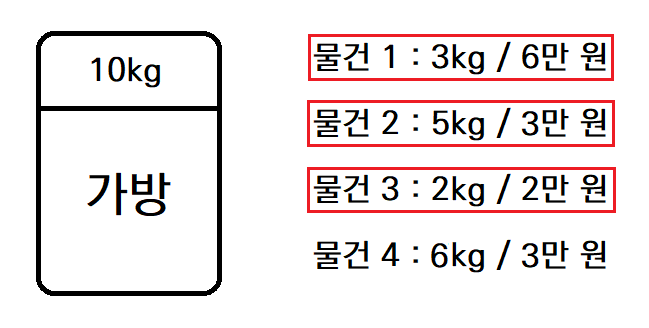
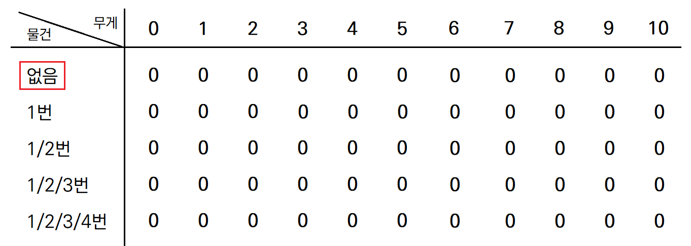
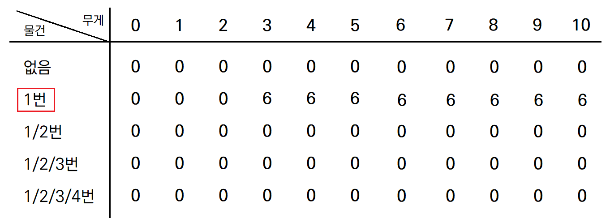
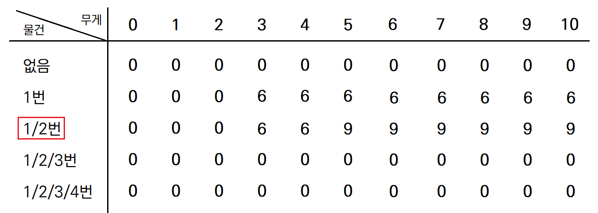
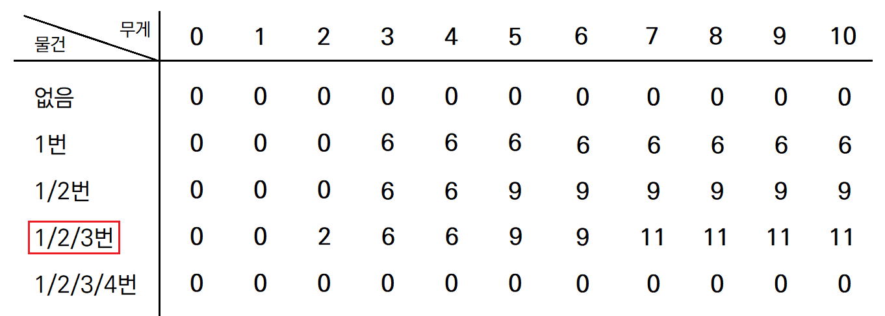
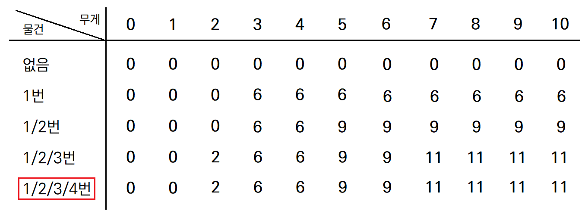

# Knapsack Problem (냅색 알고리즘)

## 문제 설명

각 물건의 무게와 가치가 주어지고, 가방에 담을 수 있는 최대 무게가 주어진다.

이때 가방에 담은 물건들의 가치의 합이 최대가 되도록 하는 물건의 조합을 찾는다.

<p align="center">
  
</p>

예를 들어, 위 그림과 같이 각 물건의 무게와 가격, 가방이 담을 수 있는 최대 무게가 주어진 경우,

가방에 담은 물건들의 가격의 합이 최대가 되는 조합은 `(물건 1, 물건 2, 물건 3)`이다.

배낭 문제는 크게 Fractional Knapsack Problem과 0-1 Knapsack Problem으로 나눌 수 있다.

<br>

## Fractional Knapsack Problem

> 물건을 나눌 수 있는 경우의 배낭 문제

- 물건의 일부를 담을 수 있으며, 이 경우에도 무게 대비 가치는 유지된다. 

- 매번 무게 대비 가치가 가장 높은 물건을 담는 **그리디 알고리즘**을 통해 간단히 해결할 수 있다.

문제 설명에서 든 예시를 살펴보자. 

위 예시에서, 물건 1부터 물건 4까지의 kg당 가격은 각각 `[2, 0.6, 1, 0.5]`다.

그렇다면 kg당 가격이 높은 물건부터 `물건 1 => 물건 3 => 물건 2` 순서대로 가방에 담으면 된다.

<br>

이를 구현한 코드는 아래와 같다.

```python
def get_max_value(N, infos, limit):
    """
    가방에 담을 수 있는 물건들의 가치의 합의 최대값을 구한다.
    Args:
        N: 물건의 개수
        infos: 각 물건의 정보를 (무게, 가치)의 형태로 저장한 배열
        limit: 가방에 담을 수 있는 최대 무게
    """
    # infos를 무게 대비 가치를 기준으로 내림차순 정렬한다.
    infos.sort(key=lambda x: x[1] / x[0], reverse=True)
    
    # 무게 대비 가치가 높은 것부터 그리디한 방식으로 가방에 담는다.
    cnt_value, cnt_weight = 0, 0
    
    for i in range(N):
        w, v = infos[i]
        # 현재 물건까지만 담을 수 있는 경우
        if cnt_weight + w <= limit:
            # 가방의 남은 무게만큼 현재 물건을 채운다.
            cnt_value += (v / w) * (limit - cnt_weight)
            return cnt_value
        
        cnt_value += v
        cnt_weight += w
    
    return cnt_value
```

<br>

## 0-1 Knapsack Problem

> 물건들 나눌 수 없는 경우의 배낭 문제

- 비트가 0 또는 1인 것처럼, 물건은 들어가거나 들어가지 않을 수 있을 뿐, 일부만 들어갈 수는 없다.

- 탐욕적 선택 속성(greedy choice property)이 없으므로 그리디 알고리즘으는 풀 수 없다.

- **동적 프로그래밍**을 통해 효율적으로 해결할 수 있다.

다시 한번 문제 설명에서의 예시를 보자.

배낭 문제는 결국 n개의 물건 중 r개를 선택하는 조합 문제다. 

n개 중 r개를 고르는 문제는 아래의 2가지 부분 문제로 나눌 수 있다.

1. 임의의 물건 X를 고르는 경우 (n - 1개 중 r - 1개 선택)

2. 임의의 물건 X를 고르지 않는 경우 (n - 1개 중 r개 선택)

예시에서는 1) 물건 4를 선택하고 남은 4kg 내에서 다른 물건들을 고르는 경우와 2) 물건 4를 선택하지 않고 남은 10kg 내에서 다른 물건들을 고르는 경우로 나눌 수 있다. 이를 점화식으로 표현하면 아래와 같다.

```python
# weights[i] : i번 물건의 무게
# values[i] : i번 물건의 가치
# F(n, m) : 1번 ~ n번 물건 내에서 mkg까지 담을 수 있는 가방에 넣을 수 있는 물건 가치의 최대 합

F(n, m) = max(
    F(n - 1, m - weights[n]) + values[n],  # 1. n번 물건을 고르는 경우
    F(n - 1, m)                            # 2. n번 물건을 고르지 않는 경우
)
```

위와 같은 점화식을 구했으므로, tabluation 방식을 통해 2차원 테이블을 채워나가면 된다.

<p align="center">
  [초기 세팅]
  
</p>

<p align="center">
  [1번까지 선택]
  
</p>

<p align="center">
  [2번까지 선택]
  
</p>

<p align="center">
  [3번까지 선택]
  
</p>

<p align="center">
  [4번까지 선택]
  
</p>

위와 같이 1번 물건만 넣을 수 있는 경우부터 넣을 수 있는 물건을 하나씩 증가시키면서 점화식에 따라 값을 채워나가면, 마지막에 2차원 배열의 마지막 열 마지막 행의 값이 곧 찾고자 하는 값이 된다.

<br>

0-1 배낭 문제인 [백준 12865번 평범한 배낭 문제](https://www.acmicpc.net/problem/12865)의 예시 코드는 아래와 같다.

```python
N, K = map(int, input().split())
weights = [0]
values = [0]

for _ in range(N):
    W, V = map(int, input().split())
    weights.append(W)
    values.append(V)

"""
board[r][c]: r번 물건까지 선택 가능한 경우, 무게 합을 ckg 이하로 고른 경우의 가치의 최대합
board[r][c] = max(board[r - 1][c], board[r - 1][c - weights[r]] + values[r])
"""
board = [[0] * (K + 1) for _ in range(N + 1)]

for r in range(1, N + 1):
    for c in range(1, K + 1):
        # r번 물건을 선택할 수 없는 경우 (IndexError 방지)
        if c < weights[r]:
            board[r][c] = board[r - 1][c]
        # r번 물건을 선택할 수 있는 경우
        else:
            board[r][c] = max(board[r - 1][c], board[r - 1][c - weights[r]] + values[r])

print(board[N][K])
```

<br>

###  참고 출처

- [코드없는 프로그래밍 - 코딩테스트, 중급, knapsack problem](https://www.youtube.com/watch?v=rhda6lR5kyQ)

- [Wikipedia - Knapsack problem](https://en.wikipedia.org/wiki/Knapsack_problem)
