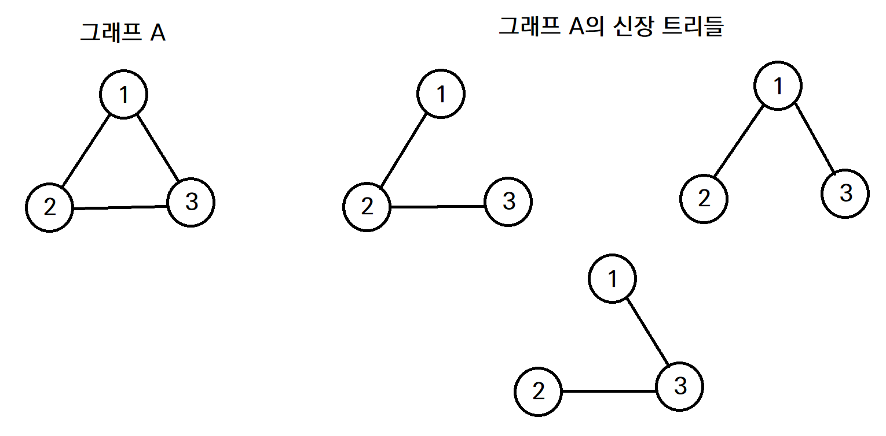
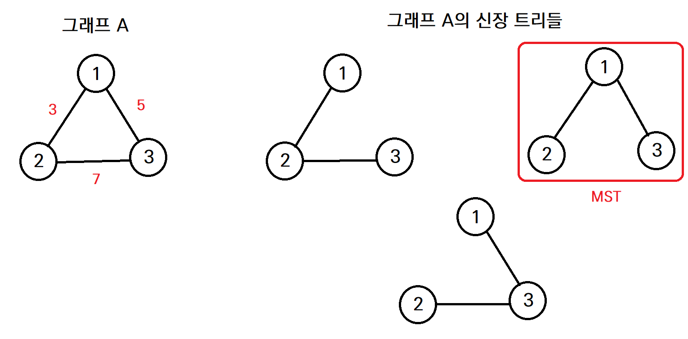
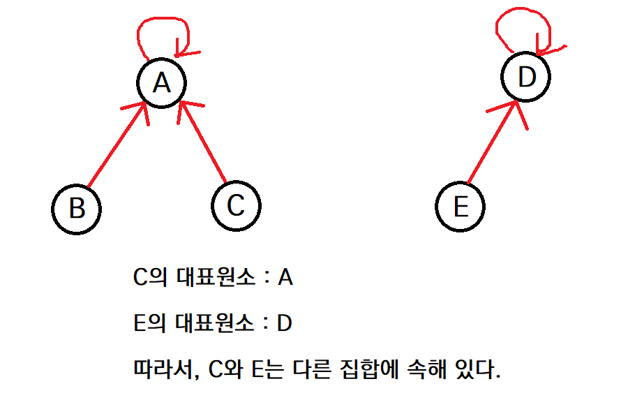
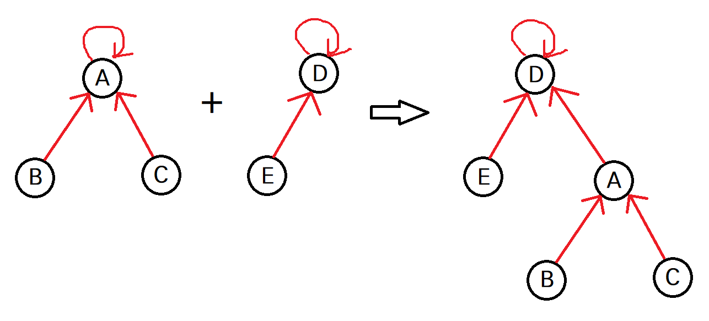

# [Python] MST 알고리즘

## 선행 지식

- 그래프 자료구조
- 트리 자료구조

<br>

## 최소 신장 트리 (MST)

#### 신장 트리 (Spanning Tree)

> 그래프 내의 모든 정점을 포함하는 트리

- 트리의 일종이므로, 사이클이 존재하지 않는다.

- 그래프의 정점이 `n`개라면, `n - 1`개의 간선을 가진다.

<p align="center">
  
</p>

#### 최소 신장 트리 (Minimum Spanning Tree)

> 무방향 그래프에서 간선들의 가중치 합이 최소인 신장 트리

- 아래 그림에서, 3개의 신장 트리 중 오른쪽 신장 트리의 가중치 합이 8로 가장 적으므로, 해당 신장 트리가 그래프 A의 최소 신장 트리가 된다.

<p align="center">
  
</p>

- cf) 위키피디아에 따르면, 방향 그래프에서의 최소 신장 트리 문제는 Arborescence 문제라 불리며, Chu-Liu/Edmonds 알고리즘을 사용하여 풀 수 있다고 한다. ([Chu-Liu/Edmonds 알고리즘](https://en.wikipedia.org/wiki/Edmonds%27_algorithm)) 

- 최소 신장 트리를 구현하는 알고리즘으로는 **Prim 알고리즘**, **Kruskal 알고리즘**이 대표적이다.

<br>

## Prim 알고리즘

> 시작 정점에서 출발하여 정점을 하나씩 선택하며 신장트리 집합을 확장해나가는 방법

- 그리디 알고리즘의 일종이다.

#### 작동 순서

1. 임의의 시작 정점을 하나 정한다. 시작 정점만 포함된 신장 트리 집합을 만든다.

2. N개의 정점이 모두 선택될 때까지
   - 신장 트리 집합에 포함된 정점에 인접했으며 아직 방문하지 않은 정점 중, 최소 비용의 간선이 존재하는 정점을 선택한다.
   - 선택한 정점은 신장 트리 집합에 포함시킨다.

#### 인접 행렬을 이용한 코드 (직접 구현)

```python
from math import inf


def prim(start):
    global N, adj_mat
    visited = [False] * N
    visited[start] = True
    """
    costs[i]: 현재까지 방문한 정점에서 i번 정점으로 갈 수 있는 최소 비용
    cnt: 현재 탐색중인 정점
    """
    costs = [inf] * N
    costs[start] = 0
    cnt = start
    total = 0

    # start를 제외하고 N - 1개의 정점을 선택할 때까지 반복한다.
    for _ in range(N - 1):
        for i in range(N):
            # 아직 방문하지 않았고, 현재 방문한 정점에서 갈 수 있는 정점인 경우, 비용을 업데이트한다.
            if not visited[i] and adj_mat[cnt][i]:
                costs[i] = min(costs[i], adj_mat[cnt][i])

        # next_node: 현재 방문한 정점에서 최단 거리로 갈 수 있는 정점
        # min_cost: next_node로 갈 수 있는 최소 비용
        next_node, min_cost = -1, inf

        for i in range(N):
            if not visited[i] and costs[i] < min_cost:
                next_node = i
                min_cost = costs[i]  

        total += min_cost
        visited[next_node] = True
        cnt = next_node

    return total


"""
N: 정점의 개수 (0번 ~ (N - 1)번)
M: 간선의 개수
adj_mat: 그래프의 인접 행렬
"""
N, M = map(int, input().split())
adj_mat = [[0] * N for _ in range(N)]

for _ in range(M):
    # x와 y 사이의 가중치 = value
    x, y, value = map(int, input().split())
    adj_mat[x][y] = value
    adj_mat[y][x] = value

# 0번 정점에서 탐색을 시작
print(prim(0))
```

#### 우선순위 큐를 사용한 코드 (링크)

코드는 아래 출처에서 확인할 수 있다.

[[알고리즘] 프림 알고리즘(Prim Algorithm)](https://deep-learning-study.tistory.com/595)

<br>

## Kruskal 알고리즘

> 비용에 따라 정렬된 간선을 하나씩 선택하며 MST를 찾는 방법

- 프림 알고리즘과 마찬가지로, 그리디 알고리즘의 일종이다.

#### 작동 순서

1. 그래프의 간선들을 가중치를 기준으로 오름차순 정렬한다.
2. N - 1개의 간선이 선택될 때까지
   - 가중치가 낮은 간선부터 탐색하면서, 사이클을 형성하지 않으면 간선을 선택한다.
   - 사이클 형성 여부는 `union-find 자료구조`를 활용하여 판단한다.

#### union-find

> 서로소 집합을 표현하는 자료구조

- 서로소 집합은 중복된 원소가 없는 집합을 뜻한다.
- 집합에 속한 하나의 **대표 원소**를 통해 집합들을 구분한다.


- `find`
  - 원소가 속한 집합을 반환한다. (일반적으로 집합의 대표 원소를 반환)
  - 여러 원소끼리 대표 원소를 비교하여, 같은 집합에 속했는지의 여부를 판단할 수 있다.

<p align="center">
  
</p>

- `union`
  - 두 개의 집합을 하나의 집합으로 합친다.
  - 한 집합의 대표 원소가 다른 집합의 대표 원소를 가리키게 하는 방식으로 구현한다.

<p align="center">
  
</p>

```python
# 합치기 전
parents = [0, 0, 0, 3, 3]  # A, A, A, D, D

# 합친 후
parents = [3, 0, 0, 3, 3]  # D, A, A, D, D
```

#### 예시 코드 (직접 구현)

```python
def find_set(x):
    # x의 대표원소를 찾아서 리턴한다.
    while x != parents[x]:
        x = parents[x]
    return x


"""
N: 정점의 개수 (0번 ~ N-1번)
M: 간선의 개수
edges: 그래프의 간선 정보
"""
N, M = map(int, input().split())
edges = []

for _ in range(M):
    a, b, value = map(int, input().split())
    edges.append((a, b, value))

# 간선을 비용순으로 오름차순 정렬
edges.sort(key=lambda x: x[2])

# parents : 각 정점의 부모 원소 (초기 설정: 모두 자기 자신)
# cnt : 찾은 간선의 개수
parents = [x for x in range(N)]
distance, cnt = 0, 0

for a, b, value in edges:
    # 해당 간선이 사이클을 만들지 않는다면
    if find_set(a) != find_set(b):
        # union 연산을 수행한다. (b의 대표 원소가 a의 대표 원소를 가리키게 한다.)
        parents[find_set(b)] = find_set(a)
        distance += value
        cnt += 1

        # N - 1개의 간선을 모두 찾은 경우, 탐색을 종료한다.
        if cnt >= N - 1:
            break

print(distance)
```

<br>

## Prim vs Kruskal

- Prim 알고리즘의 시간복잡도 : `O(N^2)`

- Kruskal 알고리즘의 시간복잡도 : `O(ElogE)`

- 정점에 비해 간선이 적은 **희소 그래프**에서는 Kruskal 알고리즘이 적합하다.
- 
- 정점에 비해 간선이 많은 **밀집 그래프**에서는 Prim 알고리즘이 적합하다.

<br>

## 참고 출처

[책 [C언어로 쉽게 풀어 쓴 자료구조]](http://www.kyobobook.co.kr/product/detailViewKor.laf?mallGb=KOR&ejkGb=KOR&barcode=9788970509716)

[위키피디아 - 프림 알고리즘](https://ko.wikipedia.org/wiki/%ED%94%84%EB%A6%BC_%EC%95%8C%EA%B3%A0%EB%A6%AC%EC%A6%98)

[위키피디아 - 서로소 집합 자료 구조](https://ko.wikipedia.org/wiki/%EC%84%9C%EB%A1%9C%EC%86%8C_%EC%A7%91%ED%95%A9_%EC%9E%90%EB%A3%8C_%EA%B5%AC%EC%A1%B0)

[위키피디아 - 크루스칼 알고리즘](https://ko.wikipedia.org/wiki/%ED%81%AC%EB%9F%AC%EC%8A%A4%EC%BB%AC_%EC%95%8C%EA%B3%A0%EB%A6%AC%EC%A6%98)

[[알고리즘] 프림 알고리즘(Prim Algorithm)](https://deep-learning-study.tistory.com/595)

