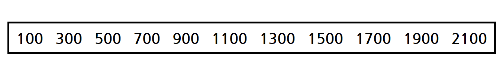
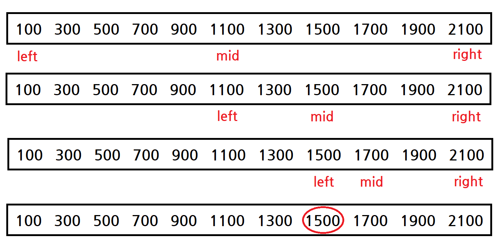

# Parametric Search

### 최적화 문제

> 특정 조건을 만족하는 변수의 최대값 혹은 최소값을 찾는 문제 

- 실제로 최적화 문제의 개념은 이보다 훨씬 복잡하다.

- 하지만 파라메트릭 서치를 이해하기 위해서는 위의 정의 이해해도 충분할 것이다.

- ex. 모두에게 같은 개수의 구슬을 나누어줄 때, 가능한 구슬의 개수의 최대값은?

<br>

### 결정 문제

> 계산 문제 중 그 결과를 'Yes' 혹은 'No'로 답할 수 있는 문제

- ex. 101은 소수인가?

- ex. 그래프의 노드 A에서 노드 B로 가는 경로가 존재하는가?

<br>

### 파라메트릭 서치

> 최적화 문제를 결정 문제로 바꾸어 푸는 기법

##### 파라메트릭 서치를 적용할 수 있는 문제

- 1 또는 0을 값으로 가지는 함수 `f(i)`가 있고,

- `f(i) = 0`이면 i보다 작은 모든 j에서 `f(j) = 0`일 때

- `f(i) = 1`인 i의 최소값 / `f(i) = 0`인 i의 최대값을 구한다.

##### 최적화 문제 => 결정 문제

- `f(i) = 1이 되는 i의 최소값을 구하여라` => `f(i) = 1인가?`

위의 수학적 설명은 잘 와닿지 않지만, 사실 이해하면 어렵지 않은 내용이다. 예시를 통해 이해해보자. 친구의 생일 선물을 사려는 A는 자신이 살 수 있는 가장 비싼 선물을 사고자 한다. 이를 위해, 우선 쇼핑몰에서 파는 물건들을 가격순으로 정렬한다.



그리고 **이분 탐색 알고리즘**을 활용하여 살 수 있는 가장 비싼 선물의 가격을 탐색한다. 

양쪽 끝을 각각 left, right로 둔 뒤, 매번 left와 right의 가운데를 mid로 두고, mid에 있는 물건의 가격을 지불 가능한 가격과 비교한다. 

아래는 A가 낼 수 있는 가격이 1600원일 때, A가 살 수 있는 가장 비싼 선물을 찾는 과정이다.



위 이미지를 보면 이분 탐색과 약간 다른 점이 있다. 

- 만약 가격이 1600원인 물건을 찾는 이분 탐색이었다면, 첫 줄에서 `1100 < 1600`이므로 left는 1100의 다음 인덱스로 두고 탐색을 이어갔을 것이다. 1100원짜리 물건은 찾는 물건일 수 없기 때문이다.

- 반면 위에서는 left를 mid 자리에 두고 탐색을 이어갔다. 이는 1100원짜리 물건이 여전히 찾고자 하는 물건, 즉 살 수 있는 가장 비싼 물건일 수 있기 때문이다. 그리고 이는 곧 이분 탐색과 파라메트릭 서치의 차이를 보여준다. 이분 탐색이 특정 값 자체를 찾는 것이라면, 파라메트릭 서치는 특정 조건을 만족하는 최적의 (최소 or 최대의) 값을 찾는 것이다. 

- 이렇게 이분 탐색과 파라메트릭 서치에서 조건문을 다르게 처리하는 부분은 실수하기 쉬운 부분이므로 주의해서 보는 것이 좋다.

<br>

### 예시 문제 - 나무 자르기 (백준 2805번)

[문제 출처](https://www.acmicpc.net/problem/2805)

적어도 M미터의 나무를 집에 가져가기 위해서 절단기에 설정할 수 있는 높이의 최댓값을 구한다.

해결 방법 : left, right을 각각 0, 1000000000 (나무의 최대 높이)로 설정한 뒤, 파라메트릭 서치를 통해 나무의 길이가 M미터 이상이 되는 절단기 설정 높이의 최대값을 구한다.

```python
from sys import stdin


def get_tree_length(cut_height):
    """
    절단기의 높이를 cut_height로 설정했을 때 얻을 수 있는 나무의 총 길이를 구한다.
    """
    global trees
    
    return sum([(tree - cut_height) for tree in trees if tree > cut_height])


def get_max_height(target):
    """
    target미터 이상의 나무를 가져가기 위해 절단기에 설정 가능한 높이의 최댓값을 구한다.
    """
    global trees
    start, end = 0, 1000000000

    while start <= end:
        mid = (start + end) // 2

        if get_tree_length(mid) >= target:
            start = mid + 1
        else:
            end = mid - 1

    return end


N, M = map(int, stdin.readline().split())
trees = [int(x) for x in stdin.readline().split()]

print(get_max_height(M))
```

<br>

### 참고 출처

https://www.youtube.com/watch?v=F6lKjRDlOpk

https://www.crocus.co.kr/1000

https://sarah950716.tistory.com/16
