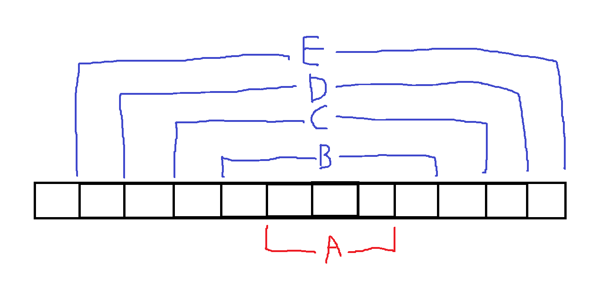

문제 출처 : SW Expert Academy

https://swexpertacademy.com/main/code/problem/problemDetail.do?contestProbId=AV14Rq5aABUCFAYi


총 10개의 테스트케이스가 주어진다.

100 X 100의 글자판에 대하여, 가로/세로 회문의 최대 길이를 구해야 한다.


반년 전쯤 풀었던 문제인데, 다시 풀면서 실행 시간을 크게 감소시킨 경우라 기록해 놓는다.

<br>

### 이전 풀이

```python
def is_palindrome(word):
    """
    주어진 문자열이 회문인지 검사한다.
    Returns:
        주어진 문자열이 회문이면 True, 회문이 아니면 False
    """
    for i in range(len(word) // 2):
        if word[i] != word[-(i + 1)]:
            return False
    return True


def get_longest_palindrome_length(board, N):
    """
    문자열로 이루어진 배열에서 가장 긴 회문의 길이를 구한다.
    Args:
        board: 문자열 배열
        N: 문자열 하나의 길이 및 문자열의 개수
    Returns:
        l: 문자열 배열 내의 가장 긴 회문의 길이
    """
    for l in range(N, 1, -1):
        # 1. 가로 회문 탐색
        for r in range(N):
            for c in range(N - l + 1):
                # current: board[r][c]에서 시작하는 길이 M의 가로 부분 문자열
                current = board[r][c:c + l]

                if is_palindrome(current):
                    return l

        # 2. 세로 회문 탐색
        for c in range(N):
            for r in range(N - l + 1):
                # current: board[r][c]에서 시작하는 길이 M의 세로 부분 문자열
                current = ''
                for cnt_r in range(r, r + l):
                    current += board[cnt_r][c]

                if is_palindrome(current):
                    return l

    # 길이가 2 이상인 회문이 없는 경우
    return 1


for _ in range(T):
    tc = int(input())
    board = []

    for _ in range(100):
        board.append(input())

    count = get_longest_palindrome_length(board, 100)
    print("#{} {}".format(tc, count))
```

회문을 검사하는 함수를 만들고, 100 X 100 글자판의 모든 문자열에 대하여 회문인지 검사하는 방식이다.

10개 테스트케이스의 실행 시간은 약 **3.37초**이다.

<br>

### 새로운 풀이

(SWEA에서는 import sys가 안 되서 input()으로 입력값을 받았다.)

새로운 풀이는 회문의 1가지 특성을 이용하여 시간 효율성을 크게 개선할 수 있었다. 바로 회문은 더 작은 회문을 포함한다는 특성이다.

`ABCDEDCBA`라는 회문을 보자. `ABCDEDCBA`는 E를 중심으로 좌우 대칭이다. 그렇다면 양쪽 끝의 A를 제거한 `BCDEDCB`로 회문일 것이다. 마찬가지로 `CDEDC`, `DED`, `E`도 회문이다. 

회문에서 양쪽 문자를 제거해도 회문이므로, 반대로 회문이 아닌 문자열에는 양쪽 끝에 같은 문자를 붙이더라도 회문이 될 수 없다. 이를 이용해서 문자열 내의 모든 부분 문자열을 검사하지 않고도, 문자열 내의 모든 회문인 부분 문자열을 찾을 수 있다.



위 그림에서, A가 회문이 아니라는 것을 안다면, B/C/D/E는 따로 검사하지 않아도 회문이 아님을 알 수 있다는 것이다.

위와 같은 성질을 이용하여 각 문자를 중심으로 양쪽 문자가 다를 때까지 검사한다. `ABCDEDABA`에서 E를 중심으로 검사한다고 하면, `DED`는 회문이고, `CDEDA`는 회문이 아니다. 그렇다면 E를 중심으로 하는 가장 긴 회문은 `DED`이며, 그보다 긴 문자열은 검사할 필요가 없다.

길이가 짝수인 문자열 또한 같은 방식으로 검사한다.

```python
for _ in range(10):
    tc = int(input().readline())
    max_length = 1
    board = []

    for _ in range(100):
        board.append([x for x in input().rstrip()])

    # 1. 길이가 홀수인 회문의 최대 길이를 구한다.
    for r in range(100):
        for c in range(100):
            # 1-1. board[r][c]를 중심으로 하는 가로 회문의 최대 길이를 구한다.
            width = 1
            left, right = c - 1, c + 1

            while 0 <= left and right < 100 and board[r][left] == board[r][right]:
                width += 2
                left, right = left - 1, right + 1

            # 1-2. board[r][c]를 중심으로 하는 세로 회문의 최대 길이를 구한다.
            height = 1
            up, down = r - 1, r + 1

            while 0 <= up and down < 100 and board[up][c] == board[down][c]:
                height += 2
                up, down = up - 1, down + 1

            max_length = max(max_length, width, height)

    # 2. 길이가 홀수인 세로 회문의 최대 길이를 구한다.
    for r in range(100):
        for c in range(100):
            # 2-1. board[r][c], board[r][c + 1]을 중심으로 하는 가로 회문의 최대 길이를 구한다.
            width = 0
            left, right = c, c + 1

            while 0 <= left and right < 100 and board[r][left] == board[r][right]:
                width += 2
                left, right = left - 1, right + 1

            # 2-2. board[r][c], board[r + 1][c]을 중심으로 하는 세로 회문의 최대 길이를 구한다.
            height = 0
            up, down = r, r + 1

            while 0 <= up and down < 100 and board[up][c] == board[down][c]:
                height += 2
                up, down = up - 1, down + 1

            max_length = max(max_length, width, height)

    print(f"{tc} {max_length}")
```

새로운 풀이를 돌렸을 때 10개 테스트케이스의 실행 시간은 약 **0.38초**이다.

