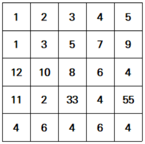
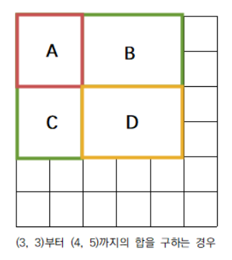

출처: 백준 온라인 저지
https://www.acmicpc.net/problem/11660

<br>

___

### 📃 문제 설명




숫자들로 채워진 N x N의 표가 있고, 두 개의 좌표 `(x1, y1)`, `(x2, y2)`가 주어지면 `(x1, y1)`부터 `(x2, y2)`까지의 합을 구해야 한다. `(x, y)`는 x행 y열을 의미한다.

예를 들어 `(2, 3)`과 `(4, 4)`가 주어진 상황을 생각해보자. 2행 3열의 `5`와 4행 4열의 `4`를 양 끝으로 하는 직사각형에 포함된 수들의 합을 구해야 한다. 위 그림에서는 `5+7+8+6+33+4=63`이 될 것이다.

<br>

### 🔎 prefix sum (구간 합)

가장 쉬운 방법은 반복문으로 해당하는 값들을 일일이 순회하면서 더하는 것이다. 하지만 여러 구간 합을 구해야 할 경우 이러한 방법은 비효율적이다. 이때 사용할 수 있는 것이 바로 `구간 합(prefix sum)`이다.

구간 합은 어떤 수열에서 해당 인덱스까지의 수열의 전체 합을 의미한다.
예를 들어, [10, 20, 30, 40, 50]의 구간 합은 [10, 30, 60, 100, 150]이다.

위 문제는 구간 합을 2차원 배열에 적용하여 해결할 수 있다. 기본 구간 합이 수열의 처음 수부터 해당 인덱스의 수까지의 합을 저장한다면, 2차원 배열에서는 1행 1열부터 x행 y열까지의 수들의 합을 `prefix_sum[x][y]`에 저장할 수 있다.

예를 들어 위 그림의 구간 합을 만든다고 하면, `prefix_sum[2][3]`에는 1행 1열부터 2행 3열까지의 합을 저장하면 된다. 이 값은 `1+2+3+1+3+5=15`가 될 것이다.

<br>

### 🔑 해결 방법



1행부터 `(x, y)`까지의 합을 구하고 나면 `(x1, y1)`부터 `(x2, y2)`까지의 합을 구하기 쉬워진다. 

`(3, 3)`부터 `(4, 5)`까지의 합을 구하는 예시를 생각해보자. 위 그림에서 구해야 할 값은 D에 속한 수들의 합이다. `prefix_sum[4][5]`은 A ~ D를 모두 더한 값과 같다. 여기에서 A, B, C의 값을 빼면 구하고자 하는 D의 값이 남는다. `prefix_sum[2][5]`는 A + B이고, `prefix_sum[4][2]`는 B + C이다. A ~ D의 합에서 이 둘을 빼면 D - A가 된다. A의 값은 `prefix_sum[2][2]`이므로 이 값을 더하면 구하고자 하는 D의 값이 된다.

<br>

이를 일반화하면 다음과 같다.

`(x1, y1)에서 (x2, y2)까지의 합` = `prefix_sum[x2][y2] - prefix_sum[x1 - 1][y2] - prefix_sum[x2][y1 - 1] + prefix_sum[x1 - 1][y1 - 1]`

<br>

### 🔓 최종 풀이

```python
from sys import stdin


n, m = map(int, stdin.readline().split())

numbers = [[0] * (n + 1)]

for _ in range(n):
    nums = [0] + [int(x) for x in stdin.readline().split()]
    numbers.append(nums)

# prefix sum 행렬 만들기

# 1. 행 별로 더하기
for i in range(1, n + 1):
    for j in range(1, n):
        numbers[i][j + 1] += numbers[i][j]

# 2. 열 별로 더하기
for j in range(1, n + 1):
    for i in range(1, n):
        numbers[i + 1][j] += numbers[i][j]

for _ in range(m):
    x1, y1, x2, y2 = map(int, stdin.readline().split())
    # (x1, y1)에서 (x2, y2)까지의 합
    # p[x2][y2] - p[x1 - 1][y2] - p[x2][y1 - 1] + p[x1 - 1][y1 - 1]
    print(numbers[x2][y2] - numbers[x1 - 1][y2] - numbers[x2][y1 - 1] + numbers[x1 - 1][y1 - 1])
```