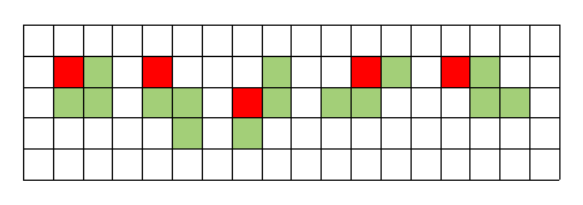

출처: 백준 온라인 저지
https://www.acmicpc.net/problem/14500

<br>

___

### 풀이 과정

`완전 탐색` 알고리즘으로 풀 수 있다. 보드에 테트로미노를 놓을 수 있는 모든 경우의 수에 대하여, 테트로미노가 놓인 판의 수의 최대값을 구하면 된다. 원리는 매우 간단하지만, 가능한 테트로미노의 모양이 (회전해서 같은 것도 다른 모양으로 계산하면) 19가지나 되서 구현에 적지 않은 시간이 걸린다. 

테트로미노를 놓는 19가지 방법은 아래와 같다. (빨간색은 기준점)


각각의 칸에 대하여 19가지 방법을 각각 계산해도 되지만, 그렇게 할 경우 중복되는 부분을 여러 번 계산해야 해서 비효율적이다. 겹치는 부분을 최대한 적게 계산하기 위해서는 겹치는 부분이 많은 모양끼리 분류한 뒤 계산하면 된다.

나의 경우 아래와 같이 3가지 경우로 나누어 생각해 보았다.

<br>

1. 가로로 3칸 붙어 있는 조각을 포함한 경우


기준점의 좌표를 `a[r][c]`라고 할 때, `a[r][c], a[r][c + 1], a[r][c + 2]`를 포함한다.

<br>

2. 세로로 3칸 붙어 있는 조각을 포함한 경우


기준점의 좌표를 `a[r][c]`라고 할 때, 모두 `a[r][c], a[r + 1][c], a[r + 2][c]`를 포함한다.

<br>

3. 그 외의 경우



기준점을 `a[r][c]`라고 할 때, `a[r][c], a[r][c + 1], a[r + 1][c], a[r + 1][c + 1]` 중 3개 이상을 포함한다.


위 분류를 바탕으로, 가능한 겹치지 않는 부분들끼리 비교하면 보다 효율적으로 최대값을 구할 수 있다.

<br>

### 정답 풀이

```python

from sys import stdin


n, m = map(int, stdin.readline().split())

# 상하좌우에 3칸씩 여백을 준다.
b = [[0] * (m + 6) for _ in range(3)]

for _ in range(n):
    b.append([0, 0, 0] + [int(x) for x in stdin.readline().split()] + [0, 0, 0])

for _ in range(3):
    b.append([0] * (m + 6))

max_value = 0

for i in range(3, n + 3):
    for j in range(3, m + 3):
        # 1) 가로로 3칸 붙어 있는 조각을 포함한 경우
        case1 = b[i][j] + b[i + 1][j] + b[i + 2][j]
        case1 += max(b[i + 3][j], b[i][j + 1], b[i][j - 1], b[i + 1][j - 1],
                     b[i + 2][j - 1], b[i + 2][j + 1], b[i + 1][j + 1])

        # 2) 세로로 3칸 붙어 있는 조각을 포함한 경우
        case2 = sum(b[i][j:j + 3])
        case2 += max(max(b[i - 1][j:j + 3]), max(b[i + 1][j:j + 3]), b[i][j + 3])

        # 3) 그 외의 경우
        case3 = b[i][j] + b[i + 1][j] + b[i][j + 1] + b[i + 1][j + 1]
        case3 += max(0, b[i + 2][j + 1] - b[i][j + 1], b[i + 2][j] - b[i][j],
                     b[i][j + 2] - b[i][j], b[i + 1][j + 2] - b[i + 1][j])

        max_value = max(max_value, case1, case2, case3)

print(max_value)
```

<br>

### 정답 풀이 2 (210718 추가)

우연히 이 문제를 `DFS 알고리즘`으로 풀 수 있다는 글을 보게 되었다. 테트리스 조각은 4칸으로 만들 수 있는 모든 경우를 포함하므로, 한 칸에서 시작해서 DFS로 3칸을 더 탐색하면, 어떤 경우라도 테트리스 조각에 포함되기 때문이다. 따라서 각 칸에서 DFS로 탐색하여 최대값을 구하고, 그중에서 다시 최대값을 구하면 원하는 값을 구할 수 있게 된다. 

위의 아이디어로 구현한 코드는 아래와 같다.

```python
from sys import stdin


n, m = map(int, stdin.readline().split())
board = []
max_value = 0


def visit_and_comeback(board, r, c, visited, count):
    visited.append((r, c))
    dfs_search(board, r, c, visited, count + 1)
    visited.pop()


def dfs_search(board, r, c, visited, count):
    if count >= 4:
        value = 0
        for a, b in visited:
            value += board[a][b]

        global max_value
        max_value = max(max_value, value)
    else:
        if r > 0 and (r - 1, c) not in visited:
            visit_and_comeback(board, r - 1, c, visited, count)
        if r < (n - 1) and (r + 1, c) not in visited:
            visit_and_comeback(board, r + 1, c, visited, count)
        if c > 0 and (r, c - 1) not in visited:
            visit_and_comeback(board, r, c - 1, visited, count)
        if c < (m - 1) and (r, c + 1) not in visited:
            visit_and_comeback(board, r, c + 1, visited, count)


for _ in range(n):
    board.append([int(x) for x in stdin.readline().split()])

# 1. 십자 모양을 제외한 모든 경우에 대하여 너비 우선 탐색
for r in range(n):
    for c in range(m):
        # visited의 초기값은 [(r, c)]
        dfs_search(board, r, c, [(r, c)], 1)

# 2. 십자 모양 탐색
for r in range(1, n - 1):
    for c in range(m - 1):
        # 'ㅏ' 모양 탐색
        max_value = max(max_value, board[r][c] + board[r - 1][c] + board[r + 1][c] + board[r][c + 1])
        # 'ㅓ' 모양 탐색
        max_value = max(max_value, board[r][c] + board[r - 1][c + 1] + board[r + 1][c + 1] + board[r][c + 1])

for r in range(n - 1):
    for c in range(1, m - 1):
        # 'ㅗ' 모양 탐색
        max_value = max(max_value, board[r][c] + board[r + 1][c - 1] + board[r + 1][c] + board[r + 1][c + 1])
        # 'ㅜ' 모양 탐색
        max_value = max(max_value, board[r][c] + board[r + 1][c - 1] + board[r + 1][c] + board[r + 1][c + 1])


print(max_value)

```

