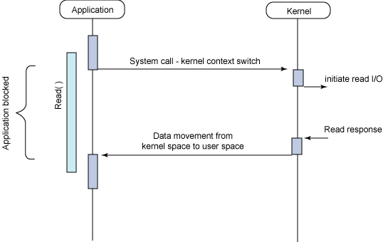
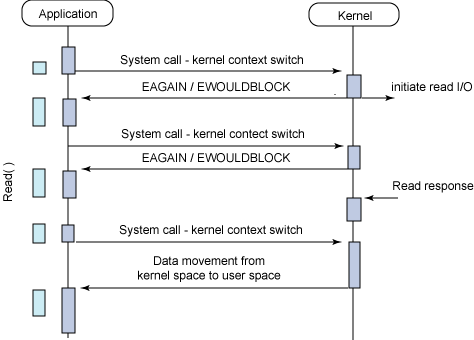

# Blocking I/O vs NonBlocking I/O

### **blocking I/O**

- I/O 작업을 요청한 스레드가 요청이 완료될 때까지 block된다.
- 스레드가 blocking 시스템 콜을 호출하면, 작업을 마칠 때까지 제어권을 받지 못한다.

- `Read()` 시스템 콜을 호출한 스레드는 **blocked** 상태가 된다. 
- 커널 모드에서 커널이 read I/O를 실행하여 응답 데이터를 스레드로 보낸다.
- 요청한 데이터를 받은 이후에야 스레드는 blocked 상태에서 깨어난다.

 

### **NonBlocking I/O**

- 스레드를 block시키지 않고, 요청에 대한 현재 상태를 즉시 리턴한다.
- 호출된 함수가 바로 값을 리턴하기에, 호출한 스레드는 제어권을 바로 돌려받는다.

- 스레드가 `Read()` 시스템 콜을 호출하면 커널 모드가 된다.

- 커널 모드에서 read I/O를 실행시키자마자 바로 스레드에 응답을 한다. 아직 데이터가 없으므로 `EAGAIN` 또는 `EWOULDBLOCK` 에러 코드를 리턴한다.

- 응답을 받은 스레드는 코드를 실행하다가, 다시 Read() 시스템 콜을 호출한다.

- read I/O의 응답 데이터가 있다면, 커널은 데이터를 스레드로 보낸다.

- Q. I/O 작업 완료를 어떻게 확인할 수 있는가?

  - 방법 1 : 완료됐는지 반복적으로 확인하기
    - 커널이 데이터를 받아도 바로 스레드가 받을 수 없다.
    - CPU 낭비가 발생한다.

  - 방법 2 : **I/O multiplexing (다중 입출력)**
    - 관심있는 I/O 작업들을 동시에 모니터링하고, 그중 완료된 I/O 작업들을 한번에 알려준다.
    - ex. linux의 epoll, macOS의 kqueue, windows의 IOCP 등

 

### 동기 vs 비동기 프로그래밍

**동기(synchronous) 프로그래밍**

- 여러 작업들을 **순차적으로** 실행하도록 개발한다.

**비동기(asynchronous) 프로그래밍**

- 여러 작업들을 **동시에** 실행하도록 개발한다.

- Q. 어떻게 비동기 프로그래밍을 구현할 수 있는가?

  - 멀티 스레드 [(참고)](https://github.com/by-gramm/TIL/blob/master/computer_science/process_and_thread.md#%EB%A9%80%ED%8B%B0-%EC%8A%A4%EB%A0%88%EB%93%9C)
    - 한 프로세스 내에서 여러 스레드가 동시에 실행되는 처리 방식

  - non-blocking I/O
    - ex. A 요청에 대해 즉시 상태를 리턴받고, 다시 B 요청을 한다.

 

### 동기/비동기 I/O

**동기 I/O**

- 요청한 스레드가 요청한 작업이 완료되었는지 확인한다.
  - blocked 상태로 작업 완료를 기다리면 sync-blocking
  - 다른 일을 수행하면서도, 작업이 완료되었는지 계속 확인하면 sync-nonblocking

**비동기 I/O**

- 요청한 스레드가 직접 작업이 완료되었는지 확인하지 않는다.
- 요청받은 쪽에서 작업 완료시 callback 함수 등으로 완료 사실을 처리한다.
- 비동기 I/O의 예시 : **message queue**
  - 생산자(Producer)는 메시지를 메시지 큐에 추가한다. 생산자는 이후 메시지가 언제 처리되는지는 신경쓰지 않는다.
  - 소비자(Consumer)는 메시지 큐에 있는 메시지를 처리한다.
  - 생산자가 메시지를 추가한 이후, 작업의 완료 여부를 확인하지 않기 때문에 비동기 I/O에 해당한다. 
  - 빠른 응답이 필요하지 않은 채팅, 이메일 전송 등에 사용될 수 있다.
  - ex. Kafka, RabbitMQ, ActiveMQ 등

 

### 참고 자료

https://www.youtube.com/watch?v=mb-QHxVfmcs

https://www.youtube.com/watch?v=EJNBLD3X2yg