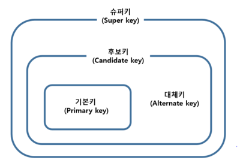

# Database Key

> 검색, 정렬시 튜플을 식별하는 식별자 역할을 하는 속성(들)의 집합

### 무결성 제약 조건

**개체 무결성**

- 기본키를 구성하는 어떤 속성도 중복값이나 null값을 가질 수 없다.

**참조 무결성**

- 외래키는 참조되는 릴레이션의 기본키 값 또는 null 값이다.
- ex. 주문 테이블에서 80번 상품 id를 외래키로 가지는데, 상품 테이블에 id가 80인 튜플이 없으면 안 됨.

**도메인 무결성**

- 각 속성값은 정의된 범위 내의 값을 가져야 한다.
- ex. 100점 만점 기준 점수 필드에 0보다 작거나 100보다 큰 수가 오면 안 됨.

 

### 유일성과 최소성

**유일성**

- 하나의 키값으로 튜플을 유일하게 식별할 수 있는 성질

**최소성**

- 키를 구성하는 속성들 중 최소한의 속성들로만 키를 구성하는 성질
- 키를 구성하는 속성 중 하나라도 빠지면 튜플을 구분할 수 없다.

 

### 키의 종류

(이미지 출처 : http://wiki.hash.kr/index.php?title=%EB%8C%80%EC%B2%B4%ED%82%A4&mobileaction=toggle_view_desktop)

**슈퍼키 (Super Key)** 

- 유일성을 만족하는 속성(들)의 집합

**후보키 (Candidate Key)**

- 유일성과 최소성을 모두 만족하는 속성(들)의 집합 (기본키 후보)
- 하나의 릴레이션에는 중복된 튜플이 있을 수 없으므로, 모든 릴레이션에는 하나 이상의 후보키가 존재한다.

**기본키 (Primary Key)**

- 후보키 중 선택된 키
- 각 테이블에서 기본키는 하나만 지정 가능하다.
- **개체 무결성**을 만족해야 한다.

**대체키 (Alternate Key)**

- 후보키 중 선택되지 않은 키

**외래키 (Foreign Key)**

- 다른 릴레이션의 기본키를 참조하는 키
- 데이터의 무결성을 유지하기 위해 사용한다.
- **참조 무결성**을 만족해야 한다.

 

### 기본 키

- unique key와의 비교

  - primary key는 null값을 가질 수 없지만, unique key는 가질 수 있다.

  - primary key는 테이블당 하나만 존재할 수 있지만, unique key는 여러 개가 존재할 수 있다.

- primary key를 생성하는 경우 기본적으로 clustered index로 생성된다.
  - 단, primary key가 아닌 다른 key를 clustered index로 설정할 수도 있다.

- 참고) Clustered index vs Non-clustered index

  - **Clustered Index**
    - 해당 키를 기준으로 테이블의 데이터가 물리적으로 정렬된다.
    - 테이블 당 한 개씩만 존재할 수 있다.
    - cf) mongoDB의 경우, clustered index가 존재하지 않는다.

  - **Non-Clustered Index**
    - 해당 키를 기준으로 테이블의 데이터가 논리적으로 정렬된다.

- Q. 기본키를 선정하는 방법에는 무엇이 있는가?
- 방법 1 : **자연 키 (Natural key)**
  - 후보키 중 가장 적합한 속성(들)을 기본키로 선정하는 방식
  - Q. 후보키 중 기본키를 고를 때 어떤 점을 고려해야 하는가?
    - 값이 변경될 가능성이 낮은 속성을 포함한 후보키를 선택한다.
    - 속성의 개수가 적고, 자리수가 적은 속성으로 구성된 후보키를 선택한다.
- 방법 2 : **대리 키 (Surrogate key)**
  - 적합한 기본키가 없는 경우 가상의 속성을 생성하여 기본키로 선정하는 방식
  - ex. `AUTO_INCREMENT`로 생성하는 id

 

### 참고 자료

https://jerryjerryjerry.tistory.com/49

http://wiki.hash.kr/index.php?title=%EB%8C%80%EC%B2%B4%ED%82%A4&mobileaction=toggle_view_desktop

https://www.geeksforgeeks.org/difference-between-primary-key-and-unique-key/