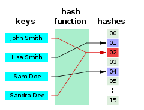

# Hash Table

> 해시함수를 사용하여 변환한 값을 index으로 삼아 키(key)와 데이터(value)를 저장하는 자료구조

### Hash Function

- 임의의 크기를 가지는 type의 데이터를 고정된 크기를 가지는 type의 데이터(해시값)으로 변환하는 함수
- 같은 입력값에 대하여, 같은 출력값이 나오는 것이 보장된다.
- hash table에서는 **임의의 데이터를 정수(해시값)으로 변환하는 함수**

- ex. "John Smith"의 해시값이 2라면, 해시 테이블의 2번 인덱스에 "John Smith"를 저장한다.
- **버킷(bucket)** : 데이터가 저장되는 곳

- Java의 **hashCode()**
  - java에서는 hashCode()를 통해 해시값을 구한다.
  - hashCode()가 반환하는 해시값의 범위는 int 자료형의 범위와 같다.
  - hashCode()를 통해 데이터를 int형 해시값으로 변환한 뒤, 해당 값을 다시 해시 테이블의 길이로 나눈 나머지가 인덱스가 된다.
  - ex. 배열의 길이가 16인 경우
    - ("apple", 3000)을 저장한다. "apple"의 해시값이 800이라면 `800 mod 16 = 0`이므로 해시 테이블의 0번 버킷에 ("apple", 3000)이 저장된다.
    - ("banana", 2000)을 저장한다. "banana"의 해시값이 535라면 `535 mod 16 = 7`이므로 ("banana", 2000)가 해시 테이블의 7번 버킷에 저장된다.

 

### Hash Collision

1. 해시 함수의 반환값인 해시 값이 같은 경우

2. 해시 값은 다르지만 해시 값을 배열의 길이로 나눈 나머지가 겹치는 경우

주의) key값 자체가 같은 경우는 해시 충돌이 아니다. 해시에서는 애초에 key값이 중복될 수 없기 때문이다. ("apple", 3000)을 저장한 후 다시 ("apple", 5000)을 저장하면, 해시 충돌이 발생하는 대신 새로운 데이터가 기존 데이터를 덮어쓴다.

[해시 충돌 해결 방법]

#### **Open Addressing**

- 해시 테이블의 각 버킷에는 1개의 데이터만 저장한다.
- 빈 버킷을 찾을 때까지 빈 버킷을 찾아나간다.

- Q. 빈 버킷을 어떻게 찾는가?
- a. **선형 탐사 (linear probing)**
  - 빈 버킷을 찾을 때까지 바로 다음 버킷을 탐사한다.
  - 3 => 4 => 5 => 6...
  - 단점 1 : **Primary Clustering**
    - 특정 해시값 주변 버킷이 모두 채워지는 문제로, 이 경우 효율성이 크게 떨어진다.
  - 단점 2 : **Secondary Clustering**
    - 시작 위치가 같은 경우, 같은 위치를 따라 탐색한다.
- b. **제곱 탐사 (quadratic probing)**
  - 빈 버킷을 찾을 때까지 제곱수를 더한 인덱스의 버킷을 탐사한다.
  - 3 => 4 => 7 => 12... (시작 위치에 1, 4, 9...를 더함)
  - 선형 탐사와 마찬가지로, Secondary Clustering 문제가 발생한다.

- c. **이중 해싱 (doucle hashing)**
  - 2개의 해시 함수를 사용한다.
  - 해시 충돌 발생시, 2번째 해시 함수를 이용하여 빈 버킷을 탐사한다.
  - 장점 : Primary Clustering / Secondary Clustering 문제가 없다.
  - 단점 : 해시 함수를 통해 탐색 위치를 계산하므로 성능이 떨어진다.

#### Chaining

- **연결 리스트** 자료구조를 통해 데이터를 저장한다.
- 버킷에서 충돌 발생시, 기존 데이터에 새로운 데이터를 연결시킨다.

- 단점
  - 특정 인덱스에 자료가 몰릴 경우 검색 효율이 낮아진다.
  - 외부 저장 공간을 사용한다.

- Java의 **HashMap**이 Chaining을 사용한다.
  - Java 7까지는 연결 리스트를 사용하여 구현했다.
  - Java 8에서는 데이터의 개수가 적은 경우 **연결 리스트**, 많은 경우 **Red-Black Tree**를 사용하여 구현했다.

 

### Hash table resizing

Open Addressing에서는 해시 충돌 발생시, 빈 버킷을 찾아 데이터를 저장한다. 그런데 빈 버킷이 줄어들수록 해시 충돌은 많아지고, 이는 성능 저하로 이어질 것이다. 심지어 빈 버킷이 남아있지 않을 수도 있다. Chaining에서도 버킷이 가득 찰수록 성능이 떨어지는 것은 마찬가지다. 따라서 데이터가 많이 찬 경우, 해시 테이블의 크기를 늘려주어야 한다.

Java의 HashMap의 경우, 해시 버킷 개수의 default값은 **16**이다. 그리고 해시 버킷의 **3/4 이상** 데이터가 존재할 경우, 버킷 개수를 **2배**로 늘려준다. 2의 4제곱에서 시작해 2의 5제곱, 2의 6제곱...과 같이 길이가 늘어나게 된다.

**[해시 테이블의 길이가 2의 거듭제곱인 이유] = 나머지 연산을 빠르게 할 수 있어서**

(이 부분은 개인적인 추측에 기반한 내용이므로 틀릴 수 있습니다.)

- 해시 테이블에서는 해시값을 해시 테이블 길이로 나눈 나머지로 데이터의 저장 위치를 결정한다. 
- 해시 값이 커지면, 나머지 연산에 걸리는 시간도 커질 것이다.
- 그런데 해시 테이블의 길이가 2의 거듭제곱이라면, 빠른 나머지 연산이 가능해진다.
- ex. 123,456,789를 32로 나누는 경우
  - 123,456,789는 이진수로 ......10101(2)다.
  - 따라서 123,456,789를 32(2^5)로 나눈 나머지는 10101(2) = 21이다.

- 정리하면, 나머지 연산을 빠르게 할 수 있기 때문에 해시 테이블의 길이는 2의 거듭제곱이다.

 

### Java의 HashSet

- **HashSet**은 내부적으로 HashMap을 사용하므로, 결국 해시 테이블 자료구조를 사용한다.

- HashMap과 마찬가지로 Chaining을 사용하고, 해시 버킷의 default 길이는 16이며, 버킷 resizing도 동일하게 적용된다.
- 중복된 객체를 저장할 수 없다.

### equals()와 hashCode()

**A == B (동일성 비교)** 

- A와 B의 주소값이 같으면 true, 다르면 false를 리턴한다.

**A.equals(B) (동등성 비교)**

- A와 B의 내용이 같으면 true, 다르면 false를 리턴한다.

equals()는 기본적으로 == 연산자로 정의된다. 그런데 주소값은 다르지만 내용은 같은 두 객체가 존재할 수 있다. 따라서 객체의 주소값이 아니라 내용을 제대로 비교하기 위해서는 equals()를 Override해야 한다.

한편 Java의 Collection 프레임워크 중 해시를 사용한 HashMap, HashSet 등은 동등성 비교를 할 때 아래의 2단계를 거친다.

1. hashCode() 리턴값이 다르면 => 다른 객체다.
2. hashCode() 리턴값이 같으면 => equals() 리턴값이 false면 다른 객체, true면 같은 객체다.

이처럼 두 객체가 동등한지 판단할 때, equals()에 앞서 hashCode()의 해시값을 비교한다. 이때 hashCode()를 재정의하지 않으면, 값이 같은 객체라도 해시값이 달라질 수 있다. 

HashSet에 같은 값을 가진 객체 2개를 저장하는 경우를 생각해보자. HashSet은 중복을 허용하지 않기에, 같은 객체가 이미 있는지 확인해서 없는 경우에만 새로운 객체를 추가한다. 그런데 hashCode()를 재정의하지 않은 경우, 같은 객체라도 다른 해시값을 리턴할 수 있다. 따라서 값이 같은 두 객체를 다른 객체로 판단하여, HashSet에 값이 같은 객체를 2개 저장하게 된다.

위와 같은 경우를 방지하기 위해, **equals()와 hashCode()는 함께 재정의해야 한다.**

 

### 참고 자료

https://www.geeksforgeeks.org/hashing-set-3-open-addressing/

https://en.wikipedia.org/wiki/Hash_table

https://www.youtube.com/watch?v=ZBu_slSH5Sk

https://d2.naver.com/helloworld/831311

https://tecoble.techcourse.co.kr/post/2020-07-29-equals-and-hashCode/