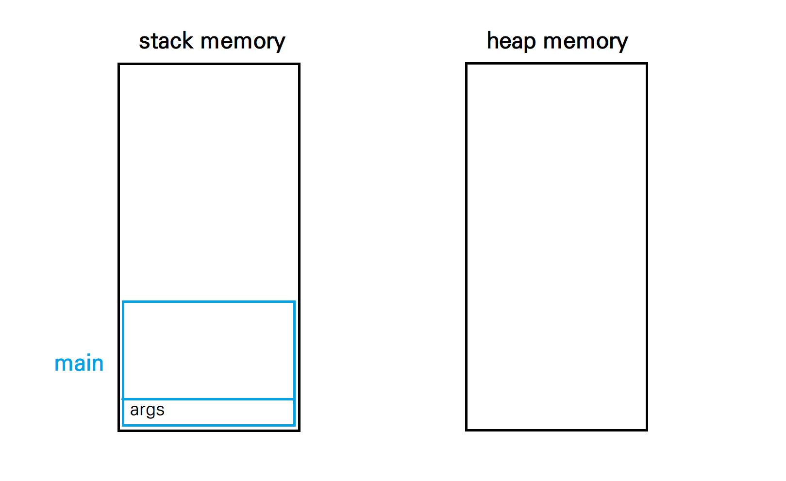
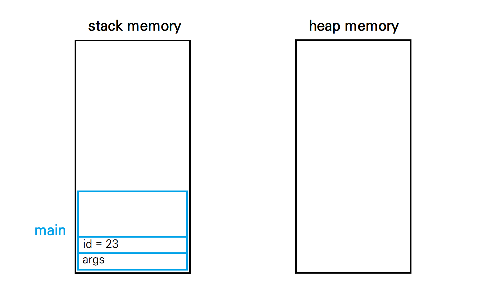
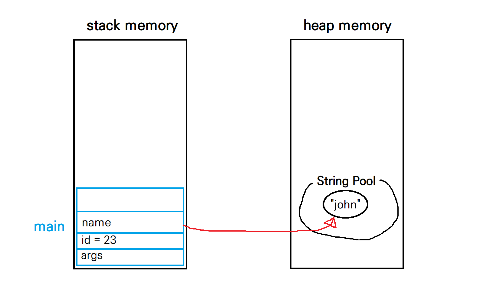
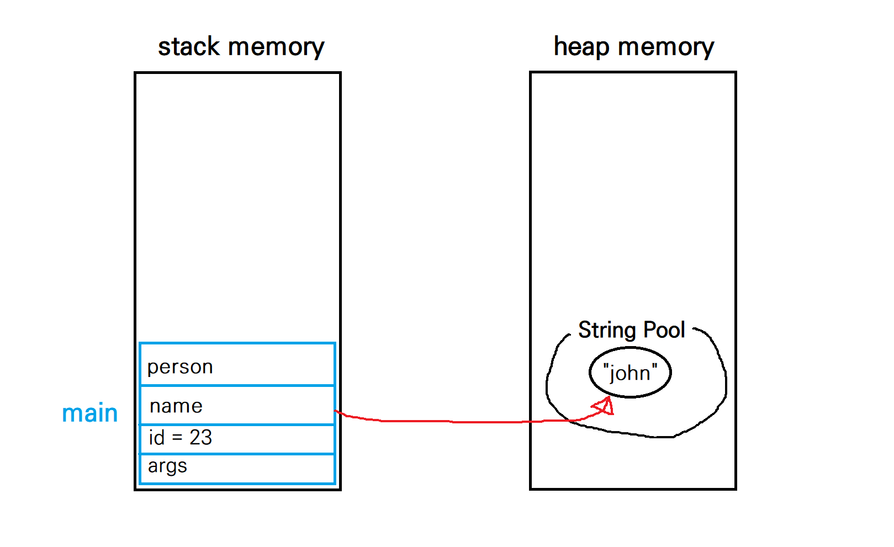
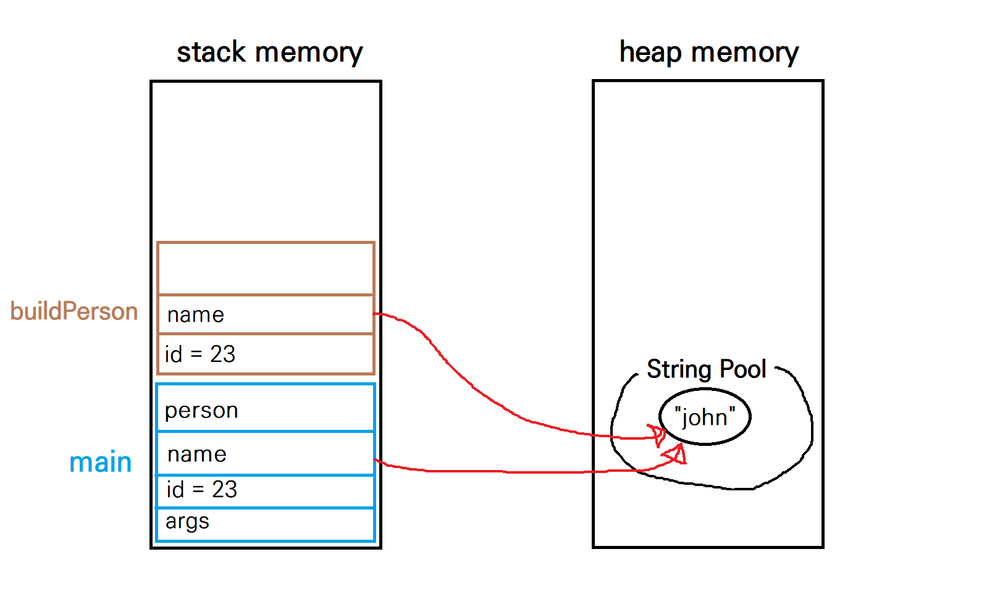
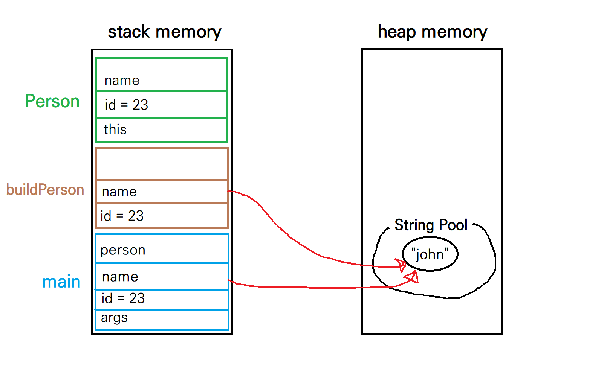
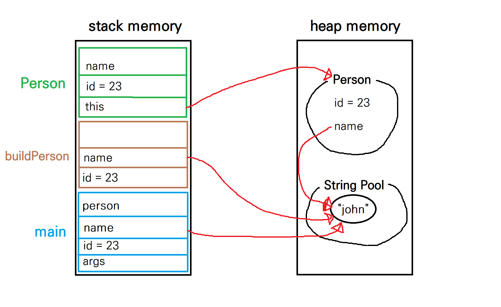
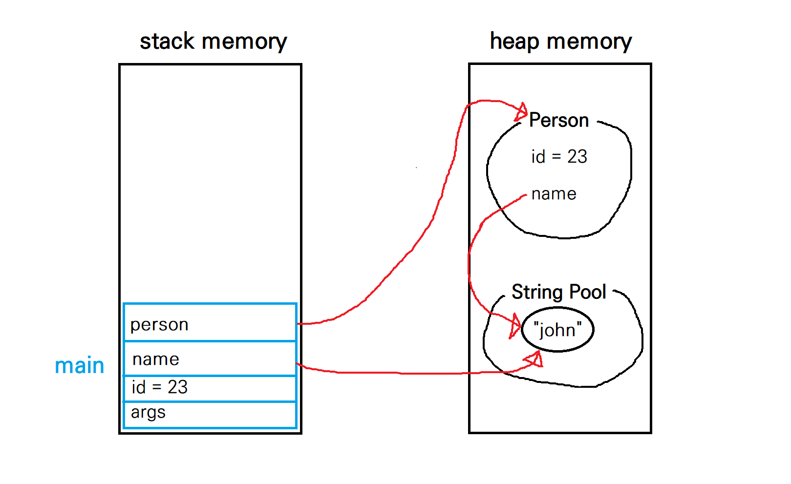

# 메모리 구조


### 스택 메모리와 힙 메모리

애플리케이션이 실행되면 메모리에 할당된다.

JVM은 메모리를 스택 메모리와 힙 메모리로 나누어 관리한다.

**스택 메모리**

- 함수나 메서드가 호출되면, 스택 메모리에 **스택 프레임**이 쌓인다.
- 스택 프레임 내에 **매개변수와 지역변수**가 저장된다.
- 스레드의 수만큼 스택 메모리를 나누어 사용한다.
- 스택 메모리가 가득차면, `java.lang.StackOverFlowError` 에러가 발생한다.

**힙 메모리**

- **생성된 모든 인스턴스**가 저장된다.
- 힙 메모리가 가득차면, `java.lang.OutOfMemoryError` 에러가 발생한다.

<br>

### 스택 메모리 vs 힙 메모리

- 스택 메모리는 thread-safe하지만, 힙 메모리는 thread-safe하지 않다.

  - 스택 메모리는 스레드별로 나누어 사용하며, 하나의 스레드는 다른 스레드의 스택 영역이 접근할 수 없다. 따라서 스택 메모리는 thread-safe하다. 반면 힙 메모리의 데이터는 모든 JVM 스레드가 공유하므로 thread-safe하지 않다.

- 스택 메모리의 접근 속도가 더 빠르다.

- 스택 메모리의 경우, 메서드가 실행을 마치면 해당 메서드에 대한 스택 프레임은 스택 메모리에서 자동으로 사라진다. 반면 힙 메모리에 할당된 객체는 사용이 끝났다고 해서 자동으로 사라지지 않는다. 사용되지 않는 객체를 없애는 일은 **Garbage Collector**가 담당한다.

- cf) Garbage Collection

  - 대표적인 가비지 컬렉션 알고리즘은 **Mark and Sweep**이다. Java와 Javascript에서 해당 알고리즘을 사용한다.
  - 사용되는(reachable) 객체를 표시(**mark**)하고, 사용되지 않는(unreachable) 객체를 제거하는(**sweep**) 방식이다.
  - Q. 객체가 사용되는지 여부는 어떻게 판단하는가?
  - A. 스택 메모리 영역 내의 지역 변수/매개 변수가 참조하는 객체를 표시하고, 다시 그 객체가 참조하는 객체를 표시한다. 이렇게 참조 관계로 연결될 수 있는 모든 객체를 표시한다.

  

<br>

### 동작 설명

실제 코드를 통해 스택 메모리와 힙 메모리가 어떻게 동작하는지 살펴보자.

```java
class Person {
    int id;
    String name;

    public Person(int id, String name) {
        this.id = id;
        this.name = name;
    }
}

public class PersonBuilder {
    private static Person buildPerson(int id, String name) {
        return new Person(id, name);
    }

    public static void main(String[] args) {
        int id = 23;
        String name = "John";
        Person person = null;
        person = buildPerson(id, name);
    }
}

(코드 출처 : https://www.baeldung.com/java-stack-heap)
```

<br>

위 코드가 스택 메모리와 힙 메모리에 저장되는 과정을 정리하면 아래와 같다.

|                                                              |                                                              |
| :----------------------------------------------------------- | :----------------------------------------------------------- |
|                        |                        |
| 1. main 메서드가 실행되면, main 메서드에 대한 스택 프레임이 스택 메모리에 생기며, 매개변수 `args`가 저장된다. | 2. 기본형 변수인 `id`가 main 메서드의 스택 프레임에 저장된다. |
|                        |                        |
| 3. `name`은 참조형 변수이므로, 인스턴스가 힙 메모리에 저장되고, 스택 프레임에는 메모리 주소가 저장된다. `name`은 String을 리터럴 방식으로 생성했으므로, "John"이 힙 메모리의 **String Pool**에 저장된다. | 4. `person`도 참조형 변수이다. 단, `person`에는 null값이 할당되었으므로, 아직 힙 메모리에 Person 객체가 생성되지는 않는다. |
|                        |                        |
| 5. `buildPerson` 메서드가 실행되면, 해당 메서드에 대한 스택 프레임이 스택 메모리에 생긴다. 매개변수 `id`의 값과 `name`의 메모리 주소가 저장된다. | 6. `buildPerson` 메서드에서 다시 `Person` 메서드를 호출하므로, `Person` 메서드에 대한 스택 프레임이 스택 메모리에 생긴다. 스택 프레임에는 `id`의 값과 `name`의 메모리 주소, 그리고 **객체 자신을 가리키는** `this` 변수가 저장된다. |
|                        |                        |
| 7. `Person`은 생성자 메서드이므로, 힙 메모리에 `id`, `name` 정보를 담은 Person 인스턴스가 생성된다. 스택 프레임의 `this` 변수는 해당 인스턴스를 가리키게 된다. | 8. `buildPerson` 메서드가 Person 인스턴스를 반환하므로, main 메서드의 `person`도 새로 생긴 Person 인스턴스를 가리키게 된다. 이후`Person` 메서드와 `buildPerson` 메서드는 실행이 종료되었으므로 스택 메모리에서 사라진다. |


cf) String 객체의 2가지 생성 방식

```java
// 1. 리터럴 방식
String name1 = "john";
String name2 = "john";

// 2. new 연산자
String name3 = new String("john");
String name4 = new String("john");
```

- 리터럴 방식으로 String 객체를 생성하면 힙 메모리의 String Pool에 값이 저장되며, 같은 값은 재사용된다. 위 코드에서, `name1`과 `name2`는 String Pool 내의 같은 값을 가리키게 된다.
- 반면 new 연산자로 String 객체를 생성하면, 매번 힙 메모리에 새로운 String 객체를 생성한다.

```java
System.out.println(name1 == name2);         // true
System.out.println(name1 == name3);         // false
System.out.println(name3 == name4);         // false

System.out.println(name1.equals(name2));    // true
System.out.println(name1.equals(name3));    // true
System.out.println(name3.equals(name4));    // true
```

- java의 참조형 변수에 대하여, **== 연산자**는 주소값을 비교한다. `name1`과 `name2`는 String Pool의 같은 값을 가리킨다. 반면 `name3`과 `name4`는 서로 다른 String 객체를 가리킨다.
- java의 Object 클래스에서 **equals 연산자**는 == 연산자로 구현되어 있다. 하지만 **String 클래스는 equals 연산자를 문자열 값 자체를 비교하도록 재정의한다.** `name1` ~ `name4`의 값은 모두 "john"이므로, equals 연산자의 결과값은 모두 true가 된다.

<br>

### 참고 출처

https://www.youtube.com/watch?v=GIsr_r8XztQ&ab_channel=%EC%89%AC%EC%9A%B4%EC%BD%94%EB%93%9C

https://www.baeldung.com/java-stack-heap

https://go-coding.tistory.com/35
