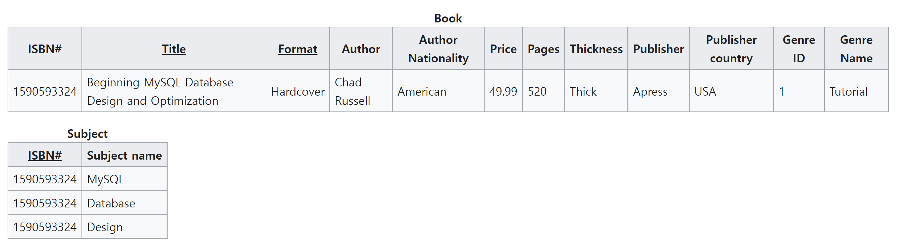

# 정규화와 반정규화

> 함수적 종속성 파트의 테이블을 제외한 모든 이미지의 출처는 위키피디아입니다.

### 이상 현상 (anomaly)

- 테이블 내 데이터의 중복으로 인해, 테이블 조작 시 발생하는 데이터 불일치 현상

- **삽입 이상 (insert anomaly)**
  - 불필요한 데이터를 추가하지 않고는 삽입이 불가능한 상황
  - 위 표에서, Dr. Newsome은 수업을 배정받지 않아서, Course Code가 null이다. 따라서 테이블에 해당 레코드를 삽입할 수 없다.

- **갱신 이상 (update anomaly)**
  - 전체 데이터 중 일부만 변경하여 데이터가 불일치하는 상황
  - 위 표에서, Employee ID가 519인 두 레코드의 Employee Address가 다르다.

- **삭제 이상 (delete anomaly)**
  - 특정 데이터를 삭제할 때, 삭제하면 안 되는 다른 데이터가 함께 삭제되는 상황
  - 위 표에서, ENG-206 수업 데이터를 삭제하면 Dr.Giddens 교수 정보도 함께 삭제된다.

 

### 함수적 종속성 (functional dependency)

`X → Y` : Y는 X에 함수적으로 종속된다

- X의 값 각각에 대하여 항상 Y의 값이 하나만 매핑되어 있다

- X를 **결정자**, Y를 **종속자**라고 한다.

**완전 함수적 종속**

- 종속자가 기본키를 구성하는 모든 속성에 대해 종속된 경우

**부분 함수적 종속**

- 종속자가 기본키를 구성하는 속성 중 일부에만 종속된 경우

**이행 함수적 종속**

- `X → Y`이고 `Y → Z`일 때, `X → Z`가 성립하는 경우

- 위 테이블에서 기본키는 (학번 + 과목번호)이다.
- 점수를 알려면 학번과 과목번호를 모두 알아야 하므로, 점수 속성은 기본키에 **완전 함수적 종속**된 관계다.
- 학년을 알려면 학번만 알아도 되므로, 학년 속성은 기본키에 **부분 함수적 종속**된 관계다.
- 학번을 알면 이름을 알 수 있고, 이름을 알면 학과를 알 수 있다. 따라서 **이행 함수적 종속** 관계가 성립한다.

 

### 정규화 (normalization)

> 이상 현상을 방지하기 위해 데이터 중복을 최소화하는 작업

**제1정규화**

- 테이블의 **각 컬럼이 하나의 값만을 가진다.**

- Before

- After

**제2정규화**

- 제1정규형 만족 + 후보키에 속하지 않는 모든 필드가 기본키에 대하여 **완전 함수적으로 종속한다.**

- Before
  - Price 필드만 {Title, Format}에 종속되어 있고, 그 외의 필드들은 Title에만 종속되어 있다.

- After
  - 완전 함수적 종속성을 만족하기 위해, Title 필드를 기본키로 설정하고, Price 필드는 별도의 테이블로 분리했다.

**제3정규화**

- 제2정규형 만족 + 후보키가 아닌 모든 필드가 기본키에 **이행 함수적으로 종속하지 않는다.**

- Before
  - Author Nationality 필드가 Author 필드에 종속되어 있으며, Author 필드가 Title 필드에 종속되어 있는 등, 이행 함수적 종속 관계가 존재한다.

- After
  - Author 필드와 Genre 필드를 별도의 테이블로 분리하여, 해당 필드들이 기본키(Title)에 이행 함수적으로 종속하지 않도록 만들었다.

**BCNF**

- 제3정규형 만족 + **후보키가 아닌 결정자는 존재하지 않는다.**
- 제3정규형을 만족하면서 BCNF을 만족하지 않는 경우 = 일반 컬럼이 결정자가 되는 경우

- Before
  - 아래 테이블에서 후보키는 {Person, Shop Type}과 {Person, Nearest shop}이다.
  - 모든 필드가 후보키에 포함되므로, 제3정규형을 만족한다.
  - 반면, BCNF를 만족하지 않는다. {Nearest shop}은 후보키가 아님에도, Shop type이 Nearest shop에 종속되므로 결정자에 해당하기 때문이다.

- After
  - 테이블을 분리하여 BCNF의 조건을 만족하도록 했다.

 

### 반정규화 (denormalization)

- 정규화의 단점
  - 릴레이션의 분해로, 릴레이션 간의 JOIN 연산이 많아져 조회 성능이 저하될 수 있다.

- 정규화로 인한 성능 저하가 발생하는 경우, 정규화된 모델에 대하여 다시 릴레이션을 합치는 등 데이터를 중복시키는 **반정규화**를 고려할 수 있다.
- 반정규화의 예시
  - JOIN 연산으로 읽어올 속성을 양쪽 테이블에 함께 저장한다.
  - 빈번하게 접근되는 컬럼과 그렇지 않은 컬럼을 분리한다.
- 장점
  - JOIN 연산이 줄어들기 때문에 조회 성능이 향상된다.
- 단점
  - 데이터 삽입, 수정, 삭제의 성능은 줄어들 수 있다.
  - 데이터의 일관성을 유지하기 위해 추가적인 비용이 필요하다.
  - 데이터를 중복하여 저장하므로 더 많은 저장 공간이 필요하다.

 

### 참고 자료

https://en.wikipedia.org/wiki/Database_normalization

https://en.wikipedia.org/wiki/Boyce%E2%80%93Codd_normal_form

https://dodo000.tistory.com/20?category=760756

https://owlyr.tistory.com/20