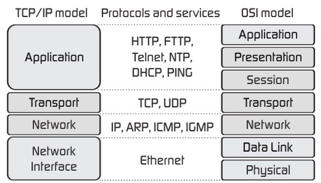

# TCP & UDP

### TCP와 UDP의 위치

- **OSI 7계층**과 **TCP/IP 4계층**은 모두 계층적 네트워크 모델이다.

- OSI 7계층이 역할 기반이라, TCP/IP 4계층은 프로토콜 기반이다.

- TCP와 UDP는 OSI 7계층과 TCP/IP 4계층에서 모두 **전송 계층**에 해당한다.

 

### TCP vs UDP

- TCP는 연결지향형 프로토콜이고, 순서를 보장하며, 데이터의 전송을 보장한다.
  - HTTP 통신, 이메일, 파일 전송 등에 사용된다.
  - 단, HTTP/3은 UDP를 사용한다.
- UDP는 비연결지향형 프로토콜이고, 순서를 보장하지 않으며, 데이터의 전송을 보장하지 않는다.
  - 실시간 스트리밍, DNS 등에 사용된다.
    - Q. DNS에서 UDP를 사용하는 이유는 무엇인가?
    - DNS는 신뢰성보다 속도가 더 중요하기 때문이다. 도메인 이름에 해당하는 IP 주소를 못 찾으면, 다시 탐색하면 된다.
    - DNS는 연결 상태를 유지할 필요가 없기 때문이다. 
    - 단, DNS에서는 응답 데이터 크기가 512byte를 넘어가면 TCP를 사용한다.
    - UDP 데이터가 512byte 이하면, DNS 패킷이 전송 중 쪼개졌더라도 다시 재조립될 수 있기 때문이다.
  - 실시간 스트리밍 서비스의 경우에도 많은 경우 TCP를 사용한다.
- UDP는 TCP보다 빠르다.

 

### 3-way handshake

> TCP의 연결 성립 과정

1. 클라이언트가 서버에게 요청의 의미로 **SYN** 플래그 전송
2. 서버는 클라이언트의 요청을 수락하는 의미로 **SYN + ACK** 플래그 전송
3. 클라이언트는 최종 수락의 의미로 **ACK** 플래그 전송

**cf) HTTP vs HTTPS**

- HTTPS는 HTTP와 달리 **SSL**을 사용한다. 
  - 데이터를 안전하게 전송하기 위한 보안 프로토콜

  - Q. SSL은 OSI 7계층 중 어디에 속하는가?
  - SSL은 7계층 중 특정 계층이 아니라, 응용계층(HTTP)과 전송계층(TCP) 사이에 독립적인 계층을 형성한다.

- HTTPS는 3-way handshake 이후, **SSL Handshake**를 함께 진행한다.
  - (SSL Handshake의 구체적인 과정 추가 예정)

- SSL 인증 절차
  - 서버는 인증기관에 사이트 정보를 제공하여, SSL 인증서를 받는다.
  - 브라우저는 서버로부터 SSL 인증서를 받는다.
  - 브라우저는 받은 SSL 인증서를 인증기관에 요청한다.
  - SSL 인증서가 검증되었다면, 이제 서버를 신뢰할 수 있다.

 

### 4-way handshake

> TCP의 연결 해제 과정

1. 클라이언트가 서버에게 **FIN** 플래그 전송
2. 서버는 확인의 의미로 클라이언트에게 **ACK ** 플래그로 답장
   - 남은 데이터를 마저 보내기 위해 **CLOSE_WAIT** 상태로 전환
3. 데이터를 모두 보냈다면, **FIN** 플래그를 클라이언트에게 전송
4. 클라이언트는 확인의 의미로 **ACK** 플래그를 서버로 전송
   - 추가 데이터를 대기하기 위해 **TIME_WAIT** 상태로 전환

 

### 참고 출처

https://velog.io/@hidaehyunlee/TCP-%EC%99%80-UDP-%EC%9D%98-%EC%B0%A8%EC%9D%B4

https://serverfault.com/questions/587625/why-dns-through-udp-has-a-512-bytes-limit

https://aws-hyoh.tistory.com/entry/HTTPS-%ED%86%B5%EC%8B%A0%EA%B3%BC%EC%A0%95-%EC%89%BD%EA%B2%8C-%EC%9D%B4%ED%95%B4%ED%95%98%EA%B8%B0-3SSL-Handshake
