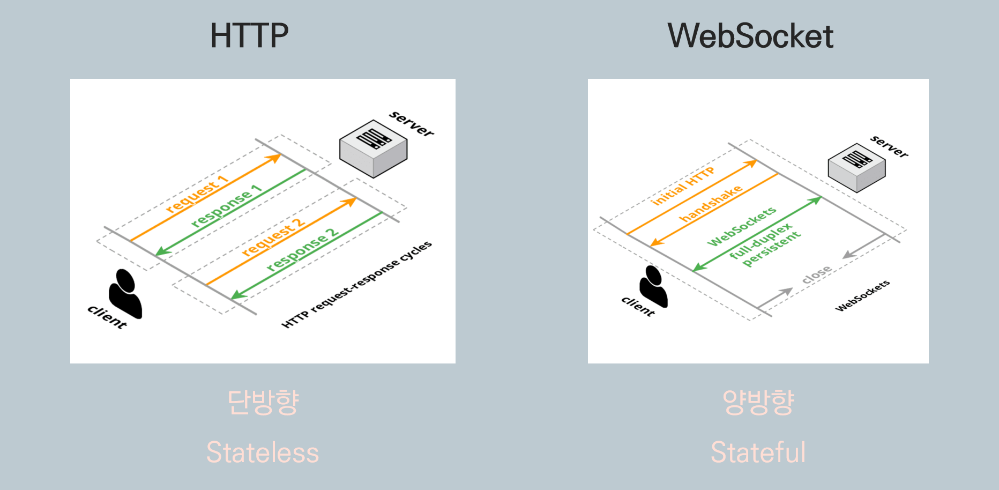
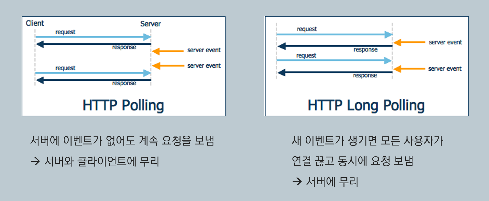
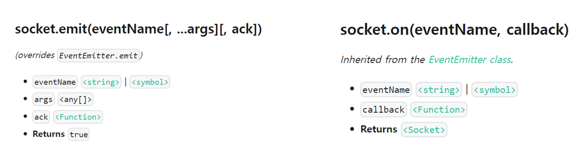
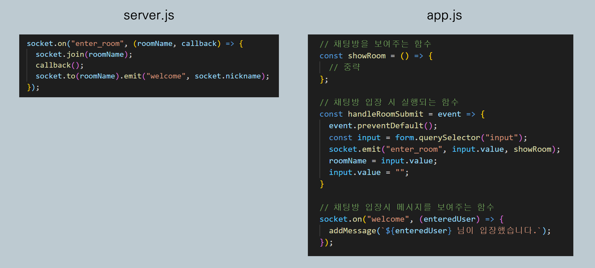

# WebSocket과 socket.io

웹소켓과 socket.io에 대해 알게 된 내용을 정리해보았다.

## HTTP vs WebSocket

(내부 이미지 출처 : https://stackoverflow.com/questions/14703627/websockets-protocol-vs-http)

#### HTTP

- `단방향(Unidirectional)` : 클라이언트가 서버에 request를 보내면 서버는 그에 대해서 response만 할 수 있을뿐, 요청이 오지도 않았는데 서버가 클라이언트한테 메시지를 보낼 수는 없다.

- `무상태(Stateless)` : 서버가 클라이언트의 정보를 저장하지 않는다.

#### WebSocket

- `양방향(Bidirectional)` : 클라이언트와 서버가 Opening handshake를 해서 웹소켓 연결이 되면, 이후로는 양방향 소통이 가능해진다. 클라이언트에서 서버로 메시지를 보낼 수도 있지만, 반대로 서버에서도 (클라이언트의 요청이 없어도) 클라이언트에 메시지를 보낼 수 있다.

- `상태 유지(Stateful)` : 웹소켓 연결 이후, 클라이언트와 서버는 계속 같은 라인을 사용해 통신한다. 서버가 클라이언트의 정보를 알고 있기 때문에, 매번 헤더에 클라이언트 정보를 담아서 보낼 필요가 없다.

 

## WebSocket의 탄생 배경

위에서 살펴본 것처럼, 웹소켓과 달리 HTTP는 단방향으로 통신이 이루어지므로, 실시간 통신을 구현하기 어렵다. 하지만 웹소켓의 등장 이전에, HTTP를 통해 실시간 통신을 구현하고자 하는 시도들이 있었다. 

(내부 이미지 출처 : https://adrenal.tistory.com/20)

#### HTTP Polling

- 일정 시간 간격으로 request를 보내서 response를 받는다. 

- 수강신청할 때, 빈자리가 남았는지 확인하려고 계속 새로고침을 누르는 것에 비유할 수 있다.

- 수강신청할 때 새로고침만 누르고 있는 것이 그렇듯, 서버에서 이벤트가 발생하지도 않는데 계속 request를 보내게 되면 비효율적이다.

#### HTTP Long Polling

- request를 보낸 뒤, 서버에서 클라이언트로 전달할 이벤트가 있을 때까지 기다린다. 서버에서 이벤트가 발생하면 클라이언트로 response를 보낸다. 그러면 클라이언트에서는 바로 다시 서버로 request를 보낸 뒤 기다린다.

- `HTTP Polling`보다는 나을 수 있지만, 새 이벤트가 생기면 모든 사용자가 연결을 끊고 동시에 request를 보내므로 비효율적이다.

HTTP 방식의 이러한 이러한 한계를 극복하기 위해 나온 것이 바로 `WebSocket`이다.

#### WebSocket

- 실시간 양방향 소통을 위한 프로토콜

- 채팅 앱, 실시간 주식 차트 등에서 주로 쓰인다.

- 주의) 웹소켓이 HTTP의 한계를 극복하기 위해등장했다고 해서, 반드시 `HTTP long polling` 등의 방식보다 낫다는 것은 아니다. 장단점이 있으므로 구현하고자 하는 서비스에 따라 더 나은 선택지는 다를 수 있다.

 

## socket.io

> 실시간 양방향 소통을 위한 프레임워크

- `WebSocket`은 프로토콜, `socket.io`는 프레임워크

- 브라우저가 `WebSocket`을 지원하면 `WebSocket`을 사용하고, 지원하지 않으면 `Http Long Polling`을 사용한다.

#### emit과 on

- `emit`
  - 첫번째 인자로 이벤트 이름을 받아서, 해당 이벤트를 서버로 보낸다.

  - 두번째 인자부터는 여러 인자가 들어갈 수 있고, 마지막에는 콜백 함수도 들어갈 수 있다. (콜백 함수는 반드시 마지막에 넣어야 한다.) 그러면 이벤트를 발생시킬 때, 해당 인자들을 함께 보낸다.

- `on`
  - `addEventListener`와 유사하게 동작한다.

  - 첫번째 인자에 해당하는 이벤트가 발생하면, 그 뒤의 콜백 함수가 실행된다.

- `emit`과 `on`은 클라이언트와 서버에서 모두 사용 가능하다. 클라이언트에서 `emit`으로 넘긴 이벤트를 서버에서 `on`으로 listen할 수도 있지만, 그 반대도 가능하다.

실제 코드를 통해 살펴보자.

`app.js`에서 유저가 채팅방에 입장하면 `handleRoomSubmit` 함수가 실행된다. 해당 함수에서는 `enter_room`이라는 이름으로 이벤트를 넘기는데, 채팅방 이름과 `showRoom`이라는 함수를 함께 넘겨준다. 

이제 `server.js`에서 `enter_room`이라는 이벤트를 listen해서, 그 뒤의 콜백 함수가 실행된다. `roomName`과 `callback`은 각각 채팅방 이름과 `showRoom` 함수를 받는다. `socket.join(roomName)`은 채팅방에 접속하는 부분이다. 그리고 `callback()`으로 함수를 실행시킨다. 

이 부분이 신기한 부분인데, `server.js`에서 `callback()`으로 함수를 호출하면, 해당 함수가 `server.js`가 아니라 `app.js`에서 실행된다. 백엔드에서 호출한 함수가 실제로는 프론트엔드에서 실행되는 것이다. 아까 `showRoom` 함수를 넘겨주었으므로, `app.js`의 `showRoom` 함수가 실행된다.

그리고 `server.js`의 다음 줄 코드가 실행된다. `welcome`이라는 이름으로 이벤트를 넘기면, `app.js`에서 해당 이벤트를 listen하는 코드가 실행된다.

 

## 참고 자료

[노마드코더 - 줌 클론코딩 강의](https://nomadcoders.co/noom/lobby)

[socket.io 공식문서](https://socket.io/docs/v4/)

[깜찍한 프로그래머들을 위한 간단한 프로그래밍 상식(2–2. HTTP를 넘어서.. 실시간 네트워킹 websocket)](https://medium.com/@icehongssii/%EA%B9%9C%EC%B0%8D%ED%95%9C-%ED%94%84%EB%A1%9C%EA%B7%B8%EB%9E%98%EB%A8%B8%EB%93%A4%EC%9D%84-%EC%9C%84%ED%95%9C-%EA%B0%84%EB%8B%A8%ED%95%9C-%ED%94%84%EB%A1%9C%EA%B7%B8%EB%9E%98%EB%B0%8D-%EC%83%81%EC%8B%9D-2-2-http%EB%A5%BC-%EB%84%98%EC%96%B4%EC%84%9C-%EC%8B%A4%EC%8B%9C%EA%B0%84-%EB%84%A4%ED%8A%B8%EC%9B%8C%ED%82%B9websocket-c49125e1b5a0)

[WebSockets protocol vs HTTP (Stack overflow)](https://stackoverflow.com/questions/14703627/websockets-protocol-vs-http)

[webSocket 으로 개발하기 전에 알고 있어야 할 것들](https://adrenal.tistory.com/20)
