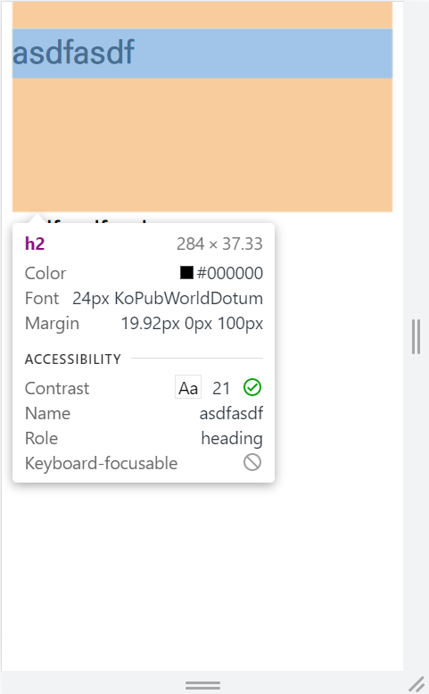
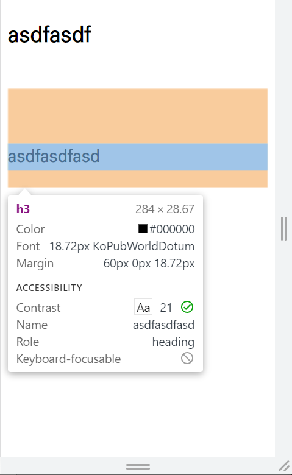
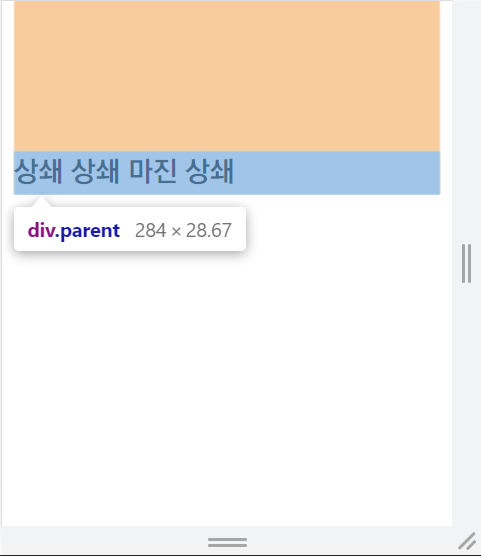
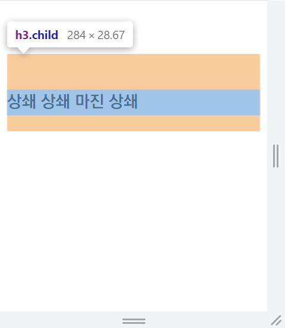
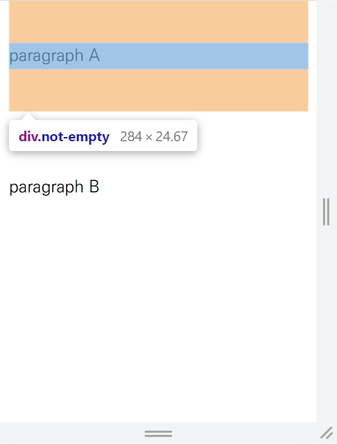
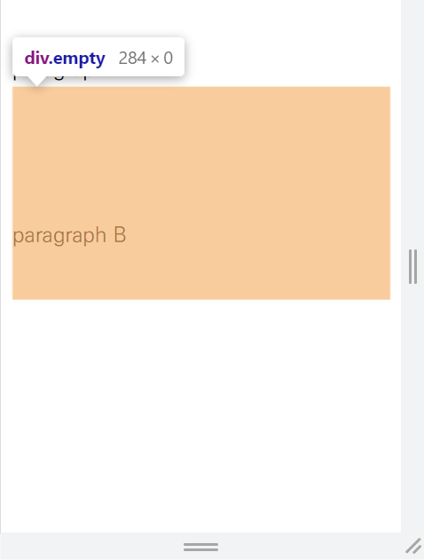
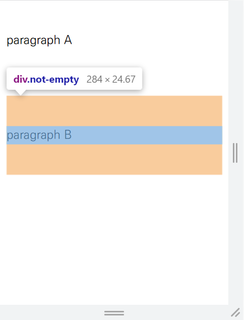

# 마진 상쇄

> 여러 블록의 위쪽 및 아래쪽 바깥 여백(마진)이 경우에 따라 제일 큰 여백의 크기를 가진 단일 여백으로 결합(상쇄)되는 현상 (출처: MDN)

<br>

## 언제 발생하는가?

#### 1. 인접 형제일 때

```html
<style>
  h2 {
    margin-bottom: 100px;
  }

  h3 {
    margin-top: 60px;
  }
</style>

<div class="test">
  <h2>asdfasdf</h2>
  <h3>asdfasdfasd</h3>
</div>
```

<p align="center">
  
  
</p>

- h2의 `margin-bottom`은 100px, h3의 `margin-top`은 60px이다.

- 하지만 둘의 간격은 100px과 60px를 더한 값이 아니라, 둘 중 더 큰 값이다.

- 이처럼 `margin-top`과 `margin-bottom`이 겹칠 때, 더 큰 값으로 상쇄되는 현상이 **마진 상쇄**다.

<br>

#### 2. 부모와 자손을 분리하는 컨텐츠가 없을 때

```html
<style>
  .parent {
    margin-top: 100px;
  }
  .child {
    margin-top: 60px;
  }
</style>

<div class="parent">
  <h3 class="child">상쇄 상쇄 마진 상쇄</h3>
</div>
```

<br>

<p align="center">
  
  
</p>

- div의 `margin-top`과 h3의 `margin-top` 사이에 마진 상쇄가 발생한다.

- 위 예시가 보여주듯이, 마진 상쇄는 같은 방향으로도 발생 가능하다.

<br>

#### 3. 빈 블록일 때

**빈 블록**?

border, padding, 인라인 콘텐츠, height, min-height, max-height가 없는 경우. 

쉽게 말해 높이가 0인 경우.

```html
<style>
  .not-empty {
    margin: 40px 0px;
  }  

  .empty {
    margin-top: 60px;
    margin-bottom: 100px;
  }
</style>

<div class="not-empty">paragraph A</div>
<div class="empty"></div>
<div class="not-empty">paragraph B</div>
```

<p align="center">
  
  
  
</p>

- 1번에서 살펴본 내용에 따라, 첫 번째 div의 `margin-bottom`과 두 번째 div의 `margin-top`이 상쇄되고, 두 번째 div의 `margin-bottom`과 세 번째 div의 `margin-top`이 상쇄된다.

- 하지만 상쇄가 발생하더라도, 두 번째 div의 `margin-top`과 `margin-bottom`의 합은 160px이므로, 첫 번째 div와 세 번째 div는 160px만큼 떨어져 있어야 한다. 하지만 실제로는 100px만 떨어져 있다.

- 이는 높이가 0인 두 번째 div의 `margin-top`과 `margin-bottom` 사이에 다시 상쇄가 발생했기 때문이다.

- 위 예시가 보여주듯이, 빈 블록의 경우 자기 자신의 `margin-top`과 `margin-bottom`끼리도 상쇄될 수 있다.

<br>

## 마진 상쇄의 규칙들

- `float` 요소와 `display` 속성이 `absolute`인 요소의 여백은 상쇄되지 않는다.

- 마진 상쇄는 수직적으로만 일어난다. `margin-left`와 `margin-right`가 상쇄되는 경우는 없다.

- 마진 상쇄는 인접한 요소 사이에서만 발생한다.

- 3개 이상의 마진도 상쇄될 수 있다.

<br>

## 참고 출처

https://developer.mozilla.org/ko/docs/Web/CSS/CSS_Box_Model/Mastering_margin_collapsing

https://www.joshwcomeau.com/css/rules-of-margin-collapse/#nesting-doesnt-prevent-collapsing