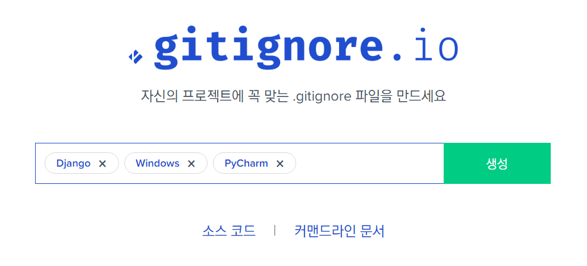

# [Django] before initial commit

Django에서 처음 프로젝트를 시작하고, initial commit을 하기 전에 하면 좋을 것들을 정리해보았다.

<br>

### 가상환경 설정 및 django 설치

```bash
# 가상환경 생성
python -m venv venv

# 가상환경 실행
source venv/Scripts/Activate

# django 설치
pip install django
````

<br>

### 프로젝트 시작

```bash
django-admin startproject <프로젝트 이름>
```

- 새로운 폴더를 만들지 않고 현재 폴더에 바로 프로젝트를 생성하려면 뒤에 `.`을 붙인다.

```bash
django-admin startproject <프로젝트 이름> .
```

<br>

### requirements.txt

`requirements.txt` 파일에는 프로젝트에 필요한 모든 라이브러리를 저장한다.

```bash
# 아래 명령어를 사용하면 현재 설치된 라이브러리를 requirements.txt 파일에 한번에 저장할 수 있다.

pip freeze > requirements.txt
```

만약 개발용/배포용/테스트용 등 여러 버전을 만들 생각이라면, requirements.txt도 미리 나누어두면 좋다. 아래 예시에서는 requirements 폴더 안에 공통 라이브러리를 저장하는 common.txt와, common.txt를 상속받는 버전별 파일들을 만들었다. dev.txt는 개발용 파일, prod.txt는 배포용 파일이다.

<p align="center">
  
</p>

<br>

### .gitignore

보안 등의 이유로 git 원격저장소에 올리지 말아야 하는 파일들도 있다. `.gitignore` 파일에 git에 올리면 안 되는 파일들을 명시해두면, git add를 하더라도 해당 파일들은 add가 되지 않는다.

`.gitignore` 파일은 프로젝트 최상단 디렉토리에 만든다.


<p align="center">
  
</p>

https://gitignore.io/ 

위 사이트에서 `.gitignore` 파일에 작성할 내용을 알 수 있다. 예를 들어 Windows 운영체제에서 Pycharm으로 django 프로젝트를 만들었다면, 아래와 같이 검색한 다음 나온 내용을 그대로 `.gitignore` 파일에 추가하면 된다.

<p align="center">
  
</p>

<br>

### localization

`settings.py`에서 언어와 시간대를 지정할 수 있다.

```python
# 기본 설정

LANGUAGE_CODE = 'en-us'

TIME_ZONE = 'UTC'
```

```python
# 한국어 / 서울 표준시

LANGUAGE_CODE = 'ko-kr'

TIME_ZONE = 'Asia/Seoul'
```

<br>

### static, media 파일 경로 설정

**static 파일**은 개발자가 미리 준비해둔 파일로, 배포 이후 변경되지 않는 파일이다. 반면 **media 파일**은 사용자들이 업로드하는 파일이다. 프로젝트 시작 후, static/media 파일의 경로를 지정해주어야 한다. settings.py 파일의 맨 아래에 아래와 같이 작성하면 된다.

```python
STATIC_URL = '/static/'
STATICFILES_DIRS = [
]
STATIC_ROOT = os.path.join(BASE_DIR, 'static')

MEDIA_URL = '/media/'
MEDIA_ROOT = os.path.join(BASE_DIR, 'media')
```

(물론 os가 임포트되지 않았다면 임포트해주어야 한다.)

<br>

그리고 프로젝트 폴더의 urls.py에 아래와 같이 작성한다.

```python
if settings.DEBUG:
    urlpatterns += static(settings.MEDIA_URL, document_root=settings.MEDIA_ROOT)
```

static 폴더에 파일들을 넣고 사용하려면 STATICFILES_DIR을 설정해야 한다. 아래에서는 프로젝트 폴더 안에 static 파일을 추가하고, 경로를 지정해주었다.

<p align="center">
  
</p>

<br>

### SECRET_KEY 제외하기

settings.py의 SECRET_KEY(비밀키)는 보안에 활용되므로, 원격저장소에 올릴 경우 보안상의 문제가 발생할 수 있다. 그렇다면 이 내용을 깃허브에 push하지 않으려면 어떻게 해야 할까? 물론 settings.py 자체를 .gitignore에 추가할 수도 있지만, 여러 사람이 공동으로 프로젝트를 진행할 때 이러한 방식은 적절하지 안흥ㄹ 것이다. 

settings.py는 커밋하되 SECRET_KEY는 노출시키지 않으려면, SECRET_KEY를 따로 `.env` 파일에 저장한 다음, `.env`만 .gitignore에 추가하면 된다. 

settings.py에서는 `str(os.getenv('SECRET_KEY'))`를 통해 `.env`에 저장된 SECRET_KEY를 가져오게 하고, settings.py만 git push를 하면 settings.py 파일을 푸시하면서도 SECRET_KEY를 노출시키지 않을 수 있다.

<p align="center">
  
</p>

<br>

### django-debug-toolbar

django debug toolbar는 django 개발 시 편리하게 디버그를 할 수 있게 해주는 툴바다. 다음의 순서로 설정하면 된다.

1. django-debug-toolbar 설치

```bash
pip install django-debug-toolbar
```

2. settings.py 설정

```python
INSTALLED_APPS = [
    # ...
    'debug_toolbar',
    # ...
]
```

```python
MIDDLEWARE = [
    # ...
    'debug_toolbar.middleware.DebugToolbarMiddleware',
    # ...
]
```

```python
# 초기 설정에는 INTERNAL_IPS 자체가 없으므로 settings.py 맨 아래에 직접 추가한다.

INTERNAL_IPS = [
    # ...
    '127.0.0.1',
    # ...
]
```

3. urls.py 설정

- `if settings.DEBUG:` 내부에 아래 코드를 추가한다.

```python
urlpatterns += [
    path('__debug__/', include(debug_toolbar.urls)),
]
```

- 설정 후 urls.py 전체는 다음과 같다.

```python
from django.conf import settings
from django.conf.urls.static import static
from django.contrib import admin
from django.urls import path, include

urlpatterns = [
    path('admin/', admin.site.urls),
]

if settings.DEBUG:
    import debug_toolbar
    urlpatterns += [
        path('__debug__/', include(debug_toolbar.urls)),
    ]
    urlpatterns += static(settings.MEDIA_URL, document_root=settings.MEDIA_ROOT)
```

4. requirements 설정

requirements.txt에 django-debug-toolbar를 추가한다. `pip freeze` 명령을 통해 추가해도 되고, 직접 추가해도 된다. 보통 디버그는 개발 시에만 하므로, 개발용 버전에만 추가하는 것이 좋다.

<br>

### 기타 설정

- `python manage.py migrate` 명령으로 초기 마이그레이션을 해준다.

- `python manage.py createsuperuser` 명령으로 관리자 계정을 생성한다.

- `python manage.py runserver` 명령으로 서버가 돌아가는지 확인한다.

- 아래와 같은 쓸데없는 주석들을 지운다.

<p align="center">
  
</p>

<br>

### 최초 커밋

이제 initial commit을 하면 된다.

- `git init` : 깃 저장소 생성

- `git add .` : working directory 내용을 staging area에 추가

- `git commit -m "initial commit"` : 최초 커밋

<br>

### 참고 출처

[django 공식 문서](https://docs.djangoproject.com/en/3.2/)

[인프런 - 파이썬/장고 웹서비스 개발 완벽 가이드 with 리액트 강의](https://www.inflearn.com/course/%ED%8C%8C%EC%9D%B4%EC%8D%AC-%EC%9E%A5%EA%B3%A0-%EC%9B%B9%EC%84%9C%EB%B9%84%EC%8A%A4)

[django-debug-toolbar 공식 문서](https://django-debug-toolbar.readthedocs.io/en/latest/index.html)