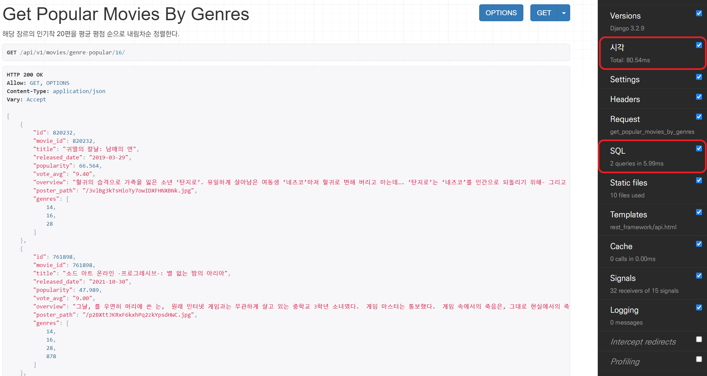

# prefetch_related를 통한 성능 개선

### 상황 분석

아래 코드와 같이, 장르별로 인기작 20편을 평균 평점이 높은 것부터 차례대로 보여주는 API를 구현했다. 

```python
@api_view(['GET'])
@permission_classes([AllowAny])
def get_popular_movies_by_genres(request, genre_id):
    popular_movies_by_genre = (
        Movie.objects
            .filter(genres=genre_id)
            .order_by('-vote_avg')[:20]
    )
```

그런데 10,000개 가까이 되는 영화 데이터에서 쿼리문을 돌리기 때문에, 많은 시간이 소요될 것으로 예상되었다. 실제로 django debug toolbar를 통해 살펴보니, 애니메이션 장르를 기준으로 쿼리를 돌렸을 때 21개의 쿼리가 실행되었으며, 450~650ms 사이의 시간이 소요되었다. 


<br>

### 성능 최적화

django에서는  `prefetch_related` 메서드와 `select_related` 메서드를 통해 성능을 향상시킬 수 있다. 둘 모두 쿼리셋과 관련된 objects들을 미리 불러오는 **Eager Loading** 방식을 통해 쿼리 호출 횟수를 줄이고, 이를 통해 성능을 향상시킨다.

- `select_related`는 1:1 관계나 1:N 관계의 N에서 사용 가능하다.
- `prefetch_related`는 1:N 관계의 1이나 M:N 관계에서 사용 가능하다.

Movie와 Genre는 M:N 관계이므로, `prefetch_related`를 통해 최적화를 시도했다.

```python
@api_view(['GET'])
@permission_classes([AllowAny])
def get_popular_movies_by_genres(request, genre_id):
    popular_movies_by_genre = (
        Movie.objects
            .filter(genres=genre_id)
        	.prefetch_related('genres')  # 추가된 부분
            .order_by('-vote_avg')[:20]
    )
```

`prefetch_related` 추가 후  다시 애니메이션 장르를 기준으로 쿼리를 돌리니, 단 2개의 쿼리가 실행되었으며, 80~110ms 사이의 시간이 소요되었다.



최적화에 성공했다!

<br>


### 참고 출처

https://leffept.tistory.com/312?category=950490