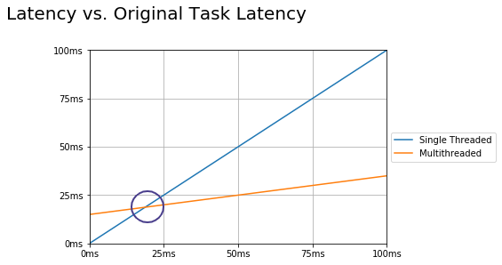

## 멀티스레딩에서의 성능

- **Latency (지연 시간)**
  - 하나의 작업을 처리하는 데 걸리는 시간
- **throughput (처리량)**
  - 단위 시간동안 완료하는 작업의 양

- **멀티스레딩에서 성능을 높인다 = 지연 시간을 줄이고 처리량을 늘린다**

 

## Latency (지연 시간)

> 하나의 작업을 처리하는 데 걸리는 시간

- 이론적으로는 N개의 스레드에서 작업을 하면 지연 시간은 N분의 1이 된다.

- 하지만 실제로 이를 적용하기 위해서는 몇 가지 질문을 생각해보아야 한다.
- 질문 1) 작업을 몇 개의 스레드로 나눌 수 있는가?
  - 이론적으로는 코어의 개수가 N개라면, N개의 스레드를 완전히 병렬로 실행할 수 있다.
  - 스레드가 N + 1개가 되면, context switching이나 캐시 성능 저하 등으로 인해 생산성이 떨어진다.
  - 단, 코어의 개수만큼 스레드를 사용하여 최적의 효과를 내기 위해서는, 모든 스레드가 interruption 없이 실행되어야 한다.
  - 또한 최근에는 코어 하나가 둘 이상의 스레드를 동시에 실행하는 **hyperthreading** 방식이 많이 사용된다.
- 질문 2) 작업을 하위 작업으로 나누고 다시 합치는 비용은 얼마인가?
  - 크게 아래와 같이 나눌 수 있다.
    - 작업을 여러 하위 작업으로 나누는 비용
    - 스레드를 생성하고 스레드에 작업을 할당하는 비용
    - 운영체제가 스레드를 스케줄링하여 스레드가 실행되기까지의 시간
    - 마지막 스레드가 작업을 마친 뒤 신호를 보낼 때까지 기다리는 시간
    - 통합 스레드가 신호를 받아 다시 실행되는 시간
    - 하위 결과들을 하나의 결과로 합치는 시간

- 위 그래프에서 x축은 Original Task Latency다. 
  - 멀티스레딩에서도 작업이 커짐에 따라 latency가 증가하지만 증가하는 정도는 싱글스레드에 비해  훨씬 작다. 
  - 그래프에서의 교차점을 기준으로 싱글스레드 혹은 멀티스레드를 선택할 수 있다.
- 질문 3) 어떤 작업이든 하위 작업으로 나눌 수 있는가?
  1. Parallelizable Tasks
     - 병행 가능하며 하위 작업으로 쉽게 분할되는 작업
  2. Unbreakable, Sequential Task
     - 분할이 불가능하여 싱글 스레드만 가능한 작업
  3. Partially Parallelizable, Partially Sequential
     - 부분적으로만 병행 가능한 작업

 

## Throughput (처리량)

> 단위 시간(주로 1초) 동안 완료하는 작업의 양

- 처리량을 높이기 위한 2가지 접근법
  1. 작업을 하위 작업으로 나누기
     - N개의 스레드에서 동시에 작업을 처리하면, 이론적으로 처리량도 N배가 된다.
     - 단, 앞서 latency 파트에서 살펴본 것처럼 작업을 하위 작업으로 나누고 다시 합칠 때 비용이 든다.
  2. 각 작업을 별개의 스레드에서 처리하기
     - 작업을 하위 작업으로 나누고 다시 합치는 비용이 없으므로, 최적에 가까운 처리량을 얻을 수 있다.
- **Thread Pooling**
  - 스레드를 미리 생성하여 풀에 저장한 뒤, 각 작업이 대기열을 통해 스레드별로 분배된다.
  - 스레드 풀을 사용하여, 스레드의 개수를 유지하며, 스레드를 생성하고 종료시키는 비용을 아낄 수 있다.

