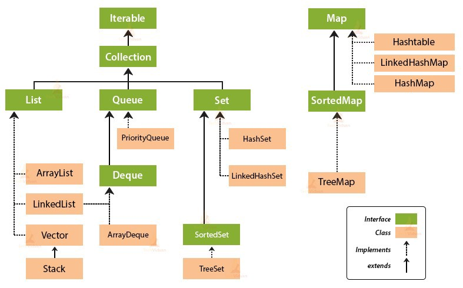

# Collections Framework


### Java Collections Framework

- **Collection**
  - 여러 원소를 담을 수 있는 자료구조

- **Java Collections Framework**

  - 흔히 재사용되는 collection 자료구조를 구현한 클래스와 인터페이스의 집합

  - 프레임워크지만, 실제로는 라이브러리의 방식으로 동작한다.

- **vs 배열(Array)**

  - 배열(Array)은 인스턴스 생성시 크기를 지정해야 하지만, Collections는 크기를 지정할 필요가 없으며, 값을 추가/삭제함에 따라 크기가 동적으로 변한다.
    - 클래스별 default capacity는 아래와 같다. (단, Java 버전별로 차이가 있을 수 있다.)
      - Vector, ArrayList = 10
      - HashMap, HashTable, HashSet = 16
      - LinkedList, TreeSet = empty

  - 배열과 달리 Collections는 기본 자료형을 원소로 가질 수 없다. (기본 자료형 대신 wrapper 클래스 값을 원소로 가질 수 있다.)

<br>

### Collections 프레임워크 구조



(이미지 출처 : https://silvahansini.medium.com/an-introduction-to-the-collection-framework-in-java-d13e30530161)

**List**

- 순서가 유지되며, 중복이 허용된다.
- 인덱스로 원소에 접근할 수 있다.

**Queue**

- 중복이 허용된다.
- 먼저 들어간 것이 먼저 나오는 선입선출(FIFO) 자료구조

**Deque**

- Stack + Queue
- 앞, 뒤에서 데이터를 추가하거나 삭제할 수 있다.

**Set**

- List와 달리 순서가 없으며, 중복이 허용되지 않는다.
- 집합 연산이 가능하다.
  - 합집합 : `addAll`
  - 교집합 : `retainAll`
  - 차집합 : `removeAll`
  - 부분집합 : `containsAll`

**Map**

- key, value 쌍으로 값을 저장한다.
  - key와 value로 구성되는 데이터를 **Entry**라고 한다.
- key는 중복될 수 없지만, value는 중복될 수 있다.

<br>

### ArrayList vs LinkedList

> 시간 복잡도는 평균 시간 복잡도 기준

- **ArrayList**는 동적 배열 자료구조로 구현된다.
  - `add(element)` - `O(1)`
    - 단, 용량이 차서 새로운 배열을 만들어야 하는 경우 `O(N)`
  - `add(index, element)`, `remove(index)` - `O(N)`
    - 삽입/삭제한 값 이후의 모든 값의 위치를 이동시켜야 하므로
  - `get(index)` - `O(1)`
  - `indexOf(object)`, `contains(object)` -  `O(N)`
    - 배열 전체를 돌며 값을 비교해야 하므로
- **LinkedList**는 이중 연결 리스트 자료구조로 구현된다.
  - `add(element)` – `O(1)`
  - `add(index, element)`, `remove(index)` – 탐색 시간 + `O(1)`
    - 탐색 시간 : 연결 리스트의 원하는 위치로 이동하는 시간
    - 단, 첫번째 / 마지막 값을 삽입/삭제하는 경우 `O(1)`
  - `get(index)` – `O(n)`
  - `contains(object)` - `O(n)`
- 시간복잡도에서 다른 부분을 정리하면 아래와 같다.
  - 인덱스를 통해 값을 탐색하는 경우 => ArrayList는 `O(1)`, LinkedList는 `O(N)`
  - 값을 삽입/삭제하는 경우 =>  ArrayList는 `O(N)`, LinkedList는 탐색 시간 + `O(1)`
  - **탐색이 빈번한 경우 ArrayList가, 삽입/삭제가 빈번한 경우 LinkedList가 적합하다.**

<br>

### HashSet vs LinkedHashSet vs TreeSet

- **HashSet**
  - 가장 기본적인 Set이다.
  - 해시 테이블 자료구조로 구현된다.
  - 따라서 `add()`, `contains()`, `remove()`의 시간복잡도가 `O(1)`이다.
- **LinkedHashSet**
  - HashSet과 달리 **삽입 순서를 유지**한다.
  - 연결 리스트 + 해시 테이블 자료구조로 구현된다.
  - `add()`, `contains()`, `remove()`의 시간복잡도가 `O(1)`이지만, 삽입 순서를 유지하기 때문에 HashSet에 비하면 성능은 떨어진다.
- **TreeSet**
  - 원소들을 자동으로 **오름차순 정렬**한다.
  - red-black tree 자료구조로 구현된다.
  - 삽입/삭제 연산의 시간복잡도가 `O(logN)`이다.
  - HashSet, LinkedHashSet과 달리 null을 허용하지 않는다.
    - Q. 왜 null을 허용하지 않는가?
    - TreeSet은 값을 정렬하기 위해 Comparable 인터페이스를 구현한다.
    - Comparable 인터페이스에서는 `compareTo()` 메서드로 값을 비교한다.
    - null은 값이 없으므로, `compareTo()` 메서드는 null을 받으면 **NullPointerException**을 발생시킨다.
    - 따라서 TreeSet에 null값을 추가하면 **NullPointerException**이 발생한다.

<br>

### HashMap vs HashTable vs ConcurrentHashMap

- **HashMap**
  - key와 value에 null을 허용한다.
  - thread-safe하지 않다.
    - 동기화를 보장하지 않는 대신, 탐색 속도가 빠르다.
- **HashTable, ConcurrentHashMap**
  - key와 value에 null을 허용하지 않는다.
  - thread-safe하다.
- HashTable은 `get()`, `put()`, `remove()` 등 데이터를 다루는 메소드마다 `synchronized` 키워드를 붙여서 동기화를 보장한다. 

```java
// Java 8 HashTable.java의 일부

public synchronized V get(Object key) {
    Entry<?,?> tab[] = table;
    int hash = key.hashCode();
    int index = (hash & 0x7FFFFFFF) % tab.length;
    for (Entry<?,?> e = tab[index] ; e != null ; e = e.next) {
        if ((e.hash == hash) && e.key.equals(key)) {
            return (V)e.value;
        }
    }
    return null;
}

(코드 출처 : https://hg.openjdk.java.net/jdk8/jdk8/jdk/file/tip/src/share/classes/java/util/Hashtable.java)
```

- 참고) 위 코드를 보면 key에 해당하는 값이 저장되어 있는지 확인하기 위해 `hashCode()`의 반환값을 비교한 뒤, `equals`로 key값을 비교한다. 이를 통해 `equals()` 메소드를 오버라이드할 때 `hashCode()` 메소드도 함께 오버라이드해야 함을 알 수 있다.
- 반면 ConcurrentHashMap은 메소드 자체에 `synchronized` 키워드를 붙이지 않는다. 아래 코드를 보면 `get()` 메서드에는 아예 `synchronized` 키워드가 없고, `put()` 메서드에서도 어떤 Entry를 조작하는 경우 해당 Entry에 대해서만 락을 건다.
- 따라서 동기화를 지원하면서도 HashTable보다 성능이 더 낫다.

```java
// Java 8 ConcurrentHashMap.java의 일부

public V get(Object key) {
    Node<K,V>[] tab; Node<K,V> e, p; int n, eh; K ek;
    int h = spread(key.hashCode());
    if ((tab = table) != null && (n = tab.length) > 0 &&
        (e = tabAt(tab, (n - 1) & h)) != null) {
        if ((eh = e.hash) == h) {
            if ((ek = e.key) == key || (ek != null && key.equals(ek)))
                return e.val;
        }
        else if (eh < 0)
            return (p = e.find(h, key)) != null ? p.val : null;
        while ((e = e.next) != null) {
            if (e.hash == h &&
                ((ek = e.key) == key || (ek != null && key.equals(ek))))
                return e.val;
        }
    }
    return null;
}

final V putVal(K key, V value, boolean onlyIfAbsent) {
    if (key == null || value == null) throw new NullPointerException();
    int hash = spread(key.hashCode());
    int binCount = 0;
    for (Node<K,V>[] tab = table;;) {
        Node<K,V> f; int n, i, fh;
        if (tab == null || (n = tab.length) == 0)
            tab = initTable();
        else if ((f = tabAt(tab, i = (n - 1) & hash)) == null) {
            if (casTabAt(tab, i, null,
                         new Node<K,V>(hash, key, value, null)))
                break;                   // no lock when adding to empty bin
        }
        else if ((fh = f.hash) == MOVED)
            tab = helpTransfer(tab, f);
        else {
            V oldVal = null;
            synchronized (f) {
                if (tabAt(tab, i) == f) {
                    if (fh >= 0) {
                        binCount = 1;
                        for (Node<K,V> e = f;; ++binCount) {
                            K ek;
                            if (e.hash == hash &&
                                ((ek = e.key) == key ||
                                 (ek != null && key.equals(ek)))) {
                                oldVal = e.val;
                                if (!onlyIfAbsent)
                                    e.val = value;
                                break;
                            }
                            Node<K,V> pred = e;
                            if ((e = e.next) == null) {
                                pred.next = new Node<K,V>(hash, key,
                                                          value, null);
                                break;
                            }
                        }
                    }
                    else if (f instanceof TreeBin) {
                        Node<K,V> p;
                        binCount = 2;
                        if ((p = ((TreeBin<K,V>)f).putTreeVal(hash, key,
                                                              value)) != null) {
                            oldVal = p.val;
                            if (!onlyIfAbsent)
                                p.val = value;
                        }
                    }
                }
            }
            if (binCount != 0) {
                if (binCount >= TREEIFY_THRESHOLD)
                    treeifyBin(tab, i);
                if (oldVal != null)
                    return oldVal;
                break;
            }
        }
    }
    addCount(1L, binCount);
    return null;
}

(코드 출처 : https://github.com/frohoff/jdk8u-jdk/blob/master/src/share/classes/java/util/concurrent/ConcurrentHashMap.java)
```

- 정리하면 싱글 스레드 환경에서는 HashMap, 멀티 스레드 환경에서는 ConcurrentHashMap을 쓰는 것이 좋다.

<br>

### Iterator Interface

- Collection 인터페이스는 Iterator 인터페이스를 구현한다.
- Iterator 인터페이스를 구현하는 클래스의 경우, 아래의 메소드를 사용하여 원소를 순회할 수 있다.
  - `hasNext()` : 순회할 요소가 남아 있다면 true, 아니면 false를 리턴한다.
  - `next()` : 다음 요소를 리턴한다. 더 이상 남은 요소가 없다면 NoSuchElementException을 발생시킨다.
  - `remove()` : 다음으로 순회할 요소를 제거한다. `next()`를 한번 호출할 때마다 한번만 호출 가능하다.

- Q. Collection 인터페이스를 구현하지 않는 Map 인터페이스의 경우 어떻게 순회하는가?
  - `keySet()` : key를 순회
  - `entrySet()` : key, value를 함께 순회
  - 람다식을 활용한 순회

```java
Map<String, String> englishToKorean = new HashMap<>();

englishToKorean.put("apple", "사과");
englishToKorean.put("apology", "사과");
englishToKorean.put("historian", "사가");

for (String key : map.keySet()) {
    System.out.println(key);
}

for (Map.Entry<String, String> entry : englishToKorean.entrySet()) {
    String english = entry.getKey();
    String korean = entry.getValue();
    System.out.println(english + " = " + korean);
}

// forEach와 람다식 활용
englishToKorean.forEach((key, value) -> {
    System.out.println(key + " = " + value);
}
```

<br>

### Collections 정렬

Collections.sort()의 기본 정렬 구현

- **Arrays.sort()**의 경우 기본형 타입은 DualPivotQuickSort, 참조형 타입은 TimSort를 사용한다.

- **Collections.sort()**의 경우 TimSort를 사용한다.

- 이전에 [이 글](https://github.com/by-gramm/TIL/blob/master/algorithm/sort_algorithm.md)에서 위와 관련된 내용을 정리했었다.

**java.lang.Comparable 인터페이스**

- 클래스에서 기본으로 사용할 정렬 기준을 정의한다.

- 자기 자신과 매개변수 객체를 비교한다.
- `compareTo()` 메소드를 오버라이드해야 한다.
  - 오름차순 정렬을 구현하려면, 매개변수가 자기 자신보다 크면 양수, 같으면 0, 작으면 음수를 반환하도록 해야 한다. (리턴값의 자료형은 `int`다.)
  - 그 이유는, 앞에 있는 값이 더 큰 경우(리턴값이 음수인 경우) 두 값의 위치를 교환해야 결과적으로 오름차순 정렬이 이루어지기 때문이다.
- ex. name, age 필드를 가지는 Person 클래스를 name 기준으로 오름차순 정렬한다고 하면, 아래와 같이 `compareTo()` 메소드를 오버라이드해야 한다.

```java
class Person implements Comparable<Person> {
	private int name;
	private int age;
	
	public Student(int name, int age) {
        this.name = name;
		this.age = age;
	}
    
    public String getName() {
        return name;
    }
	
	@Override
	public int compareTo(Person person) {
		return name.compareTo(person.getName());
	}
}
```

- 위 코드에서는 `compareTo()` 메소드를 String 필드인 name 필드의 `compareTo` 메소드로 오버라이드했다. 문자열 필드는 기본적으로 알파벳 기준 오름차순 정렬되므로, Person 클래스의 객체도 name 필드의 알파벳 기준 오름차순 정렬된다.

```java
@Override
public int compareTo(Person person) {
    return this.age - person.age;
    
    // 내림차순이라면 return person.age - this.age;
}
```

- 이번에는 나이순으로 정렬해보자. 
- 앞선 방법처럼 age 필드의 `compareTo()` 메소드를 오버라이드해도 되지만, 위처럼 직접 구현할 수도 있다. 
- 그런데 두 값의 차이를 리턴하는 위와 같은 방식에는 한계가 있다. 
  - 리턴값이 int 자료형의 범위를 벗어나는 **Underflow** 혹은 **Overflow**의 문제가 발생할 수 있다.
  - int형 필드가 아닌 경우 리턴값의 자료형이 int가 아닐 수 있다.
- 따라서 안전성을 위해서는 부등호를 사용한 아래와 같은 코드가 더욱 낫다.

```java
@Override
public int compareTo(Person person) {
    if (this.age > person.age) {
        return 1;
    } else if (this.age == person.age) {
        return 0;
    } else {
        return -1;
    }
}
```

**java.util.Comparator 인터페이스**

- 클래스의 기본 정렬 기준과 별개의 정렬 기준을 정의하는 데 사용된다.
  - `Collections.sort(객체명, Comparator)`의 형태로 사용된다.

- 두 매개변수 객체를 비교한다.
- `compare()` 메소드를 오버라이드해야 한다.
  - `compareTo()`와 원리는 유사하다. 오름차순 정렬을 구현하려면 첫 번째 매개변수가 두 번째 매개변수보다 크면 양수, 같으면 0, 작으면 음수를 반환하도록 해야 한다.
- ex. 앞서 살펴본 Person 클래스를 Comparator 인터페이스를 활용하여 이름순으로 오름차순 정렬해보자.

```java
import java.util.Comparator;

Comparator<Person> sortByName = new Comparator<Person>() {
    @Override
	public int compare(Person p1, Person p2) {
		if (p1.name > p2.name) {
			return 1;
		} else if (p1.name == p2.name) {
			return 0;
		} else {
			return -1;
		}
	}
}

ArrayList<Person> teamMembers = new ArrayList<>();
// 데이터 추가...

Collections.sort(teamMembers, sortByName);  // 이름 순으로 오름차순 정렬
```

- Comparator 인터페이스를 활용하여 **다중 정렬**도 가능하다.

- 아래 코드는 Person 클래스를 1) 나이가 어린 순으로 2) 나이가 같다면 이름이 알파벳상으로 앞서는 순으로 정렬한다.

```java
import java.util.Comparator;

Comparator<Person> sortByAgeAndName = new Comparator<Person>() {
    @Override
	public int compare(Person p1, Person p2) {
		if (p1.age > p2.age) {
			return 1;
		} else if (p1.age == p2.age) {
            if (p1.name > p2.name) {
                return 1;
            } else if (p1.name == p2.name) {
                return 0;
            } else {
                return -1;
            }
		} else {
			return -1;
		}
	}
}

ArrayList<Person> teamMembers = new ArrayList<>();
// 데이터 추가...

Collections.sort(teamMembers, sortByAgeAndName);  // 나이순, 이름순으로 오름차순 정렬
```

<br>

### 참고 자료

https://en.wikipedia.org/wiki/Java_collections_framework

https://opentutorials.org/module/516/6446

https://www.geeksforgeeks.org/difference-and-similarities-between-hashset-linkedhashset-and-treeset-in-java/

https://www.geeksforgeeks.org/why-null-is-not-allowed-in-java-treeset/

https://tecoble.techcourse.co.kr/post/2021-11-26-hashmap-hashtable-concurrenthashmap/

https://www.geeksforgeeks.org/iterators-in-java/

https://st-lab.tistory.com/243

[이미지, 코드 출처]

https://silvahansini.medium.com/an-introduction-to-the-collection-framework-in-java-d13e30530161

https://hg.openjdk.java.net/jdk8/jdk8/jdk/file/tip/src/share/classes/java/util/Hashtable.java

https://github.com/frohoff/jdk8u-jdk/blob/master/src/share/classes/java/util/concurrent/ConcurrentHashMap.java
