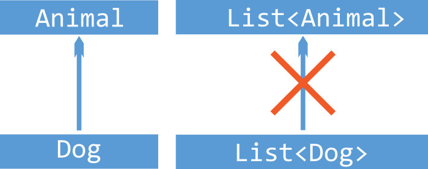

# Java의 Generic

> 내부에서 사용할 데이터 타입을 외부에서 지정하는 기법

### What : 제네릭은 무엇인가

**Generic programming**

- a style of computer programming in which algorithm are written in terms of types **to-be-specified-later** that are then **instantiated** when needed for specific types provided as parameters. (출처 : [Wikipedia](https://en.wikipedia.org/wiki/Generic_programming))

- 코드의 타입을 미리 결정하지 않고, 객체를 생성할 때 구체적인 타입을 지정하는 프로그래밍 방식
- 하나의 코드를 여러 타입의 객체로 구현할 수 있으므로 재사용성을 높인다.

**Generic in Java**

- 클래스/인터페이스/메소드를 정의할 때 자료형을 확정하지 않고, 인스턴스를 생성할 때 자료형을 지정하는 기능

- Java 5에서 처음 도입되었다.

```java
class Student<T> {
    private T id;
}

Student<String> student1 = new Student<String>();
Student<Integer> student2 = new Student<Integer>();
```

<br>

### Why : 제네릭을 사용하는 이유

예시 코드를 통해 살펴보도록 하자.

[제네릭을 사용하지 않은 경우]

```java
class StudentInfo {
    public int grade;
    StudentInfo(int grade) { this.grade = grade; }
}

class EmployeeInfo {
    public int rank;
    EmployeeInfo(int rank) { this.rank = rank; }
}

class Person {
    public Object info;
    Person(Object info) { this.info = info; }
}

public class GenericDemo {
    public static void main(String[] args) {
        Person p1 = new Person("부장");
        EmployeeInfo ei = (EmployeeInfo)p1.info;
        System.out.println(ei.rank);
    }
}

(코드 출처 : https://opentutorials.org/module/516/6237)
```

- 위 코드에서는 Person 클래스에서 info 필드의 자료형으로 StudentInfo, EmployeeInfo 둘 다 설정할 수 있도록 info의 자료형을 Object로 지정했다.
- 하지만 그로 인해 Person 생성자 메소드의 파라미터로 올 수 있는 자료형에 제한이 없어졌다.
- 위 코드는 컴파일 시 오류가 발생하지 않지만, 런타임시 **ClassCastException**이 발생한다.
  - ClassCastException은 형변환 오류로, unchecked exception의 일종이다.

[제네릭을 사용한 경우]

```java
// StudentInfo, EmployeeInfo 코드는 동일

class Person<T> {
    public T info;
    Person(T info) { this.info = info; }
}

public class GenericDemo {
    public static void main(String[] args) {
        Person<String> p1 = new Person<String>("부장");
        String ei1 = p1.info;
        System.out.println(ei1.rank);
    }
}

(코드 출처 : https://opentutorials.org/module/516/6237)
```

- 위 코드에서는 제네릭을 사용하여 `p1` 생성시 자료형을 지정했고, 그 결과 컴파일 오류가 발생했다.
- 이처럼 제네릭을 사용하면 **중복 제거와 타입 안정성(type safety)을 동시에 추구할 수 있다.**

- 또한 제네릭은 **명시적 타입 캐스팅을 없애준다**는 장점도 가지고 있다. 아래 코드를 보자.

```java
// 제네릭 X
List list = new ArrayList();
list.add("hello");
String s = (String) list.get(0);

// 제네릭 O => 명시적 타입 캐스팅 제거
List<String> list = new ArrayList<String>();
list.add("hello");
String s = list.get(0);

(코드 출처 : https://docs.oracle.com/javase/tutorial/java/generics/why.html)
```

[cf. 타입 캐스팅의 종류]

- **Upcasting**
  - 부모 클래스 타입으로 형변환
  - 자동으로 이루어진다. 
  - ex. `Parent parent = new Child();`
- **Downcasting**
  - 자식 클래스 타입으로 형변환
  - 명시적으로 데이터 타입을 변환해주어야 한다.
  - ex. `Child child = (Child) new Parent();`

<br>

### How : 제네릭은 어떻게 사용하는가

1. 제네릭은 클래스뿐 아니라 인터페이스, 메소드에도 사용 가능하다.
   - 제네릭 클래스가 아닌 일반 클래스에도 제네릭 메소드를 사용할 수 있다.

```java
public class Person {
    public <T> boolean isEqual(T p1, T p2) {
        return p1.equals(p2);
    }
}
```

2. 멀티 타입 파라미터 : 제네릭의 타입은 여러 개일 수 있다.

```java
interface Talkable<T1, T2> {
    public T1 hello();
    public T2 goodbye();
}
```

3. 제네릭은 참조 자료형에 대해서만 사용할 수 있다.

   - **Wrapper 클래스** : 기본 자료형 데이터를 객체로 포장해주는 클래스
     - Byte / Short / Integer / Long / Float / Double / Character / Boolean

   - 기본 자료형 대신 wrapper 클래스를 제네릭 타입으로 사용할 수 있다.

```java
class Student<T> {
    private T id;
}

Integer idNum = new Integer(123);
Student<Integer> student1 = new Student<Integer>(idNum);

// int 자료형은 기본 자료형이라 제네릭으로 사용할 수 없다.
// 따라서, int 자료형을 객체로 만들어주는 Integer wrapper 클래스를 사용했다.
```

4. 생성자의 인자로 자료형을 파악할 수 있는 경우, 제네릭은 생략 가능하다.
   - Java 7부터는 인자와 관계없이, 생성자 쪽의 타입을 생략할 수 있다.
     - `Person<String, Integer> person = new Person<>();`과 같이 사용할 수 있다.

```java
EmployeeInfo e = new EmployeeInfo(1);
Integer i = new Integer(10);
Person<EmployeeInfo, Integer> p1 = new Person<EmployeeInfo, Integer>(e, i);
// 인자로 자료형을 파악 가능한 경우, 타입을 생략할 수 있다.
Person p2 = new Person(e, i);

(코드 출처 : https://opentutorials.org/module/516/6237)
```

5. 제네릭 클래스도 상속이 가능하다.

<br>

### Why : 와일드카드는 왜 등장했는가

> 제네릭은 불공변이기 때문이다.

**불공변(invariant)**



(사진 출처 : [Understanding Generics and Variance in Kotlin](https://proandroiddev.com/understanding-generics-and-variance-in-kotlin-714c14564c47))

- 제네릭은 기본적으로 불공변(invariant)이다.
- 이는 A가 B의 하위 타입이라고 해서, `T<A>`가 `T<B>`의 하위 타입이 아니라는 의미다.

```java
public class Main {
    public static void main(String[] args) {
        List<Integer> numbers = Arrays.asList(1, 2, 3); 
        printNumbers(numbers);
    }

    static void printNumbers(List<Object> numbers) {
        for (Object num : numbers) { 
            System.out.println(num); 
        } 
    }
}
```

- Integer는 Object의 하위 타입이다. 하지만 제네릭은 불공변이기 때문에 `List<Integer>`는 `List<Object>`의 하위 타입이 아니다. 따라서 위 코드는 컴파일 에러를 발생시킨다.
- 위와 같은 문제를 해결하기 위해 나온 것이 바로 와일드카드다.

**와일드카드 (wildcard)**

- 제네릭 타입에서 `<?>`이 포함된 것
- 와일드카드는 unknown type으로, 모든 타입에 대한 호출이 가능하다.

- 위 코드에서 printNumbers의 파라미터 `numbers`에는 정확히 `List<Object>` 자료형의 객체만 올 수 있었다. 제네릭은 불공변이므로 `List<Integer>`, `List<String>` 등은 `List<Object>`의 하위 타입이 아니기 때문이다.
- 반면 `List<Integer>`은 `List<?>`의 하위 타입에 해당한다. 따라서 아래 코드는 컴파일 에러를 발생시키지 않는다.

```java
public class Main {
    public static void main(String[] args) {
        List<Integer> numbers = Arrays.asList(1, 2, 3); 
        printNumbers(numbers);
    }

    static void printNumbers(List<?> numbers) {
        for (Object num : numbers) { 
            System.out.println(num); 
        } 
    }
}
```

- 단, `List<?>`에 값을 추가할 때는 null만 넣을 수 있다. `List<?>`의 원소가 어떤 타입인지 알 수 없기 때문이다.

<br>

### How : 제네릭에 어떻게 제약을 걸 수 있는가

**extends = 상한선**

- `<T extends C>` / `<? extends C>`
  - C와 C의 자식 클래스만 타입으로 지정할 수 있다.

- 주의) 인터페이스와 구현 클래스에 대해서도, 제네릭에서는 `implements`가 아니라 `extends` 키워드를 사용한다.

```java
interface Info {
    int getLevel();
}

class EmployeeInfo implements Info {
    public int rank;
    
    EmployeeInfo(int rank) { 
        this.rank = rank;
    }
    
    public int getLevel() {
        return this.rank;
    }
}

class Person<T extends Info> {
    public T info;
    
    Person(T info) { 
        this.info = info; 
    }
}

public class GenericDemo {
    public static void main(String[] args) {
        Person p1 = new Person(new EmployeeInfo(1));
    }
}

(코드 출처 : https://opentutorials.org/module/516/6237)
```

**super = 하한선**

- `<? super C>`
  - C와 C의 조상 클래스만 타입으로 지정할 수 있다.

<br>

### 참고 자료

https://opentutorials.org/module/516/6237

https://stackoverflow.com/questions/678822/what-is-the-difference-between-and-object-in-java-generics

https://mangkyu.tistory.com/241

https://en.wikipedia.org/wiki/Generic_programming

https://docs.oracle.com/javase/tutorial/java/generics/why.html

https://proandroiddev.com/understanding-generics-and-variance-in-kotlin-714c14564c47

https://stackoverflow.com/questions/11497020/java-generics-wildcard-extends-number-vs-t-extends-number