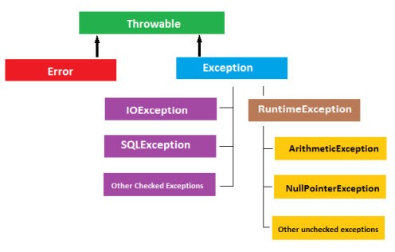
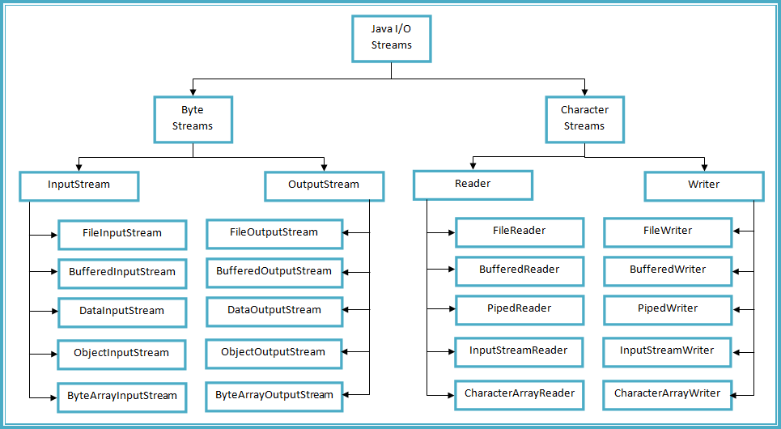

# Java Exception

### try-catch

- `try` 문의 코드 내에서 예외 발생시, 해당 예외를 정의한 첫 번째 `catch`문의 코드가 실행된다.
  - 첫 번째 `catch`문의 코드가 실행되므로, `catch` 문이 여러 개인 경우 구체적인 예외를 위에 두어야 한다. 더 구체적인 예외를 아래에 둔다면 해당 `catch` 문의 코드는 실행될 일이 없을 것이기 때문이다.
- 예외 발생 이후 `try` 문의 코드는 더 이상 실행되지 않는다.
- `finally` 문의 코드는 예외 발생 여부와 관계없이 마지막에 실행된다.

```java
public class MyClass {
    public static void main(String args[]) {
        try {
            String name = "java";
            System.out.println(name.toUpperCase());
            String name2 = null;
            System.out.println(name2.toUpperCase());
            String name3 = "python";
        } catch (NullPointerException e) {
            e.printStackTrace();
        } catch (Exception e) {
            e.printStackTrace();
        } finally {
            System.out.println("반드시 실행");
        }
    }
}

// JAVA
// 반드시 실행

// java.lang.NullPointerException: Cannot invoke "String.toUpperCase()" because "<local2>" is null at MyClass.main(MyClass.java:7)
```

- 위 코드에서는 null 객체인 `name2`에 대한 메소드를 호출했기 때문에 NullPointerException이 발생한다.
  - `NullPointerException`
    - null 객체에 대한 메소드 호출 혹은 필드 참조시 발생
- 첫 번째 `catch` 문에 걸리므로, 해당 `catch` 문의 코드가 실행된다.
  - `printStackTrace()`
    - 예외 발생시 call stack에 있던 메소드 정보 및 예외 결과를 화면에 출력한다. 
    - 일반적으로 IDE에서 예외 발생시 우리가 보게 되는 코드에 해당한다.
- `finally` 문의 코드는 반드시 실행된다.

<br>

### checked exception vs unchecked exception

**checked exception**

- 예외 처리를 필수적으로 해줘야 하는 예외
- 예외 처리를 하지 않는 경우, 컴파일 단계에서 **컴파일 에러**가 발생한다.
- RuntimeException이 아닌 Exception 클래스와 자손 클래스들
  - ex. IOException, SQLException, FileNotFoundException 등

**unchecked exception**

- 예외 처리를 필수적으로 하지 않아도 되는 예외 
- **RuntimeException** 클래스와 그 자손 클래스들
  - ex. ArithmeticException, NullPointerException, ArrayIndexOutOfBoundsException 등
  - 이름 자체가 런타임 예외다. 컴파일 타임에 예외가 발생하지 않기에, 컴파일 단계에서 예외를 발생시키는 checked exception일 수 없다.



(이미지 출처 : https://emiliosedanogijon.wordpress.com/2014/10/20/java-exceptions/)

- Q. 그렇다면 어떤 예외들이 런타임 예외(unchecked exception)인가?

```bash
Runtime exceptions can occur anywhere in a program, and in a typical one they can be very numerous. Having to add runtime exceptions in every method declaration would reduce a program's clarity. Thus, the compiler does not require that you catch or specify runtime exceptions (although you can).

출처 : https://docs.oracle.com/javase/tutorial/essential/exceptions/runtime.html
```

- 쉽게 말해, 어디서나 발생할 수 있고 자주 발생할 수 있는 예외가 런타임 예외가 된다. 그런 예외들에 대하여 일일이 예외 처리를 해주는 것은 프로그램의 명확성을 떨어뜨리기 때문이다.

<br>

### memory leak & close()

**memory leak (메모리 누수)**

- Java에서는 힙 메모리의 접근 불가능한(unreachable) 객체를 **가비지 컬렉터**를 통해 메모리에서 제거한다.
- 문제는 어떤 객체가 더이상 사용되지 않음에도 불구하고 가비지 컬렉터가 제거할 수 없는 경우다. 
- 이러한 경우 해당 객체는 쓸데없이 메모리를 낭비하는데, 이를 **메모리 누수**라고 한다.
  - ex. 전역 변수나 static 변수는 메모리 내에서 heap 영역이 아니라 **data 영역**에 저장된다. 해당 영역에 저장된 변수는 프로그램이 종료할 때까지 메모리를 차지한다. 따라서 static 변수를 너무 많이 사용하지 않는 것이 좋다.
  - 메모리 누수의 다양한 예시는 [다음 링크](https://dzone.com/articles/memory-leak-andjava-code)를 참고하면 좋다.

 **stream (스트림)**

(자바 8에서 추가된 stream API와 전혀 다른 개념입니다.)

- Java에서 모든 입출력이 이루어지는 연결 통로다.
  - 문자 입출력의 경우, **Reader**와 **Writer**를 사용한다.
  - 바이트 입출력의 경우, **InputStream**과 **OutputStream**을 사용한다.

- 아래와 같은 하위 스트림 클래스들이 존재한다.



(이미지 출처 : https://javaconceptoftheday.com/byte-stream-vs-character-stream-in-java/)

**close()**

- 위의 스트림 객체를 포함하여 외부 자원(ex. 파일, 네트워크, DB 등)을 사용하는 경우, 사용을 끝낸 후에 `close()`로 연결을 해제해야 한다.

```java
import java.io.FileWriter;
import java.io.IOException;
 
public class CheckedExceptionApp {
    public static void main(String[] args) {
        FileWriter f = null;
        try {
            f = new FileWriter("data.txt");
            f.write("Hello");
        } catch(IOException e){
            e.printStackTrace();
        } finally {
            if (f != null) {
                try {
                    f.close();
                } catch(IOException e){
                    e.printStackTrace();
                }
            }
        }
    }
}

(코드 출처 : https://opentutorials.org/module/4874/28730)
```

- try문에서 FileWriter 클래스의 인스턴스인 `f`를 생성했다. 
- FileWriter 클래스는 사용 이후 `close()`로 연결을 끊어주어야 하는데, try문에서 `close()`할 경우 중간에 오류가 날 수 있기 때문에, 반드시 실행되는 finally문에서 `f.close()`를 호출했다.
- 그런데 `f`가 null인 경우 NullPointerException이 발생하게 되므로, if 절로 `f`가 null인지 확인했다.
- 또한 `close()` 자체도 IOException을 발생시킬 수 있으므로, 해당 부분도 다시 try-catch문으로 감쌌다.

<br>

### try-with-resources

> Effective Java Item 9 : Prefer try-with-resources to try-finally

위의 예제 코드는 2가지 문제가 있다.

1. 코드의 가독성이 떨어진다.

2. `close()`를 실수로 하지 않을 수 있다.

- Java 7에서 처음 등장한 **try-with-resources**문은 이러한 문제를 해결해준다.
- try 뒤의 괄호에 선언된 객체가 `AutoCloseable` 인터페이스를 구현했다면, try문이 끝났을 때 해당 객체의 `close()` 메서드를 자동으로 호출한다.

```java
import java.io.FileWriter;
import java.io.IOException;
 
public class TryWithResource {
    public static void main(String[] args) {
        // try with resource statements
        try (FileWriter f = new FileWriter("data.txt")) {
            f.write("Hello");
        } catch(IOException e){
            e.printStackTrace();
        }
    }
}

(코드 출처 : https://opentutorials.org/module/4874/28731)
```

- 앞서 본 코드를 try-with-resource문으로 바꾸었다. 코드 길이도 짧아졌으며, 실수의 가능성도 낮아졌다.

<br>

### throw & throws

**throw**

- 함수 내에서 강제로 예외를 발생시킨다.

**throws**

- 자신을 호출한 상위 메소드로 예외를 던진다.
- 여러 예외를 함께 정의할 수 있다.
  - 앞서 checked exception은 예외 처리를 해줘야 한다고 했는데, 이때 예외 처리를 try-catch문이나 try-with-resources문으로 할 수도 있지만, `throws`로 할 수도 있다.
  - 반면 unchecked exception에서 `throws`는 의미가 없다.

```java
public class TestThrowAndThrows  
{  
    static void method() throws ArithmeticException {  
        System.out.println("Inside the method()");  
        throw new ArithmeticException("throwing ArithmeticException");  
    }  

    public static void main(String args[]) {  
        try {  
            method();  
        } catch (ArithmeticException e) {  
            System.out.println("caught in main() method");  
        }  
    }  
}

// Inside the method()
// caught in main() method
// 코드 출처 : https://www.javatpoint.com/difference-between-throw-and-throws-in-java
```

- main 메소드가 실행되면, 우선 try문의 method() 메소드가 실행된다.
- method()에서 "Inside the method()"를 출력하고, ArithmeticException을 발생시킨다.
- method()에서 `throws` 예약어로 ArithmeticException을 추가했으므로, 발생한 ArithmeticException은 method()를 호출한 상위 메소드(=`main() 메소드` )에서 처리해야 한다.
- 따라서 main() 메소드의 catch문 내의 코드가 실행된다.

<br>

### 참고 자료

https://opentutorials.org/module/4874

https://www.youtube.com/watch?v=zqjZBSqHs0s

https://docs.oracle.com/javase/tutorial/essential/exceptions/runtime.html

https://javaconceptoftheday.com/byte-stream-vs-character-stream-in-java/

https://dzone.com/articles/memory-leak-andjava-code

https://www.javatpoint.com/difference-between-throw-and-throws-in-java