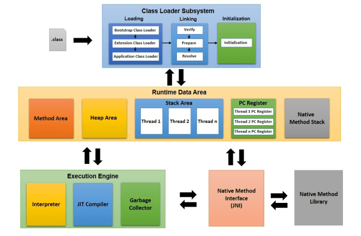

## JVM, JDK, JRE

#### JVM (Java Virtual Machine)

- 특정 OS에 종속되지 않고 자바 프로그램을 실행할 수 있게 해주는 가상 머신

- .class 파일의 자바 바이트 코드를 OS에 특화된 코드로 변환하여 실행한다.
  - OS에 맞추어 네이티브 코드(기계어)를 실행해야 하므로 플랫폼에 종속적이다.
- 바이트 코드를 실행하는 표준이자 구현체이다.
  - 표준? Oracle이 JVM의 스펙과 표준을 정의한다.
    - [JVM 17 Specification](https://docs.oracle.com/javase/specs/jvms/se17/html/index.html)
  - 구현체? Oracle, 아마존, Azul 등의 JVM 벤더(공급업체)에서 JVM 구현체를 만든다.

#### JRE (Java Runtime Environment)

- JVM + 라이브러리
- 자바 애플리케이션을 실행할 수 있도록 구성된 배포판
- 자바 애플리케이션을 실행하기 위한 도구만 포함되며, 개발 관련 도구는 포함되지 않는다.
  - ex. javac는 포함 X

#### JDK (Java Runtime Environment)

- JRE + 개발에 필요한 툴
- 소스 코드 작성시 사용하는 자바 언어는 플랫폼에 독립적이다.
- 오라클은 Java 11부터 JRE를 제공하지 않고, JDK만 제공한다.

 

## JVM 구조

#### 클래스 로더

- **Loading**
  - 클래스를 읽어온다.
  - AppClassLoader => PlatformClassLoader => BootstrapClassLoader (오른쪽이 상위)
  - .class 파일을 읽어 바이너리 코드로 만들고, 이를 메소드 영역에 저장한다.
  - 로딩이 끝나면 해당 클래스 타입의 Class 객체를 생성하여 힙 영역에 저장한다.

- **Linking**
  - 코드 내부의 레퍼런스를 연결한다.
  - Verify
    - .class 파일 형식이 유효한지 체크한다.
  - Prepare
    - static 변수와 기본값에 필요한 메모리를 준비한다.
  - Resolve (Optional)
    - 심볼릭 레퍼런스를 메소드 영역에 있는 실제 레퍼런스로 교체한다.
    - 심볼릭 레퍼런스
      - 참조하는 대상의 이름을 지칭한다.
      - 클래스 파일이 JVM에 올라가면, 해당 이름에 맞는 객체의 주소를 찾아서 연결한다.
- **Initialization**
  - static 값들을 초기화하고 변수에 할당한다.

#### 메모리

- 메소드 영역, 힙 영역은 공유 자원이다.
- 스택 영역, PC 레지스터, 네이티브 메소드 스택은 스레드별로 할당된다.

- **메소드 영역**
  - 클래스 수준의 정보 (클래스 이름, 부모 클래스 이름, 메소드, 변수)를 저장한다.
  - 클래스가 로딩될 때 static 블록이 실행된다.
- **힙 영역**
  - 객체를 저장한다.
- **스택 영역**
  - 스레드마다 런타임 스택을 만들고, 그 안에 메소드별로 스택 프레임을 쌓는다.
    - 스택 프레임에는 매개변수, 지역변수, 반환 주소값 등이 저장된다.
  - 스레드가 종료되면 런타임 스택도 사라진다.
- **PC(Program Counter) 레지스터**
  - 스레드마다 스레드에서 현재 실행할 스택 프레임을 가리키는 포인터가 생성된다.

- **네이티브 메소드 스택**
  - 네이티브 메소드 라이브러리
    - C, C++ 등으로 작성된 라이브러리
  - **JNI(Java Native Interface)**
    - 네이티브 메소드 라이브러리를 사용하기 위해 JNI를 거쳐야 한다.
  - JNI를 통해 네이티브 메소드가 호출되면, 네이티브 메소드 스택에 쌓인다.
  - 네이티브 메소드
    - ex. `public static native Thread currentThread()`

#### 실행 엔진

- **인터프리터**
  - 코드를 한줄씩 기계어로 번역한 뒤 바로 실행시키는 방식
  - Javascript, Python 등의 스크립트 언어가 사용하는 방식
  - 컴파일러에 비해 속도가 느리다.
  - cf) **컴파일러**
    - 코드 실행 전 원시 코드를 기계어로 변환한 뒤 실행시키는 방식 (ex. C, C++)
- **JIT(Just-In-Time) 컴파일러**
  - 메서드가 인터프리터에 의해 얼마나 자주 호출되는지 계산한다.
  - 메서드의 호출 횟수가 일정한 수(컴파일 임계치)를 초과하는 경우, 해당 메서드를 기계어로 번역하여 캐시에 저장한다.
  - 이후 인터프리터는 네이티브 코드로 컴파일된 코드를 바로 사용한다.
  - 도입 의의
    - 인터프리터만 사용하는 경우, 바이트 코드를 실행할 때마다 기계어로 번역해야 한다. JIT 컴파일러는 자주 사용되는 코드를 캐시에 저장하여, 프로그램 실행 속도를 높인다.
- **GC(Garbage Collector)**
  - 더 이상 참조되지 않는 객체를 모아서 정리한다. (mark and sweep)
