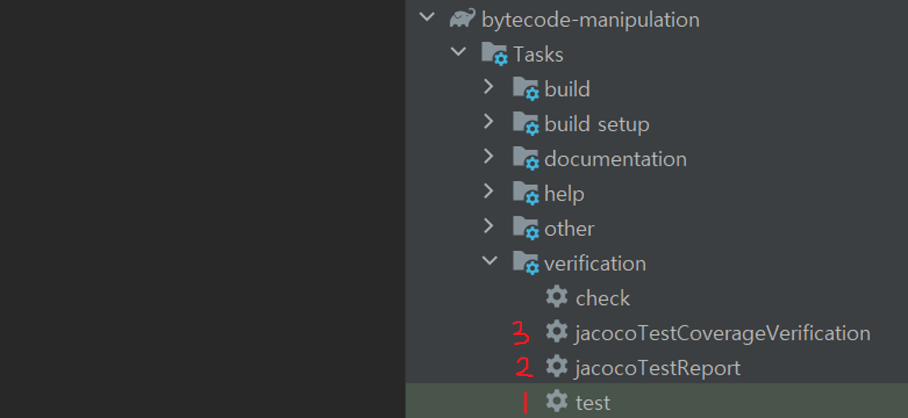
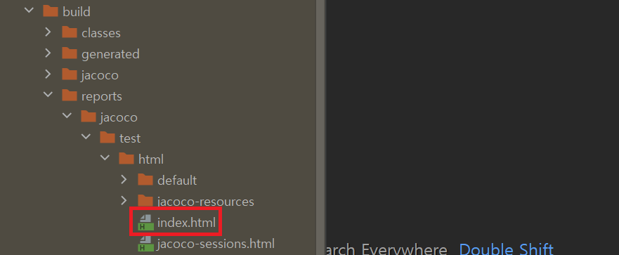
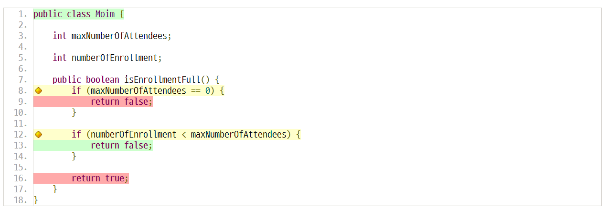
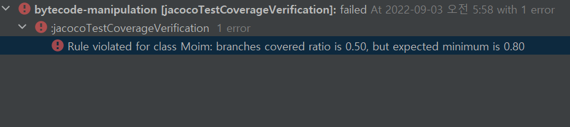
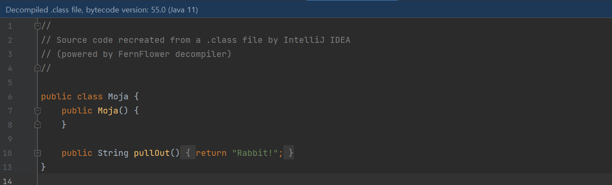
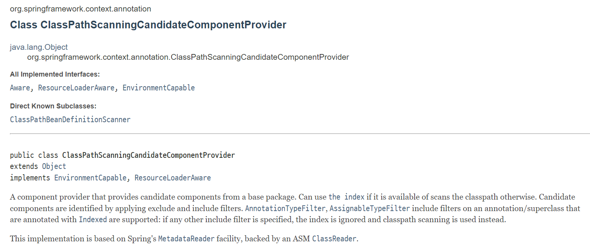

### 코드 커버리지(Code Coverage)

- a percentage measure of the degree to which the source code of a program is executed when a particular test suite is run (출처: [위키피디아](https://en.wikipedia.org/wiki/Code_coverage))
- 소스 코드 중 테스트를 통해 실행된 코드의 비율
- 바이트코드 조작의 대표적인 예시 중 하나

- **Jacoco**
  - 자바 코드 커버리지 측정을 위한 오픈소스 라이브러리

**Jacoco 코드 커버리지 실습**

> 강의에서는 빌드 관리 도구로 Maven을 사용했지만, 실습시에는 Gradle을 사용했습니다.

1. 플러그인 추가

```java
// build.gradle

plugins {
    id 'jacoco'
}

jacoco {
    toolVersion = "0.8.6"  // jacoco 버전
}
```

2. 커버리지 기준 설정 (브랜치 커버리지 80%)

```java
// build.gradle

jacocoTestCoverageVerification {
    violationRules {
        rule {
            element = 'CLASS'

            // 브랜치 커버리지를 80% 이상 만족시켜야 한다.
            limit {
                counter = 'BRANCH'      // 조건문 등의 분기 수
                value = 'COVEREDRATIO'  // 커버된 개수
                minimum = 0.80          // 최소 비율
            }
        }
    }
}
```

3. `Test` => `jacocoTestReport` => `jacocoTestCoverageVerification` 순으로 실행



4. 성공한 경우 => index.html에서 리포트 확인





5. 커버리지 기준 설정에 따라 브랜치 커버리지가 80% 미만인 경우 오류 발생



<br>

### 바이트코드 조작

- 바이트코드 조작이 필요한 경우

  - 자바 소스 코드를 변경하지 않고 코드를 변경해야 하는 경우

  - ex. 클래스 파일 생성, 최적화, 로깅 등

- 바이트코드 조작 라이브러리

  - ByteBuddy, ASM, Javassist, CGlib 등

**ByteBuddy 라이브러리를 통한 바이트코드 조작 실습**

- 바이트코드를 조작할 파일

```java
// Moja.java

public class Moja {
    public Moja() {
        
    }
    
    // 이 메서드의 바이트코드를 조작할 것
    public String pullOut() {
        return "";
    }
}
```

1. 플러그인 추가

```java
// build.gradle

dependencies {
    implementation 'net.bytebuddy:byte-buddy:1.11.22'
}
```

2. 바이트코드 조작

```java
// Masulsa.java

public class Masulsa {

    public static void main(String[] args) throws IOException {
        try {
            new ByteBuddy().redefine(Moja.class) // Moja 클래스의
                    .method(named("pullOut"))  // 'pullOut'이라는 이름의 메소드가
                    .intercept(FixedValue.value("Rabbit!"))  // "Rabbit!"을 리턴하게 하는
                    .make()                                  // 새로운 클래스를 만들어
                    .saveIn(new File("바이트코드 파일이 저장된 경로"));  // 파일에 저장한다.
        } catch (IOException e) {
            e.printStackTrace();
        }
    }
}
```

3. Moja.java의 바이트코드가 바뀐 것을 확인할 수 있다.




```java
public class Masulsa {

    public static void main(String[] args) throws IOException {
        try {
            new ByteBuddy().redefine(Moja.class)
                    .method(named("pullOut"))
                    .intercept(FixedValue.value("Rabbit!"))
                    .make()
                    .saveIn(new File("바이트코드 파일이 저장된 경로"));
        } catch (IOException e) {
            e.printStackTrace();
        }
    }
    
    System.out.println(new Moja().pullOut());
}
```

- 그런데 위와 같이 바이트코드를 조작하여 pullOut 메서드가 "Rabbit!"을 리턴하게 만들고 해당 메서드를 실행하더라도, "Rabbit!"은 출력되지 않는다.
- try문 내의 코드에서 이미 Moja 클래스를 읽는 과정에서 JVM 메모리에 Moja 클래스가 로딩되기 때문이다.
- 앞서 JVM 챕터에서 살펴본 것처럼, JVM의 클래스 로더에서는 .class 파일을 읽어 기계어로 만든 뒤, JVM 메모리의 메소드 영역에 저장한다.
- 위 코드를 실행하면 Moja 클래스의 바이트코드는 조작되지만, Moja 클래스를 다시 호출하면 변경된 새로운 클래스가 아니라, 이미 메모리에 로딩된 원본 클래스를 참조하게 되는 것이다.

<br>

### Java Agent

- 앞서 살펴본 코드의 문제점: 바이트 조작이 클래스 로딩 순서에 의존적
- 따라서, 클래스 로딩 순서와 독립적으로 바이트 코드를 조작할 수 있어야 한다. 이를 가능하게 하는 것이 **Java Agent**다.
- Java Agent를 사용하면, 클래스 로더가 클래스를 읽어올 때 Java Agent를 거쳐서 변경된 바이트코드를 읽어들여 사용한다.
  - 이때, .class 파일 자체는 변경되지 않으며, 변경된 바이트코드가 메모리에 들어간다.


<br>

### Spring - 컴포넌트 스캔

- Spring에서는 `@ComponentScan` 어노테이션이 붙은 클래스 기준 하위 패키지를 탐색하며,
- `@Service`, `@Repository` 등의 어노테이션이 붙은 객체를 빈으로 등록한다.
- 이때 바이트코드 조작 라이브러리인 **ASM**이 사용된다.
  - 구체적으로는 `ClassPathScanningCandidateComponentProvider` 클래스에서 빈으로 등록할 후보 클래스 정보를 찾는데 사용된다.
  - ASM의`ClassReader`와 스프링의 `MetadataReader`를 바탕으로 클래스의 메타 정보를 읽어온다.

