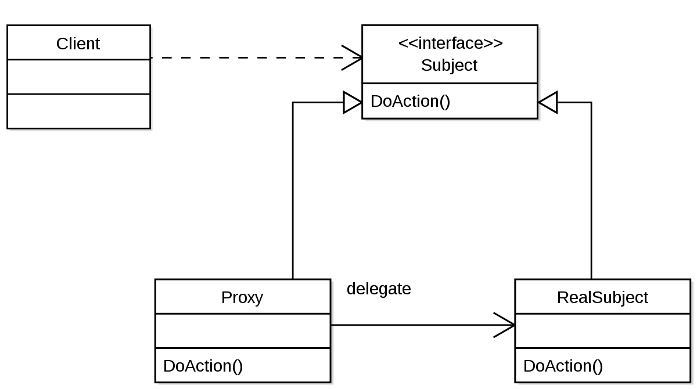

### Dynamic Proxy

- 다이나믹 프록시는 리플렉션의 일부다.

- 사용 예시 : **Spring Data JPA**

- Spring Data JPA에서는 아래와 같은 코드만으로도 BookRepository 타입의 인스턴스를 생성하고, 빈으로 등록해준다.

  ```java
  public interface BookRepository extends JpaRepository<Book, Integer> {
  }
  ```

- 위 코드에서 인터페이스 타입의 인스턴스는 어떻게 만들어지는가?

  - RepositoryFactorySupport에서 프록시를 생성한다.

    ```java
    // 프록시 생성
    ProxyFactory result = new ProxyFactory();
    result.setTarget(target);
    result.setInterfaces(repositoryInterface, Repository.class, TransactionalProxy.class);
    ```

  - 생성된 프록시 객체가 빈으로 등록되어 주입된다.

<br>

### Proxy Pattern



- 프록시와 리얼 서브젝트가 인터페이스를 공유한다.
- 클라이언트는 해당 인터페이스 타입으로 프록시를 사용한다.
- 클라이언트는 프록시를 거쳐서 리얼 서브젝트를 사용한다.
  - 따라서 프록시는 리얼 서브젝트에 대한 접근 관리, 부가기능 제공, 리턴값 변경 등을 할 수 있다.

- 리얼 서브젝트에는 핵심 비즈니스 로직만 남겨두고, 프록시로 부가 기능을 제공할 때 사용한다.
  - **SRP (Single Responsibility Principle)**
- 스프링에서는 AOP를 프록시 패턴으로 구현한다.

<br>

### Dynamic Proxy

- 정적 프록시의 단점
  - 부가기능을 추가할 때마다 새로운 프록시를 구현해야 해서 번거롭다.
- **다이나믹 프록시**
  - 런타임에 인터페이스/클래스의 프록시 인스턴스 or  클래스를 만들어 사용하는 프로그래밍 기법
  - 프록시 객체를 미리 만들어야 하는 정적 프록시의 단점이 해결된다.
- 사용 예시
  - Spring Data JPA, Spring AOP, Mockito, Hibernate의 Lazy Initialization

<br>

### 프록시 인스턴스 만들기

- 리플렉션 패키지의 Proxy 클래스를 사용하여 프록시 인스턴스를 만들 수 있다.
  - [Java Proxy 객체](https://docs.oracle.com/javase/8/docs/api/java/lang/reflect/Proxy.html)

- 인스턴스 만들기
  - `Object Proxy.newProxyInstance(ClassLoader, interfaces, InvocationHandler)`

```java
// BookService 인터페이스
public interface BookService {
    void rent(Book book);
    void returnBook(Book book);
}

// DefaultBookService 클래스 (RealSubject)
public class DefaultBookService implements BookService {

    @Override
    public void rent(Book book) {
        System.out.println("rent : " + book.getTitle());
    }

    @Override
    public void returnBook(Book book) {
        System.out.println("return : " + book.getTitle());
    }
}
```

```java
// 프록시 인스턴스 만들기
BookService bookService = (BookService) Proxy.newProxyInstance(
            BookService.class.getClassLoader(),
            new Class[]{BookService.class},
            new InvocationHandler() {
                BookService bookService = new DefaultBookService();  // real subject 인스턴스

                @Override
                public Object invoke(Object proxy, Method method, Object[] args) throws Throwable {
                    System.out.println("before method");
                    Object invoke = method.invoke(bookService, args);
                    System.out.println("after method");
                    return invoke;
                }
            });

```

```java
Book bookDidi = new Book('디디의 우산');
bookDidi.rent();

// before method
// rent : 디디의 우산
// after method
```

- 하지만 위의 구조는 유연하지 않다.
- 이를 추상화된 API로 발전시킨 것이 바로 **Spring AOP**다.

<br>

### 클래스의 프록시 만들기

- 서브 클래스를 만들 수 있는 라이브러리를 사용하여 프록시를 만들 수 있다.

- **CGlib (Code Generation Library)**

  - 스프링, 하이버네이트가 사용하는 라이브러리

  - `Enhancer.create(classType, handler)`로 프록시 객체를 생성한다.

- **ByteBuddy**
  - 앞서 바이트 코드 조작 라이브러리로 살펴보았는데, 다이나믹 프록시를 만들 때도 사용 가능하다.

- 서브 클래스를 만드는 방법의 단점
  - 상속을 허용하지 않는 클래스의 경우, 서브 클래스를 만들 수 없다.
    - `private` 생성자만 존재하는 경우
    - `final` 클래스인 경우
      - cf) `final` => 클래스간 상속 금지, 메소드 오버라이딩 금지

- cf) 자바 기초 : 상속과 생성자
  - 부모 클래스의 생성자는 상속되지 않는다. 
  - 대신 자식 클래스의 인스턴스 생성시 자동으로 부모 클래스의 기본 생성자가 호출된다. 
    - Object 클래스까지 거슬러 올라가서 부모 클래스 => 자식 클래스 순으로 기본 생성자가 호출된다.
  - 부모 클래스에 기본 생성자가 없는 경우, 자식 클래스에서 **super()** 키워드를 통해 생성자를 명시적으로 호출해야 한다.
    - 이때 super()를 사용한 코드는 자식 클래스 생성자의 맨 윗 줄에 있어야 한다.
