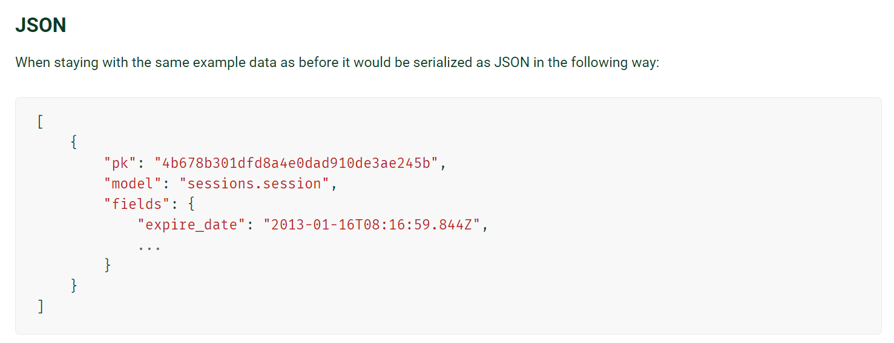
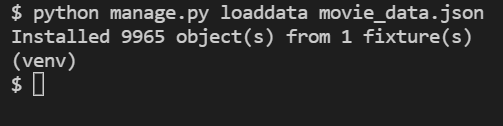

# TMDB API로 영화 데이터 가져오기

### 초기 상황

TMDB에서 아래 API로 요청을 보내면 인기 순으로 20개씩 영화 데이터를 보내준다.

```bash
<https://api.themoviedb.org/3/movie/popular?
api_key=><<api_key>>&language=<<language>>&page=<<page>>
```

위 API를 활용하여, 1페이지부터 500페이지까지 총 10,000개의 영화 정보를 가져와서 `movie_data.json` 파일에 저장했다. 

응답 데이터의 형식은 임의로 아래와 같이 정했다.

```json
// 응답 데이터 형식

{
    "name": "movie data",
    "data": [
        {
            "pk": 1,
            "title": "영화 제목",
            ...
        },
        ...
    ]
}
```

```python
# 데이터를 받아 json 파일에 저장하는 코드

import requests
import json

TMDB_API_KEY = str(os.getenv('TMDB_API_KEY'))  # .env 파일에서 불러옴.

def get_movie_datas():
    total_data = []

    # 1페이지부터 500페이지까지의 데이터를 가져옴.
    for i in range(1, 501):
        request_url = f"<https://api.themoviedb.org/3/movie/popular?api_key={TMDB_API_KEY}&language=ko-KR&page={i}>"
        movies = requests.get(request_url).json()

        for movie in movies['results']:
            if movie.get('release_date', ''):
                # Movie 모델 필드명에 맞추어 데이터를 저장함.
                data = {
                    'movie_id': movie['id'],
                    'title': movie['title'],
                    'released_date': movie['release_date'],
                    'popularity': movie['popularity'],
                    'vote_avg': movie['vote_average'],
                    'overview': movie['overview'],
                    'poster_path': movie['poster_path'],
                    'genres': movie['genre_ids']
                }

                total_data.append(data)

    json_data = {
        "name": "movie data",
        "data": data
    }

    with open("movie_data.json", "w", encoding="utf-8") as w:
        json.dump(json_data, w, indent="\\t", ensure_ascii=False)

get_movie_datas()
```

- 들여쓰기를 표시하기 위해 `indent="\\t"` 옵션을 주었다.
- 한글이 유니코드로 나오는 것을 막기 위해 `ensure_ascii=False` 옵션을 주었다.

<br>

### 문제 1

그런데 데이터를 가져오고 보니, 필드값이 빈 경우들이 있었다. 미리 정의한 Movie 모델에서 `released_date` 필드와 `genres` 필드는 `blank=True`나 `null=True` 조건이 없었다.

```python
# movies/Models.py

class Movie(models.Model):
    ...
    released_date = models.DateField()
    genres = models.ManyToManyField(Genre, related_name='movies')
    ...
```

그럼에도 빈 값이 들어간 경우가 있어, 모델에 그대로 넣을 수 없었다. 따라서 2가지 중 하나를 선택해야 했다.

1. 2가지 필드 중 하나 이상이 빈 값인 객체 삭제하기
2. 2가지 필드에 `null=True` 혹은 `blank=True` 조건 추가하기

<br>

### **해결 1**

아래와 같이 선택했다.

- `released_date` 필드의 경우, 이후 추천 시스템에서 사용될 경우 값이 없으면 문제가 발생할 수 있었다. 그래서 `released_date` 필드가 빈 값인 객체들은 없앴다. (가져오는 과정에서 필터링했다.)
- `genres` 필드의 경우 빈 값이 있어도 괜찮다고 판단하여, Movie 모델의 `genres` 필드에 `blank=True` 조건을 추가했다.

<br>

### **문제 2**

그렇게 다시 얻은 `movie_data.json` 파일을 `django-admin loaddata movie_data.json` 명령어로 django 서버에 저장하려고 하니, 아래의 오류가 떴다.

```bash
django.core.serializers.base.DeserializationError: Problem installing fixture...
```

원인을 찾아보니, django에 맞는 JSON 형식을 맞추지 않아서 생긴 오류였다. 

django 공식 문서에 따르면, JSON 파일을 직렬화하기 위해서는 아래의 형식을 따라야 한다고 한다.



<br>

### **해결**

임의로 설정한 형식 대신 위의 형식에 맞추어 다시 JSON 파일을 저장했다. 최종 코드는 아래와 같다.

```python
# 최종 코드

import requests
import json

TMDB_API_KEY = str(os.getenv('TMDB_API_KEY'))

def get_movie_datas():
    total_data = []

    # 1페이지부터 500페이지까지 (페이지당 20개, 총 10,000개)
    for i in range(1, 501):
        request_url = f"<https://api.themoviedb.org/3/movie/popular?api_key={TMDB_API_KEY}&language=ko-KR&page={i}>"
        movies = requests.get(request_url).json()

        for movie in movies['results']:
            if movie.get('release_date', ''):
                fields = {
                    'movie_id': movie['id'],
                    'title': movie['title'],
                    'released_date': movie['release_date'],
                    'popularity': movie['popularity'],
                    'vote_avg': movie['vote_average'],
                    'overview': movie['overview'],
                    'poster_path': movie['poster_path'],
                    'genres': movie['genre_ids']
                }

                data = {
                    "pk": movie['id'],
                    "model": "movies.movie",
                    "fields": fields
                }

                total_data.append(data)

    with open("movie_data.json", "w", encoding="utf-8") as w:
        json.dump(total_data, w, indent="\\t", ensure_ascii=False)

get_movie_datas()

# 결과: 영화 데이터 9,965개 가져옴.
```

위 코드로 얻은 JSON 파일을 loaddata 명령으로 장고 서버에 저장했다.

```bash
python manage.py loaddata movie_data.json
```

같은 방식으로 장르 데이터도 json 파일로 만든 뒤, 장고 서버에 저장했다.

```
python manage.py loaddata genre_data.json
```



장고 서버에 잘 저장되었다!

<br>


### 참고 출처

https://docs.djangoproject.com/en/dev/topics/serialization/

https://stackoverflow.com/questions/6153113/how-to-create-a-fixture-file