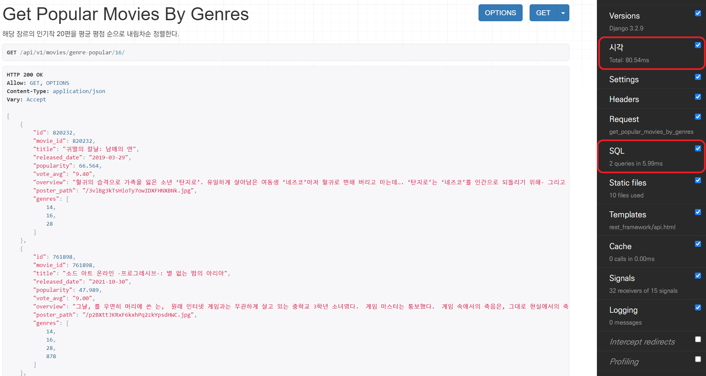

# prefetch_related를 통한 성능 개선

### 상황 분석

아래 코드와 같이, 장르별로 인기작 20편을 평균 평점이 높은 것부터 차례대로 보여주는 API를 구현했다. 

```python
@api_view(['GET'])
@permission_classes([AllowAny])
def get_popular_movies_by_genres(request, genre_id):
    popular_movies_by_genre = (
        Movie.objects
            .filter(genres=genre_id)
            .order_by('-vote_avg')[:20]
    )
```

위 API를 통해 메인 페이지에서 각 장르별 인기작을 불러오도록 했는데, 시간이 너무 오래 걸렸다. 실제로 django debug toolbar를 통해 살펴보니, 애니메이션 장르를 기준으로 쿼리를 돌렸을 때 21개의 쿼리가 실행되었으며, 450~650ms 사이의 시간이 소요되었다. 


왜 21개의 쿼리가 실행되었을까?

1. 메인 쿼리에서 Movie 테이블로 SELECT문 호출 ⇒  20개의 영화 엔티티를 조회
2. 서브 쿼리에서 20개 엔티티 각각에 대하여 다시 Genre 테이블로 SELECT문 호출

조회된 영화 엔티티의 개수만큼 다시 장르 엔티티를 조회했기 때문이다. 이처럼 **Lazy Loading** 방식으로 엔티티를 조회한 이후, 조회된 엔티티의 개수(N)만큼 다시 조회 쿼리가 나가는 문제를 **N + 1 문제**라고 한다.

<br>

### 쿼리 호출 21번 => 2번으로 줄이기

django에서는  `prefetch_related` 메서드와 `select_related` 메서드를 통해 쿼리 호출 횟수를 줄일 수 있다. 둘 모두 쿼리셋과 관련된 objects들을 미리 불러오는 **Eager Loading** 방식을 통해 쿼리 호출 횟수를 줄이고, 이를 통해 성능을 향상시킨다.

- `select_related`는 1:1 관계나 1:N 관계의 N에서 사용 가능하다.
- `prefetch_related`는 1:N 관계의 1이나 M:N 관계에서 사용 가능하다.

Movie와 Genre는 M:N 관계이므로, `prefetch_related`를 통해 최적화를 시도했다.

```python
@api_view(['GET'])
@permission_classes([AllowAny])
def get_popular_movies_by_genres(request, genre_id):
    popular_movies_by_genre = (
        Movie.objects
            .filter(genres=genre_id)
        	.prefetch_related('genres')  # 추가된 부분
            .order_by('-vote_avg')[:20]
    )
```

`prefetch_related` 추가 후  다시 애니메이션 장르를 기준으로 쿼리를 돌리니, 단 2개의 쿼리가 실행되었으며, 80~110ms 사이의 시간이 소요되었다.



왜 2개의 쿼리가 실행되었을까?

1. 메인 쿼리에서 Movie 테이블로 SELECT문 호출 ⇒  20개의 영화 엔티티를 조회 (기존과 동일)
2. Genre 테이블로 SELECT문 호출
3. 1, 2번의 결과를 python에서 join


결과적으로 21개의 쿼리를 2개로 줄일 수 있었다.

<br>


### 참고 출처

https://leffept.tistory.com/312?category=950490