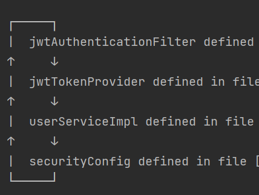

## Problem




위와 같이 순환 참조가 발생했다.

<br>

## Solution

https://www.baeldung.com/circular-dependencies-in-spring

위 글에 따르면, 스프링에서 순환 참조를 해결하는 방법은 크게 3가지다.


1. cycle이 사라지도록 재설계
2. `@Lazy` 사용하기
   - 순환 참조하는 빈 중 하나에 `@Lazy`를 사용하여 Proxy 객체 주입후, 실제로 사용될 때 실제 빈을 주입시켜준다.
3. 생성자 주입 대신 setter 주입 or 필드 주입 사용하기


이중 가장 근본적인 문제 해결 방법인 재설계를 통해 문제 해결을 시도해보았다.


순환 참조를 구성하는 참조 관계를 정리하면 아래와 같다.

1. SecurityConfig => JwtAuthenticationFilter 
2. JwtAuthenticationFilter => JwtTokenProvider
3. JwtTokenProvider => UserServiceImpl 
4. UserServiceImpl => SecurityConfig


하나씩 살펴보도록 하자.

<br>

#### SecurityConfig => JwtAuthenticationFilter 

SecurityConfig의 `filterChain` 메소드에서 JwtAuthenticationFilter를 사용하여, UsernamePasswordAuthenticationFilter 앞단에서 JWT 인증 필터가 적용되도록 한다.

```java
private final JwtAuthenticationFilter authenticationFilter;

@Bean
public SecurityFilterChain filterChain(HttpSecurity httpSecurity) throws Exception {
    httpSecurity
        // 중략
        .addFilterBefore(authenticationFilter, UsernamePasswordAuthenticationFilter.class);

    return httpSecurity.build();
}
```


#### JwtAuthenticationFilter => JwtTokenProvider

JwtAuthenticationFilter는 GenericFilterBean을 상속받은 뒤, `doFilter` 메소드를 오버라이드한다. `doFilter` 메소드에서 토큰의 인증 정보를 SecurityContext에 저장한다. 이때 JwtTokenProvider의 `getAuthentication` 메소드를 통해 토큰으로부터 인증 정보를 가져온다.

```java
public void doFilter(ServletRequest request, ServletResponse response, FilterChain chain)
    throws IOException, ServletException {

    // 중략
    Authentication authentication = jwtTokenProvider.getAuthentication(jwt);
    SecurityContextHolder.getContext().setAuthentication(authentication);
    // 중략
}
```


#### JwtTokenProvider => UserServiceImpl

토큰에서 인증 정보를 조회하는 `getAuthentication` 메소드에서 사용된다. 토큰에서 이메일 정보를 가져올 수는 있지만, 유저 객체 자체를 가져올 수는 없으므로, 토큰에서 얻은 이메일 정보로 UserServiceImpl에서 유저 객체를 가져온다.

```java
public Authentication getAuthentication(String token) {
    String email = getEmailFromToken(token);
    UserDetails userDetails = (UserDetails) userService.findUserByEmail(email);

    return new UsernamePasswordAuthenticationToken(email, "", userDetails.getAuthorities());
}
```


#### UserServiceImpl => SecurityConfig

UserServiceImpl의 `createUser`에서는 UserCreateRequest 객체를 User 객체로 변환시킨 뒤, DB에 저장한다. UserCreateRequest 객체를 User 객체로 변환해주는 `toEntity()`는 인자로  PasswordEncoder를 받는다. 이를 위해 BCryptPasswordEncoder를 주입받는데, 이 과정에서 SecurityConfig를 참조하게 된다.

```java
public Long createUser(UserCreateRequest request) {
    User user = userRepository.save(request.toEntity(passwordEncoder));

    return user.getId();
}
```

<br>


위의 4가지 참조 중 가장 끊기 쉬운 것은 마지막 참조다. 

UserCreateRequest 객체의 toEntity() 메소드의 인자로 PasswordEncoder를 넣어주는 대신, UserCreateRequest 객체 안에서 직접 PasswordEncoder를 참조하는 방식으로 코드를 수정했다.


- 수정 전

```java
public class UserCreateRequest {
    // email, name, phoneNumber, password, roleString 필드 정의

    public User toEntity(PasswordEncoder passwordEncoder) {
        String encodedPassword = passwordEncoder.encode(password);
        RoleType roleType = RoleType.valueOf(roleString);

        return User.of(email, name, phoneNumber, encodedPassword, roleType);
    }
}

@RequiredArgsConstructor
public class UserServiceImpl implements UserService {
    private final PasswordEncoder passwordEncoder;
    
    @Override
    @Transactional
    public Long createUser(UserCreateRequest request) {
        User user = userRepository.save(request.toEntity(passwordEncoder));
        return user.getId();
    }
}
```

-  수정 후

```java
public class UserCreateRequest {
    private static final PasswordEncoder passwordEncoder = new BCryptPasswordEncoder();
    
    // email, name, phoneNumber, password, roleString 필드 정의

    public User toEntity() {
        String encodedPassword = passwordEncoder.encode(password);
        RoleType roleType = RoleType.valueOf(roleString);

        return User.of(email, name, phoneNumber, encodedPassword, roleType);
    }
}

@RequiredArgsConstructor
public class UserServiceImpl implements UserService {

    @Override
    @Transactional
    public Long createUser(UserCreateRequest request) {
        User user = userRepository.save(request.toEntity());
        return user.getId();
    }
}
```

