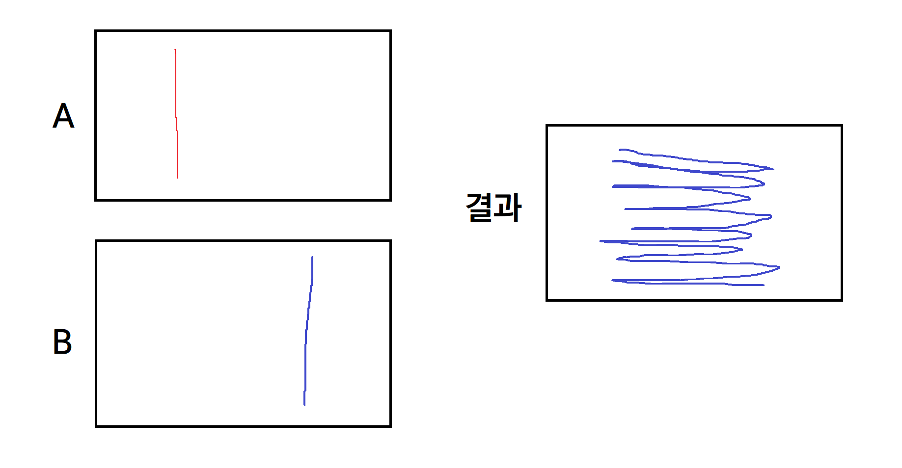

> 화상 채팅을 이용한 비대면 파티 플랫폼 프로젝트 [빠뤼피플](https://github.com/by-gramm/partypeople)에서 실시간 다중 사용자 화이트보드 기능을 만든 과정을 정리했습니다.

> 프로젝트의 프론트엔드 파트는 Vue 3로 구현했습니다.


### level 0. Canvas API vs webGL

화이트보드 기능을 구현하기 위해 고려한 선택지는 2가지였다. 둘의 특징을 살펴보면 다음과 같다.

**Canvas API**

- 2004년 애플이 처음 도입했으며, 2014년 표준화된 HTML5에 포함됨.
- `<canvas>` 요소 내에 2D 그래픽을 표현할 수 있음.
- 사용법을 익히기 쉬움.
- 라이브러리 없이 구현할 시 비교적 빠르게 구현할 수 있음.

**webGL**

- Canvas API를 기반으로 2011년 처음 등장함.

- Canvas API와 마찬가지로, `<canvas>` 요소 내에 그래픽을 표현함.
- 3D 그래픽을 표현하는데 주로 사용되며, 2D 그래픽도 표현 가능함.
- 사용법을 익히기 비교적 어려우나, 성능은 Canvas API보다 우수함.

선택 : **Canvas API**를 사용하기로 결정했다. 화이트보드 기능은 프로젝트의 핵심 기능이 아니므로, 6주라는 짧은 프로젝트 기간 동안 학습에 너무 많은 시간을 쓰지 않는 것이 좋겠다고 생각했다. 또한 구현에 있어서도 라이브러리 없이 비교적 빠르게 구현할 필요가 있었다. 또한 **webGL**은 3D 그래픽 구현에 주로 사용되기 때문에, 2D 그래픽 구현 관련 자료를 찾기도 비교적 어려울 것으로 판단했다. 정리하면 팀에서 학습보다 좋은 결과물에 더 큰 비중을 두었기 때문에, 그 목표에 맞는 **Canvas API**를 선택했다.

<br>

### level 0.5. Understanding Canvas API

**Canvas API**에서는 `CanvasRenderingContext2D` 인터페이스를 통해 `<canvas>` 요소 내에 그래픽을 표현할 수 있다.

```html
<!-- html -->
<canvas id="partycanvas"></canvas>
```

```javascript
// javascript
const canvas = document.querySelector('#partycanvas');
const ctx = canvas.getContext('2d');
```

화이트보드 기능에서 알아야할 것은 **Canvas API**에서 선을 그리는 방식이다. 우선 위와 같이 context를 가져온 후, 해당 context에 선을 그릴 때의 색상, 두께, 모양 등을 속성값으로 지정할 수 있다. 

```javascript
// 선으로 그릴 때의 색상, 두께, 모양 설정
ctx.strokeStyle = 'black';
ctx.lineWidth = 10;
ctx.lineCap = 'round';
```

이후 아래와 같은 메서드를 호출하여 선을 그리게 된다.

```javascript
// 선 그리기 시작
ctx.beginPath();
// context의 위치를 (beforeX, beforeY)로 이동
ctx.moveTo(beforeX, beforeY);
// (beforeX, beforeY)에서 (currentX, currentY)로의 직선 경로 추가
ctx.lineTo(currentX, currentY);
// 경로에 있는 직선을 실제로 그림
ctx.stroke();
// 선 그리기 종료
ctx.closePath();
```

<br>

### level 1. Single-User Whiteboard

색상/두께를 설정하면 context 내의 속성값이 그에 맞게 변경되도록 했다. 그리고 `<canvas>` 영역 내에서 마우스를 클릭하면 `beginPath()` 메서드로 그릴 준비를 하고, 현재 마우스의 좌표로 context의 좌표를 이동시켰다. 이후, `mouseup` 이벤트가 발생할 때까지 실시간으로 마우스 위치를 감지하여 직선을 그리게 했다. 예를 들어, 마우스가 `(10, 10) => (12, 12) => (15, 18)`로 이동했다면, `(10, 10)`에서 `(12, 12)`로 직선을 그리고 다시 `(12, 12)`에서 `(15, 18)`로 직선을 그리는 식이다. 이때 직선의 색상, 두께 등은 context에 저장된 속성에 의해 결정된다.

그 외에 지우개 기능, 캔버스 초기화 기능 등을 추가했다.

<br>

### level 2. Multi-User Whiteboard

이제 해야 할 일은 여러 유저가 화이트보드 화면을 실시간으로 공유할 수 있도록 하는 일이다. 이미 실시간 화상 채팅 구현을 위해 WebRTC 기반의 Openvidu 프레임워크를 도입했으므로, 화이트보드 기능도 Openvidu 프레임워크를 통해 구현하기로 했다.

컴포넌트 구조상으로는 파티룸 내부 컴포넌트인 `partyroom-detail` 컴포넌트의 하위 컴포넌트로 `whiteboard` 컴포넌트가 있다. `partyroom-detail` 컴포넌트에서 파티룸 참가자들은 openvidu 세션에 연결되어 있으므로, `signal`을 통해 방의 모든 참가자들에게 같은 정보를 보낼 수 있다. (채팅 기능도 `signal`을 통해 구현했다.) 따라서 화이트보드로 그림을 그릴 때마다 색상, 두께 및 현재 좌표를 파티룸 내 모든 사용자에게 보내도록 했다. 해당 정보를 받은 다른 사용자들은 직접 그림을 그릴 때와 마찬가지의 과정을 거쳐 자기 화면에 그림을 그릴 수 있게 했다.

<br>

```html
<!-- partyroom-detail.vue -->
<whiteboard
    ref="whiteboard"
    v-show="isWhiteboardOpen"
    @send-whiteboard-signal="sendWhiteboardSignal"
></whiteboard>
```

1. A가 그림을 그릴 때 색상, 두께, 좌표 정보를 `whiteboard` 컴포넌트에서 부모 컴포넌트인 `partyroom-detail` 컴포넌트로 보낸다.

```javascript
// whiteboard.vue
const sendSignal = (x, y, color, width) => {
    emit('send-whiteboard-signal', x, y, color, width);
};
```

2. A의 `partyroom-detail` 컴포넌트에서 해당 data를 받아서 'whiteboard'라는 이름의 signal로 모든 사용자에게 보낸다.

```javascript
// partyroom-detail.vue
sendWhiteboardSignal(x, y, color, width) {
    let data = {
        currentX: x,
        currentY: y,
        color: color,
        width: width,
    };

    this.session
        .signal({
        data: JSON.stringify(data),
        to: [],
        type: 'whiteboard',
    })
        .catch(error => {
        console.log(error);
    });	
}
```

3. 모든 사용자가 'whiteboard'라는 이름의 signal로 받은 데이터를 각자의 `whiteboard` 컴포넌트로 보낸다.

```javascript
// partyroom-detail.vue
this.session.on('signal:whiteboard', event => {
    this.$refs.whiteboard.addWhiteboardSignal(event.data);
});
```

4. 모든 사용자의 `whiteboard` 컴포넌트에서 받은 데이터에 따라 캔버스에 그림을 그린다.

   (context가 state에 포함됨.)

```javascript
// whiteboard.vue
const addWhiteboardSignal = canvasData => {
    let data = JSON.parse(canvasData);

    state.ctx.beginPath();
    state.ctx.strokeStyle = data.color;
    state.ctx.lineWidth = data.width;
    state.ctx.lineTo(data.currentX, data.currentY);
    state.ctx.stroke();
    state.ctx.closePath();
};
```

이제 A가 화이트보드 내에 그림을 그리면, 같은 그림이 B나 C의 화면에도 그려지게 된다.

문제는 2명 이상의 사용자가 동시에 그림을 그리는 경우였다. A와 B가 동시에 아래로 선을 그린다고 하자. 그렇다면 파티룸 이용자들에게는 A와 B가 보내는 정보가 교차되어 들어온다. 그러면 아래 그림과 같이 A가 그린 좌표와 B가 그린 좌표를 왔다갔다하는 현상이 발생한다. 또한 색상, 두께와 같은 속성 정보가 충돌하기도 했다. 예를 들어, A는 빨간색을 선택했더라도, B가 파란색으로 그림을 그리면 파란색 속성이 A의 context에도 저장되는 식이다.



### level 3. Multi-User Whiteboard with simultaneous drawing

여러 사용자가 동시에 화이트보드에 그림을 그릴 때 발생하는 문제를 해결하기 위한 2가지 방안을 생각해보았다. 

1.  파티룸 참가자 수만큼 캔버스 요소를 만든다. 같은 영역에 각 참가자마다의 캔버스 요소를 `z-index`를 다르게 하여 겹겹이 쌓고, 이후 signal을 보낼 때 보낸 유저의 정보를 함께 보내서, 해당 유저에 맞는 캔버스에 그림을 그린다는 생각이었다. 하지만 `<canvas>` 요소는 일종의 판 위에 그림을 그리는 방식으로 구현되므로(빈 공간이 아니라 흰 직사각형 위에 그림을 그리는 방식), 그림을 그릴 수 있게 하면서 여러 층을 쌓을 수 없었다.

2.  한 사용자가 그림을 그리는 동안에는 다른 사용자가 그림을 그리지 못하게 한다. 이렇게 하면 두 명 이상이 보내는 데이터가 충돌하는 문제는 발생하지 않을 것이다. 하지만 이는 파티룸에서 화이트보드를 통해 함께 즐길 수 있게 한다는 기존 취지와 맞지 않는다는 팀원분의 의견이 있었고, 구현도 쉽지 않았다.

2가지 방안이 모두 적용하기 어려웠으므로, 새로운 해결 방안을 생각하기보다는 기존 방안의 문제 가 무엇인지에 집중했다. 

<br>

#### 좌표 충돌 해결

level 2에서 여러 사람이 동시에 그릴 때 좌표의 충돌이 발생하는 이유는, 새로운 직선을 그릴 때 이전 좌표의 정보가 잘못 저장되었기 때문이다. 

1. A가 `(x1, y1)`에서 `(x2, y2)`로 선을 그린다.

2. B가 `(x3, y3)`에서 `(x4, y4)`로 선을 그린다.

3. A가 `(x2, y2)`에서 `(x5, y5)`로 선을 그린다.

위의 예시는 아래와 같이 처리된다.

- 2번의 데이터가 사용될 때의 현재 좌표는 `(x2, y2)`이므로 `(x2, y2)`에서 `(x4, y4)`로 선이 그려진다.
- 3번의 데이터가 사용될 때의 현재 좌표는 `(x4, y4)`이므로 `(x4, y4)`에서 `(x5, y5)`로 선이 그려진다.

이처럼 **이전 좌표의 정보가 틀린 것**이 문제였다. 따라서 signal을 보낼 때 직선을 그리기 이전 좌표의 정보도 함께 보내도록 했다. level 2와 비교해보면, step 1 ~ step 3은 이전 좌표를 보낸다는 점만 다르다. 그리고 step 4에서는 매번 context의 현재 위치를 이전 좌표로 이동한 뒤, 현재 좌표로 선을 그리는 작업을 수행한다. 

위의 1 ~ 3번은 이제 이렇게 처리된다. 

- 1번 데이터가 오면 `(x1, y1)`로 context의 위치를 이동한 뒤, `(x2, y2)`로 선을 그린다. 
- 2번 데이터가 오면 `(x3, y3)`로 context의 위치를 이동한 뒤, `(x4, y4)`로 선을 그린다. 
- 3번 데이터가 오면 `(x2, y2)`로 context의 위치를 이동한 뒤, `(x5, y5)`로 선을 그린다. 

<br>

#### 색상, 두께 충돌 해결

색상, 두께 정보가 충돌하는 이유는 A가 설정한 색상이나 두께가 B의 context에도 저장될 수 있기 때문이었다. A가 `(빨간색, 두께 10)`으로 그림을 그린 경우, B가 이를 화면에 나타내려면 context에 해당 속성을 저장해야 한다. 하지만 B가 그림을 그리는 사이 이러한 일이 발생한다면, B가 기존에 설정한 색상/두께가 아니라 A에 의해 바뀐 색상/두께로 signal을 보내게 되는 것이다. 결국 **기존의 색상/두께 정보를 유지하지 못하는 것**이 문제였다.

따라서 step 4에서 그림을 그릴 때, 기존의 색상/두께 정보를 임시 변수에 저장해두고, 새로운 색상/두께를 context에 저장하여 그림을 그린 다음, 다시 기존의 색상/두께 정보를 context에 저장하도록 했다. 이를 통해 다른 사용자가 그린 그림을 화면에 나타내면서도 자신이 설정한 속성은 유지할 수 있도록 했다.

<br>

위의 2가지 해결을 반영한 코드는 아래와 같다.

```javascript
// whiteboard.vue

// (lastX, lastY)에서 (x, y)로 직선을 그림
const sendSignal = (lastX, lastY, x, y, color, width) => {
	emit('send-whiteboard-signal', lastX, lastY, x, y, color, width);
};
```

```javascript
// partyroom-detail.vue
sendWhiteboardSignal(lastX, lastY, x, y, color, width) {
    let data = {
        lastX: lastX,
        lastY: lastY,
        currentX: x,
        currentY: y,
        color: color,
        width: width,
    };

    this.session
        .signal({
        data: JSON.stringify(data),
        to: [],
        type: 'whiteboard',
    })
        .catch(error => {
        console.log(error);
    });
},
```

```javascript
// partyroom-detail.vue
this.session.on('signal:whiteboard', event => {
    this.$refs.whiteboard.addWhiteboardSignal(event.data);
});
```

```javascript
// whiteboard.vue
const addWhiteboardSignal = canvasData => {
    let data = JSON.parse(canvasData);

    // 색깔, 두께 정보 임시로 저장
    let tempColor = state.ctx.strokeStyle;
    let tempWidth = state.ctx.lineWidth;

    state.ctx.beginPath();
    state.ctx.strokeStyle = data.color;
    state.ctx.lineWidth = data.width;
    // 이전 좌표로 이동한 뒤
    state.ctx.moveTo(data.lastX, data.lastY);
    // 이전 좌표에서 현재 좌표로 직선을 그림
    state.ctx.lineTo(data.currentX, data.currentY);
    state.ctx.stroke();
    state.ctx.closePath();

    // 기존의 색깔, 두께 정보 다시 저장
    state.ctx.strokeStyle = tempColor;
    state.ctx.lineWidth = tempWidth;
};
```

<br>

### Conclusion

화이트보드 기능을 구현하는 과정에서 배운 것은 결국 문제 파악의 중요성이었다. 문제를 어떻게(how) 해결할 지에 몰두하다보니 점점 생각이 복잡해졌지만, 이후 문제가 무엇인지(what)부터 다시 생각하니 생각보다 문제가 쉽게 해결되었다. 
