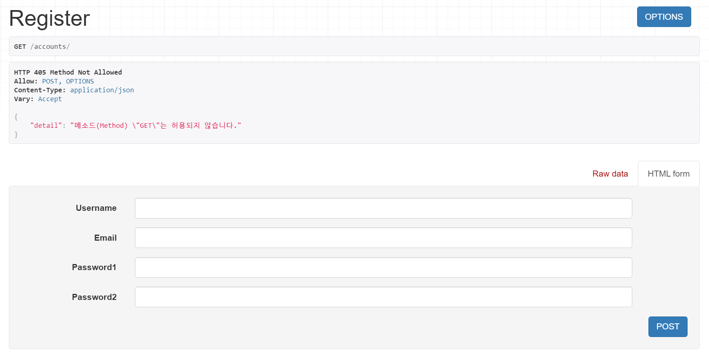
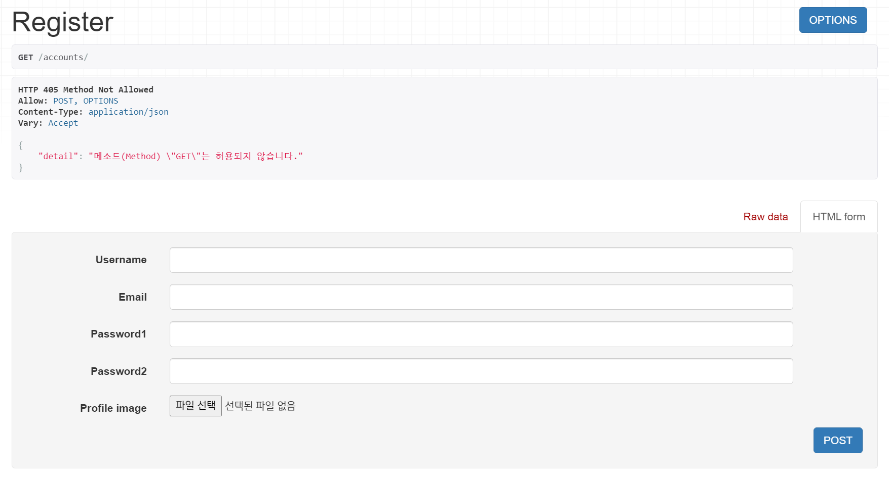
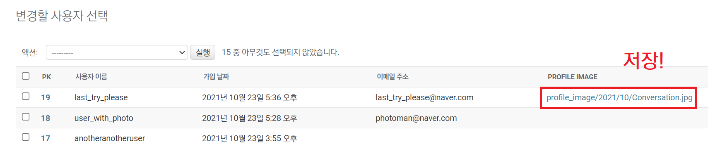

# [DRF] Custom User Registration with dj_rest_auth

### 과제 - 커스텀 User 모델의 추가 필드값 입력받기

현재 진행중인 토이 프로젝트에서 `dj_rest_auth`를 이용해 회원가입 API를 구현했다. 

```python
# <project_name>/urls.py

urlpatterns = [
    path('accounts/', include('dj_rest_auth.registration.urls')),
]
```

그리고 AbstractUser 클래스를 상속받은 커스텀 User 모델을 만들었다. 커스텀 User 모델에서는 `profile_image` 필드와 `point` 필드를 추가했다. 그리고 `settings.py`에 커스텀 User 모델을 등록했다.

```python
# accounts/models.py

from django.contrib.auth.models import AbstractUser
from django.db import models
from imagekit.models import ProcessedImageField
from imagekit.processors import ResizeToFill
from django.core.validators import MinValueValidator


class User(AbstractUser):
    # 추가한 필드 : profile_image, point
    profile_image = ProcessedImageField(
        blank=True,
        upload_to='profile_image/%Y/%m',
        processors=[ResizeToFill(300, 300)],
        format='JPEG',
        options={'quality': 70},
    )

    point = models.IntegerField(
        default=0,
        validators=[MinValueValidator(0)],
    )

    def __str__(self):
        return self.username
```

```python
# <project_name>/settings.py

AUTH_USER_MODEL = 'accounts.User'
```

추가한 필드 중 `profile_image` 필드는 사용자에게 직접 입력받고자 했다. 하지만 따로 Serializer를 등록하지 않았으므로, 회원가입 창에서는 아직 해당 필드를 입력받을 수 없었다.



<br>

### 해결 1 - CustomRegisterSerializer

`dj_rest_auth`에서는 회원가입 시 기본적으로 `RegisterSerializer`를 이용한다. 따라서 만약 커스텀 필드를 추가적으로 입력받기 위해서는 해당 serializer를 상속받는 커스텀 serializer를 만들어야 한다.

아래는 `RegisterSerializer`를 상속받아, `profile_image` 필드를 추가한 `CustomRegisterSerializer`의 코드다.

```python
# accounts/serializers.py

from rest_framework import serializers
from dj_rest_auth.registration.serializers import RegisterSerializer


class CustomRegisterSerializer(RegisterSerializer):
    # 기본 설정 필드: username, password, email
    # 추가 설정 필드: profile_image
    profile_image = serializers.ImageField(use_url=True)

    def get_cleaned_data(self):
        data = super().get_cleaned_data()
        data['profile_image'] = self.validated_data.get('profile_image', '')

        return data
```

그리고 커스텀 Serializer가 회원가입 시 사용하는 Serializer임을 알려주기 위해, `settings.py`에 아래의 코드를 추가했다.

```python
# <project_name>/settings.py

REST_AUTH_REGISTER_SERIALIZERS = {
    'REGISTER_SERIALIZER': 'accounts.serializers.CustomRegisterSerializer',
}
```

이제 회원가입 창에서 `profile_image` 필드도 입력받을 수 있게 되었다. 하지만 여전히 해당 필드의 입력값은 저장되지 않았다.



<br>

### 해결 2 - CustomAccountAdapter

`dj_rest_auth`로 회원가입을 하고자 할 때, 회원정보를 데이터베이스에 저장하는 역할을 하는 부분은 `all-auth`의 `DefaultAccountAdapter`다. 구체적으로는 해당 클래스의 `save_user` 메서드에서 회원 정보 데이터를 저장한다.

```python
# django-allauth/blob/master/allauth/account/adapter.py

class DefaultAccountAdapter(object):
    
    # (...)
  
    def save_user(self, request, user, form, commit=True):
        """
        Saves a new `User` instance using information provided in the
        signup form.
        """
        from .utils import user_email, user_field, user_username

        data = form.cleaned_data
        first_name = data.get("first_name")
        last_name = data.get("last_name")
        email = data.get("email")
        username = data.get("username")
        user_email(user, email)
        user_username(user, username)
        if first_name:
            user_field(user, "first_name", first_name)
        if last_name:
            user_field(user, "last_name", last_name)
        if "password1" in data:
            user.set_password(data["password1"])
        else:
            user.set_unusable_password()
        self.populate_username(request, user)
        if commit:
            # Ability not to commit makes it easier to derive from
            # this adapter by adding
            user.save()
        return user
```

위 코드에서 email, username 등의 값을 저장하게 된다. 그래서 만약 커스텀 User 모델의 추가 필드의 입력값을 저장하고 싶다면, 위 어댑터를 상속받은 커스텀 어댑터를 통해 값을 저장하면 된다. 아래 코드가 해당 어댑터의 코드다.

`CustomAccountAdapter`에서는 일단 `save_user()` 내에서 상위 클래스인 `DefaultAccountAdapter`의 `save_user()` 메서드를 통해 받은 값을 `user`에 저장했다. (`user = super().save_user(request, user, form, False)`) 그런데 이때 유저 정보를 바로 저장하면 안 되므로, `commit` 인자의 값은 False로 두었다. 다음으로 추가 필드의 값들을 저장한 뒤, 유저 정보를 저장했다. 

```python
# accounts/adapters.py

from allauth.account.adapter import DefaultAccountAdapter


class CustomAccountAdapter(DefaultAccountAdapter):

    def save_user(self, request, user, form, commit=True):
        data = form.cleaned_data
        # 기본 저장 필드: first_name, last_name, username, email
        user = super().save_user(request, user, form, False)
        # 추가 저장 필드: profile_image
        profile_image = data.get("profile_image")
        if profile_image:
            user.profile_image = profile_image

        user.save()
        return user
```

그리고 해당 어댑터가 유저 정보를 저장하는 어댑터임을 알리기 위해, `settings.py`에 아래 코드를 추가했다.

```python
# <project_name>/settings.py

ACCOUNT_ADAPTER = 'accounts.adapters.CustomAccountAdapter'
```

이제 회원가입 정보를 입력하면 `profile_image` 필드의 입력값도 저장된다!



<br>

## 참고 출처

https://stackoverflow.com/questions/37841612/django-rest-auth-custom-registration-fails-to-save-extra-fields

https://www.tfzx.net/article/5782861.html

[django-allauth 소스 코드](https://github.com/pennersr/django-allauth)

[dj_rest_auth 공식 문서 - Configuration](https://dj-rest-auth.readthedocs.io/en/latest/configuration.html)
