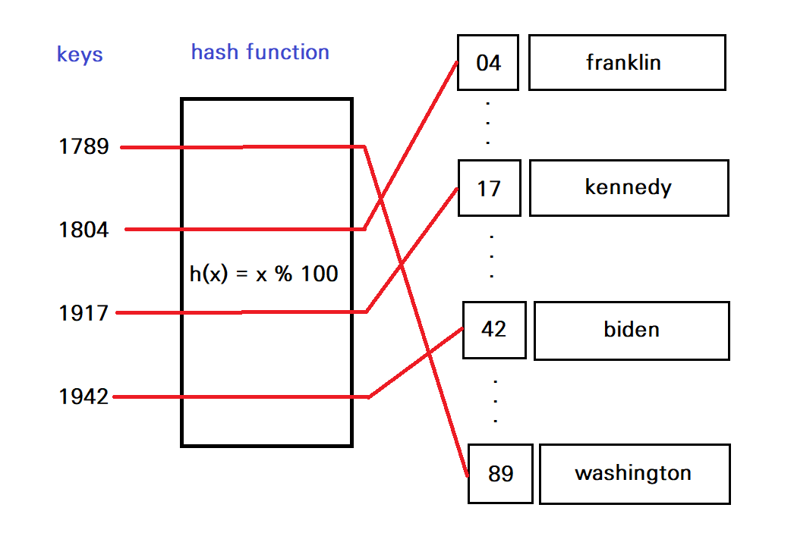

# 세트(set)의 시간 복잡도

<br><br>

### 리스트 vs 세트

며칠 전, 코딩 테스트를 보는데 한 문제의 테스트 케이스 몇 개에서 시간 초과가 발생했다.  여러 방법을 시도해도 효과가 없다가, 리스트를 세트로 바꾸자 시간이 100분의 1 이하로 단축되었다. 아래는 당시 작성했던 코드와 유사한 구조의 코드다.

```python
# 리스트 활용 => 시간 초과
id_numbers = []

for info in infos:
    cnt_id = info[:6]
    if cnt_id not in id_numbers:
        id_numbers.append(cnt_id)

# 세트 활용 => 시간 널널
id_numbers = set()

for info in infos:
    cnt_id = info[:6]
    if cnt_id not in id_numbers:
        id_numbers.add(cnt_id)
```

세트를 활용했을 때, 위처럼 극적인 시간 단축 효과가 발생한 이유는, 리스트와 세트에서의 `x in s` 연산의 시간 복잡도의 차이다. 

- 리스트에서의 `x in s` 연산의 평균 시간 복잡도 : **O(n)**
- 세트에서의 `x in s` 연산의 평균 시간 복잡도 : **O(1)**

<br><br>

### 세트가 효율적인 이유 = 해시 테이블

세트의 `x in s` 연산의 평균 시간 복잡도가 **O(1)**이 될 수 있는 이유는 간단하다. 파이썬에서는 세트가 **해시 테이블(hash table)**로 구현되어 있기 때문이다. 

해시 테이블을 이해하려면 우선 **해시 함수**를 이해해야 한다. 해시 함수는 임의의 데이터를 인자로 받아, 특정 범위 내의 데이터로 반환하는 함수다. 예를 들어, `h(x) = x % 100`이라는 함수가 있다면, 어떤 정수가 인자로 들어오더라도 0~99 사이의 숫자를 반환하게 된다.

해시 테이블은 해시 함수를 통해 데이터를 저장하는 자료구조다. 해시 함수를 통해 해싱한 후 나온 결과값을 배열의 인덱스로 사용하여, 해당 위치에 데이터를 저장하는 방식이다. 예를 들어, 아래와 같이 출생년도와 이름이 저장된 데이터가 있다고 하자.

```python
presidents = {
    1789: 'washington', 
    1804: 'franklin', 
    1917: 'kennedy', 
    1942: 'biden'
}
```

이 데이터를 인자로 받은 값을 100으로 나눈 나머지를 반환하는 해시 함수를 활용하여, 해시 테이블에 저장할 수 있다. 딕셔너리의 첫번째 키인 1789를 100으로 나눈 나머지는 89이므로, 'washington' 데이터는 89번 인덱스에 저장되는 식이다.

<p align="center">
  
</p>


(해시 테이블에 대한 자세한 설명은 [다음 링크](https://velog.io/@cyranocoding/Hash-Hashing-Hash-Table%ED%95%B4%EC%8B%9C-%ED%95%B4%EC%8B%B1-%ED%95%B4%EC%8B%9C%ED%85%8C%EC%9D%B4%EB%B8%94-%EC%9E%90%EB%A3%8C%EA%B5%AC%EC%A1%B0%EC%9D%98-%EC%9D%B4%ED%95%B4-6ijyonph6o)를 참고하도록 하자.)

리스트에서는 어떤 값이 리스트에 있는지 확인하려면, 리스트의 값을 일일이 확인해야 한다. 반면 해시 테이블로 구현되어 있는 세트의 경우, 해당 값을 해시 함수에 넣어 인덱스에 접근함으로써, 아주 빠르게 해당 값이 있는지 여부를 확인할 수 있다. 따라서 세트에서 `x in s` 연산의 평균 시간 복잡도는 **O(1)**이 된다.

물론 세트에서도 최악의 경우 `x in s` 연산의 시간 복잡도가 **O(n)**이 될 수 있다. 예를 들어, 위 해시 테이블에서 XX50년도에 태어난 사람의 데이터만을 세트에 넣었다고 해보자. 그렇다면 해시 함수를 통해 50번 인덱스에 접근하더라도, 어차피 모든 데이터가 그 인덱스 배열에 있으므로, 시간 복잡도는 리스트와 같은 **O(n)**이 된다. 하지만 적절한 해시 함수를 사용할 경우, 이런 상황이 발생할 확률은 매우 적을 것이다.

리스트와 세트는 `x in s` 연산 이외에 특정 요소를 삭제하는 `remove` 연산의 시간복잡도도 다르다. 평균적으로 리스트는 **O(n)**이지만, 세트는 **O(1)**이다. (`x in s` 연산에서의 시간복잡도 차이를 이해했다면, 이 차이도 쉽게 이해할 수 있을 것이다.) 따라서 중복되지 않는 값을 저장하는 경우에는, 리스트 대신 세트를 사용하는 것이 훨씬 효율적이다.

<br><br>

### 참고 출처

https://wiki.python.org/moin/TimeComplexity

https://velog.io/@cyranocoding/Hash-Hashing-Hash-Table%ED%95%B4%EC%8B%9C-%ED%95%B4%EC%8B%B1-%ED%95%B4%EC%8B%9C%ED%85%8C%EC%9D%B4%EB%B8%94-%EC%9E%90%EB%A3%8C%EA%B5%AC%EC%A1%B0%EC%9D%98-%EC%9D%B4%ED%95%B4-6ijyonph6o
